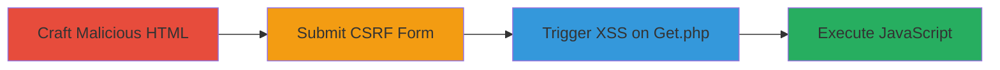

# CSRF to Stored XSS via Age Cookie in Rockstar Games Video Player Cache

Multi-stage attack chain demonstrating a complete attack workflow exploiting CSRF to inject a stored XSS payload via the age cookie in the Rockstar Games video player cache endpoints.

## Chain Metrics Dashboard

| Metric | Value |
|--------|-------|
| Chain Status | Unverified |
| Total Steps | 3 |
| Execution Time | ~5 minutes |
| Skill Level | Intermediate |
| Complexity | Medium |
| Impact Level | High |

## Attack Flow Visualization

## Prerequisites & Requirements

### Required Tools

- Web browser for testing
- Text editor for HTML/JS crafting

### Target Environment

- Web platform with PHP backend
- Access to http://www.rockstargames.com/php/videoplayer_cache/
- No authentication required for endpoints

### Initial Access Requirements

- Ability to host or send malicious HTML to victims (e.g., via phishing or drive-by)
- Victim must visit the attacker's page while authenticated or in a context where cookies are set

## Detailed Attack Procedures

### Step 1: Craft Malicious HTML Page for CSRF
procedure: [[procedures/Craft-Malicious-HTML-for-CSRF-Attack]]

**Objective**: Create an HTML page that forges a POST request to set.php with a malicious age payload encoding XSS.

**Instructions**: Develop an HTML snippet using a hidden iframe and form to target the vulnerable endpoint. The payload uses base64 to encode the XSS script for obfuscation.

**Expected Output**: A self-contained HTML file ready for hosting.

**Success Indicators**:
- HTML page loads without errors
- Form and iframe are hidden and functional

### Step 2: Submit the CSRF Form via JavaScript
procedure: [[procedures/Submit-CSRF-Form-via-JavaScript]]

**Objective**: Automatically submit the forged POST request to set the malicious age cookie without user interaction.

**Instructions**: Embed JavaScript to trigger form submission upon page load, exploiting the lack of CSRF tokens.

**Expected Output**: POST request sent, age cookie set with payload.

**Success Indicators**:
- Iframe loads successfully (indicating POST completion)
- Network inspection shows request to set.php

### Step 3: Redirect to Get.php to Trigger Stored XSS
procedure: [[procedures/Trigger-Stored-XSS-by-Redirecting-to-Get-Endpoint]]

**Objective**: Redirect the victim to the reflection endpoint to execute the stored XSS payload from the cookie.

**Instructions**: Use a JavaScript event listener on the iframe load to redirect to get.php, where the unsanitized age value is reflected.

**Expected Output**: JavaScript alert or payload execution in victim's browser.

**Success Indicators**:
- Redirect occurs after POST
- Alert box shows document.cookie or payload executes
- Potential cookie theft if payload is adapted

## Attack Chain Summary

### Key Achievements

1. Successful CSRF exploitation to set arbitrary cookie values
2. Stored XSS execution leading to client-side JavaScript
3. Potential for session hijacking via cookie theft

## Technique & Tactic Coverage

### MITRE ATT&CK Techniques

- [[Drive-by Compromise]] Drive-by Compromise
- [[JavaScript]] JavaScript

### MITRE ATT&CK Tactics

- [[Initial Access]] Initial Access
- [[Execution]] Execution

---

*Last updated: 2023-10-01T00:00:00Z*
