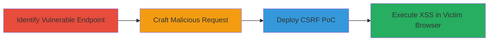

---
tags:
  - csrf
  - xss
  - web-vulnerability
  - session-hijacking
type: attack_chain
tools:
  - '[[tools/Burp-Suite]]'
tactics:
  - '[[Initial Access]]'
  - '[[Execution]]'
verified: false
platforms:
  - Web
  - ColdFusion
submitted: true
complexity: medium
created_at: '2023-10-01T00:00:00Z'
procedures:
  - '[[procedures/Identify-CSRF-Vulnerable-POST-Endpoint]]'
  - '[[procedures/Craft-Malicious-POST-with-XSS-Payload-in-CFID]]'
  - '[[procedures/Create-CSRF-PoC-HTML-Form]]'
step_count: 3
techniques:
  - '[[Drive-by Compromise]]'
  - '[[JavaScript]]'
updated_at: '2025-12-14T17:27:43.113Z'
description: >-
  A chained attack exploiting CSRF on the MTN Group daily deals page to inject
  an XSS payload via the CFID parameter, enabling arbitrary JavaScript execution
  in the victim's browser.
skill_level: intermediate
impact_level: high
id: 389a45d7-e2a8-4438-9e40-5be2dc1c1d03
validated: true
mitre_tactics:
  - '[[Initial Access]]'
  - '[[Execution]]'
mitre_techniques:
  - '[[Drive-by Compromise]]'
  - '[[JavaScript]]'
---
# CSRF to XSS via CFID Parameter Manipulation on MTN Deals Page

Multi-stage attack chain demonstrating a complete attack workflow exploiting CSRF to deliver an XSS payload on the MTN Group daily deals page.

## Chain Metrics Dashboard

| Metric | Value |
|--------|-------|
| Chain Status | Unverified |
| Total Steps | 3 |
| Execution Time | ~5 minutes |
| Skill Level | Intermediate |
| Complexity | Medium |
| Impact Level | High |

## Attack Flow Visualization

## Prerequisites & Requirements

### Required Tools

- [[tools/Burp-Suite]]

### Target Environment

- Web application built on ColdFusion
- Accessible POST endpoint at /index.cfm?GO=DEALS
- No CSRF protection on the endpoint

### Initial Access Requirements

- Network access to the target web application (e.g., https://deals.mtn.co.za)
- Victim must be authenticated to the site for session impact
- No prior credentials needed for discovery, but authentication helps in testing

## Detailed Attack Procedures

### Step 1: Identify Vulnerable Endpoint
procedure: [[procedures/Identify-CSRF-Vulnerable-POST-Endpoint]]

**Objective**: Locate the POST endpoint lacking CSRF protection to enable request forgery.

**Instructions**: Analyze the application's network traffic to identify POST requests to /index.cfm?GO=DEALS. Use Burp Suite to intercept and examine parameters like CFID, CFTOKEN, category_id, cpID, location_id, and m. Confirm absence of CSRF tokens by attempting to replay the request without them.

**Expected Output**: Confirmation that the endpoint processes requests without token validation.

**Success Indicators**:
- Request succeeds without CSRF token
- Parameters are accepted and processed

### Step 2: Craft Malicious Request
procedure: [[procedures/Craft-Malicious-POST-with-XSS-Payload-in-CFID]]

**Objective**: Inject an XSS payload into the CFID parameter to reflect unsanitized JavaScript back to the response.

**Instructions**: In Burp Suite, modify the CFID parameter to include a payload like 'fbe8c86c-c0b2-4421-8ca2-dcfc14763d6e">', URL-encoded as %27fbe8c86c-c0b2-4421-8ca2-dcfc14763d6e%22%3E%3Cimg%20src%3Dx%20onerror%3Dalert%28document.domain%29%3E. Set other parameters: CFTOKEN=0, category_id=9, cpID=1, location_id=0, m=1. Send the POST request and observe the response for payload reflection.

**Expected Output**: Response reflects the payload, triggering the alert with the document domain.

**Success Indicators**:
- JavaScript alert executes
- No sanitization of CFID input

### Step 3: Deploy CSRF PoC
procedure: [[procedures/Create-CSRF-PoC-HTML-Form]]

**Objective**: Create an HTML form that auto-submits the malicious request from the victim's browser to trigger XSS.

**Instructions**: Generate an HTML page with a hidden form targeting /index.cfm?GO=DEALS, populating fields with the tampered CFID and other parameters. Use JavaScript to auto-submit on load. Host the PoC on an attacker-controlled site and trick the victim into visiting it while authenticated to MTN.

**Expected Output**: Victim's browser submits the request, injecting XSS and executing arbitrary code.

**Success Indicators**:
- Form submission occurs without user interaction
- XSS payload executes in victim's session context

## Attack Chain Summary

### Key Achievements

1. Identified CSRF vulnerability allowing forged requests
2. Chained CSRF to XSS via unsanitized CFID reflection
3. Enabled session hijacking, data theft, and phishing via arbitrary JS execution

## Technique & Tactic Coverage

### MITRE ATT&CK Techniques

- [[Drive-by Compromise]]
- [[JavaScript]]

### MITRE ATT&CK Tactics

- [[Initial Access]]
- [[Execution]]

---

*Last updated: 2023-10-01T00:00:00Z*
