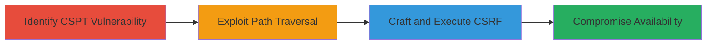

---

# CSRF via Client-Side Path Traversal in LINE Developers Console

Multi-stage attack chain demonstrating exploitation of insufficient client-side validation in the LINE Developers Console to enable CSRF attacks, leading to limited operations that compromise availability.

## Chain Metrics Dashboard

| Metric | Value |
|--------|-------|
| Chain Status | Unverified |
| Total Steps | 2 |
| Execution Time | ~5 minutes |
| Skill Level | Intermediate |
| Complexity | Medium |
| Impact Level | Medium |

## Attack Flow Visualization



## Prerequisites & Requirements

### Required Tools

- Browser developer tools for inspecting client-side code
- Proxy tool like Burp Suite for request manipulation

### Target Environment

- Web platform
- Access to https://developers.line.biz/
- No specific ports or services beyond standard HTTPS (443)

### Initial Access Requirements

- Valid user session on the LINE Developers Console
- Ability to load malicious or manipulated client-side resources
- Network access to the target domain

## Detailed Attack Procedures

### Step 1: Identify and Exploit Client-Side Path Traversal
procedure: [[procedures/Exploit-Client-Side-Path-Traversal]]

**Objective**: Discover and abuse insufficient client-side validation to perform path traversal, bypassing intended restrictions on file or resource access.

**Instructions**: Inspect the client-side JavaScript code handling resource loading or API calls on the LINE Developers Console. Identify functions that validate paths without server-side enforcement. Test traversal payloads like "../../../etc/passwd" in input fields or URL parameters that influence client-side fetches.

Use browser console to simulate:

```javascript
fetch('/api/resource?path=../../../sensitive/file');
```

Monitor for successful traversal by checking if restricted paths are accessed client-side.

**Expected Output**: Client-side access to unintended paths, revealing or enabling manipulation of resources.

**Success Indicators**:
- Error messages or logs indicating traversal success
- Access to files or endpoints outside the intended directory

### Step 2: Execute CSRF Attack Enabled by CSPT
procedure: [[procedures/Execute-CSRF-via-CSPT]]

**Objective**: Leverage the path traversal to forge requests that bypass CSRF tokens or protections, enforcing unauthorized operations on the console.

**Instructions**: Craft a malicious HTML page that embeds a form or script exploiting the traversed path to submit actions without proper CSRF validation. Host the page and trick the victim into visiting it while logged into the console.

Example malicious page structure:

```html
<form action="https://developers.line.biz/api/action" method="POST" enctype="text/plain">
  <input type="hidden" name="path" value="../../../bypass/csrf/action">
  <input type="submit" value="Click Me">
</form>
<script>document.forms[0].submit();</script>
```

The traversal in the 'path' parameter allows the request to hit unprotected endpoints, enforcing operations like channel deletions or config changes.

**Expected Output**: Successful execution of unauthorized actions, such as modifying developer settings or revoking access.

**Success Indicators**:
- Confirmation of action enforcement in console logs
- Reduced availability, e.g., temporary service disruptions

## Attack Chain Summary

### Key Achievements

1. Bypassed client-side path restrictions to access sensitive resources
2. Enabled CSRF without traditional token validation
3. Compromised availability through limited but impactful operations

## Technique & Tactic Coverage

### MITRE ATT&CK Techniques

- [[Exploit Public-Facing Application]] Exploit Public-Facing Application
- [[Drive-by Compromise]] Drive-by Compromise

### MITRE ATT&CK Tactics

- [[Initial Access]] Initial Access
- [[Impact]] Impact

---

*Last updated: 2024-01-01T00:00:00Z*
