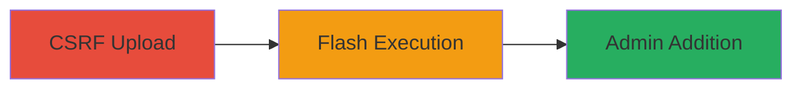

---
tags:
  - csrf
  - wordpress
  - file-upload
  - flash
  - privilege-escalation
type: attack_chain
tools: []
tactics:
  - '[[Initial Access]]'
verified: false
platforms:
  - Web
submitted: true
complexity: medium
created_at: '2023-10-01T00:00:00Z'
procedures:
  - '[[procedures/CSRF-File-Upload-of-Malicious-Flash-to-Add-Admin-in-WordPress]]'
step_count: 1
techniques:
  - '[[Exploit Public-Facing Application]]'
updated_at: '2025-12-14T17:29:20.296Z'
description: >-
  A CSRF vulnerability in WordPress file upload allows attackers to upload
  malicious Flash files disguised with trusted extensions, enabling unauthorized
  execution to add admin users.
skill_level: intermediate
impact_level: high
id: 3db52e6b-6bef-428b-9587-2859243084fc
validated: true
mitre_tactics:
  - '[[Initial Access]]'
mitre_techniques:
  - '[[Exploit Public-Facing Application]]'
---
# CSRF via Malicious Flash File Upload to Add Admin User in WordPress

Multi-stage attack chain demonstrating a complete attack workflow exploiting a CSRF vulnerability in WordPress file uploads.

## Chain Metrics Dashboard

| Metric | Value |
|--------|-------|
| Chain Status | Unverified |
| Total Steps | 1 |
| Execution Time | ~5 minutes |
| Skill Level | Intermediate |
| Complexity | Medium |
| Impact Level | High |

## Attack Flow Visualization

## Prerequisites & Requirements

### Required Tools

- Browser with developer tools for crafting CSRF PoC

### Target Environment

- WordPress instance with vulnerable file upload (pre-2016 versions without strict checks)
- Web platform
- No specific ports required beyond standard HTTP/HTTPS (80/443)

### Initial Access Requirements

- Victim must be authenticated admin in WordPress
- Attacker needs to deliver CSRF link/page to victim (e.g., via phishing)
- No prior credentials needed for attacker

## Detailed Attack Procedures

### Step 1: Perform CSRF Upload and Execution
procedure: [[procedures/CSRF-File-Upload-of-Malicious-Flash-to-Add-Admin-in-WordPress]]

**Objective**: Trick an authenticated WordPress admin into uploading a malicious Flash file via CSRF, allowing the Flash plugin to execute code that adds a new admin user.

**Instructions**: Create a malicious SWF Flash file containing ActionScript to perform the admin addition POST request. Disguise it with a trusted extension like .jpg. Host a CSRF HTML page that automatically submits an upload form to the WordPress media upload endpoint. Deliver the page to the victim (e.g., via email link). Upon upload, ensure the file is accessible via URL, and the Flash executes cross-domain if policy allows, posting to /wp-admin/user-new.php to create the admin.

**Expected Output**: New admin user created in WordPress database, visible in user list.

**Success Indicators**:
- File uploaded successfully without rejection
- Flash file loads and executes (check browser console for ActionScript errors)
- New admin account appears in WordPress admin panel

## Attack Chain Summary

### Key Achievements

1. Bypassed file type validation using Flash content with trusted extension
2. Executed unauthorized admin addition via CSRF
3. Demonstrated high-impact privilege escalation on WordPress

## Technique & Tactic Coverage

### MITRE ATT&CK Techniques

- [[Exploit Public-Facing Application]]

### MITRE ATT&CK Tactics

- [[Initial Access]]

---
*Last updated: 2023-10-01T00:00:00Z*
