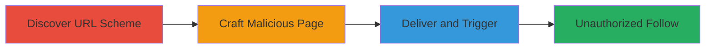

---
tags:
  - csrf
  - url-scheme
  - ios
  - mobile
  - tiktok
type: attack_chain
tools: []
tactics:
  - '[[Initial Access]]'
  - '[[Execution]]'
verified: false
platforms:
  - iOS
submitted: true
complexity: low
created_at: '2023-10-01T00:00:00Z'
procedures:
  - '[[procedures/Discover-TikTok-URL-Scheme-for-Follows]]'
  - '[[procedures/Craft-Malicious-CSFR-HTML-Page]]'
  - '[[procedures/Deliver-and-Trigger-URL-Scheme-Exploit]]'
step_count: 3
techniques:
  - '[[Drive-by Compromise]]'
  - '[[Exploitation for Client Execution]]'
updated_at: '2025-12-14T17:24:42.650Z'
description: >-
  A multi-stage attack exploiting a misconfigured URL scheme in the TikTok iOS
  app to perform CSRF and force users to follow arbitrary accounts without
  consent.
skill_level: intermediate
impact_level: low
id: f6114a93-654f-4bbc-a690-51783cf24291
validated: true
mitre_tactics:
  - '[[Initial Access]]'
  - '[[Execution]]'
mitre_techniques:
  - '[[Drive-by Compromise]]'
  - '[[Exploitation for Client Execution]]'
---
# CSRF-via-Misconfigured-URL-Scheme-in-TikTok-iOS-App-to-Force-Unauthorized-Follows

Multi-stage attack chain demonstrating a complete attack workflow exploiting TikTok's iOS app URL scheme misconfiguration for CSRF-based unauthorized account follows.

## Chain Metrics Dashboard

| Metric | Value |
|--------|-------|
| Chain Status | Unverified |
| Total Steps | 3 |
| Execution Time | ~5 minutes |
| Skill Level | Intermediate |
| Complexity | Low |
| Impact Level | Low |

## Attack Flow Visualization



## Prerequisites & Requirements

### Required Tools

- Web browser for testing (e.g., Safari on iOS)
- Text editor for crafting HTML

### Target Environment

- iOS platform with TikTok app installed
- No specific services or ports required; relies on app's URL scheme handling

### Initial Access Requirements

- User must have TikTok app installed and be authenticated
- Attacker needs to host or deliver a malicious webpage
- No prior credentials or network access to victim device needed

## Detailed Attack Procedures

### Step 1: Discover URL Scheme
procedure: [[procedures/Discover-TikTok-URL-Scheme-for-Follows]]

**Objective**: Identify the TikTok iOS app's URL scheme endpoints for sensitive actions like following accounts.

**Instructions**: Analyze the app's URL handling by reviewing decompiled app binaries or testing common URL schemes. For TikTok, the scheme 'tiktok://' is used, with paths like 'tiktok://user?username=example' for follows. Test locally by attempting to open URLs via a simple HTML file on a device with the app installed.

**Expected Output**: Confirmation of the follow URL scheme, e.g., 'tiktok://user?username=targetuser' triggers a follow without confirmation.

**Success Indicators**:
- App opens and performs the follow action silently
- No user prompt for confirmation observed

### Step 2: Craft Malicious CSRF Page
procedure: [[procedures/Craft-Malicious-CSFR-HTML-Page]]

**Objective**: Create an HTML page that embeds or links to the malicious URL scheme to trigger the CSRF action automatically.

**Instructions**: Write an HTML file with an auto-loading iframe or JavaScript redirect to the TikTok URL scheme. Host it on a web server or use a local file for testing. Example structure:

```html
<!DOCTYPE html>
<html>
<head><title>Trick Page</title></head>
<body>
<script>
window.location = 'tiktok://user?username=attackercontrolled';
</script>
</body>
</html>
```

Upload to a hosting service and verify it triggers the app on iOS.

**Expected Output**: Page loads and immediately attempts to open TikTok app with the follow action.

**Success Indicators**:
- On iOS device, TikTok app launches without user interaction
- Target account is followed post-load

### Step 3: Deliver and Trigger Exploit
procedure: [[procedures/Deliver-and-Trigger-URL-Scheme-Exploit]]

**Objective**: Trick the victim into visiting the malicious page to execute the CSRF.

**Instructions**: Distribute the malicious URL via phishing email, social media, or shortened links. When the victim (with TikTok app installed) visits on iOS Safari, the URL scheme triggers automatically. Monitor for success by checking if the victim follows the attacker's account.

**Expected Output**: Victim's TikTok app opens and follows the specified account without consent.

**Success Indicators**:
- Attacker observes new follower from victim's account
- No alerts or confirmations prompted to user

## Attack Chain Summary

### Key Achievements

1. Bypassed user consent for account follows via app URL scheme
2. Enabled mass unauthorized interactions through web-delivered CSRF
3. Demonstrated privacy compromise in mobile app integration with web

## Technique & Tactic Coverage

### MITRE ATT&CK Techniques

- [[Drive-by Compromise]]
- [[Exploitation for Client Execution]]

### MITRE ATT&CK Tactics

- [[Initial Access]]
- [[Execution]]

---
*Last updated: 2023-10-01T00:00:00Z*
