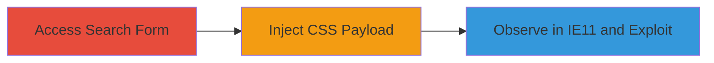

---
tags:
  - css-injection
  - xss
  - ie11
  - web-vulnerability
  - injection
type: attack_chain
tools:
  - '[[tools/Internet-Explorer-11]]'
tactics:
  - '[[Initial Access]]'
commands: []
platforms:
  - Web
complexity: medium
procedures:
  - '[[procedures/Access-Avito-Search-Functionality]]'
  - '[[procedures/Inject-Malicious-CSS-Payload-into-Search-Parameter]]'
  - '[[procedures/Observe-Exploitation-in-Internet-Explorer-11]]'
step_count: 3
techniques:
  - '[[Exploit Public-Facing Application]]'
  - '[[JavaScript]]'
description: >-
  A multi-step attack exploiting CSS injection in the Avito.ru search form,
  specific to Internet Explorer 11, to inject arbitrary CSS, demonstrate visual
  defacement, and enable potential JavaScript execution or sensitive data theft
  via CSS selectors and referer monitoring.
skill_level: intermediate
impact_level: high
id: 875bdc59-9f92-4d39-a111-5b1e11730629
created_at: '2025-12-14T03:16:37.073Z'
updated_at: '2025-12-14T03:16:37.073Z'
verified: false
validated: true
submitted: true
mitre_tactics:
  - '[[Initial Access]]'
mitre_techniques:
  - '[[Exploit Public-Facing Application]]'
  - '[[JavaScript]]'
---
# CSS Injection in Avito.ru Search Form via IE11 for Visual Defacement and Potential Data Exfiltration

## Overview

This attack chain demonstrates a CSS injection vulnerability in the search form of avito.ru, exploitable in Internet Explorer 11 due to improper escaping of user input in CSS blocks. By injecting a malicious payload into the 's' search parameter, attackers can insert arbitrary CSS, leading to visual proof-of-concept like overlaying 'XSS' text on the page. Further exploitation includes executing JavaScript via IE's expression() function, reading sensitive HTML elements (e.g., anti-CSRF tokens) using CSS selectors, or capturing URL query strings by importing attacker-controlled stylesheets and monitoring referer headers. The chain requires IE11 and targets the web platform, highlighting legacy browser risks.

## Chain Metrics Dashboard

| Metric | Value |
|--------|-------|
| Chain Status | Unverified |
| Total Steps | 3 |
| Execution Time | ~2 minutes |
| Skill Level | Intermediate |
| Complexity | Medium |
| Impact Level | High |

## Attack Flow Visualization

## Prerequisites & Requirements

### Required Tools

- [[tools/Internet-Explorer-11]]

### Target Environment

- Web platform
- No specific services or ports required beyond standard HTTP/HTTPS access to avito.ru
- Target URL: https://www.avito.ru/rossiya/nedvizhimost

### Initial Access Requirements

- Direct network access to the internet
- No credentials needed
- IE11 browser installed and default security settings

## Detailed Attack Procedures

### Step 1: Access the Search Functionality
procedure: [[procedures/Access-Avito-Search-Functionality]]

**Objective**: Navigate to the vulnerable search page to prepare for payload injection.

**Instructions**: Open a web browser and visit the Avito.ru real estate section, which includes the vulnerable search form with the 's' parameter.

**Expected Output**: The page loads with a search form visible, ready for parameter manipulation.

**Success Indicators**:
- Page loads successfully without errors
- Search form is present in the URL structure (e.g., ?s=)

### Step 2: Inject Malicious Payload into Search Parameter
procedure: [[procedures/Inject-Malicious-CSS-Payload-into-Search-Parameter]]

**Objective**: Append a crafted CSS injection payload to the search parameter to close style attributes and inject arbitrary CSS.

**Instructions**: Modify the URL by appending the payload to the 's' parameter: https://www.avito.ru/rossiya/nedvizhimost?s='><b/style=position:fixed;top:0;left:0;font-size:200px>XSS<!--. This injects a bold element positioned fixed on the page to display 'XSS' prominently.

**Expected Output**: The URL is updated with the payload; in vulnerable browsers, the injected CSS begins to render.

**Success Indicators**:
- Payload successfully appended to URL without encoding issues
- Page reloads with potential visual changes pending browser observation

### Step 3: Observe Exploitation in Internet Explorer 11
procedure: [[procedures/Observe-Exploitation-in-Internet-Explorer-11]]

**Objective**: Load the injected page in IE11 to trigger the CSS injection, demonstrating defacement and assessing further exploit potential.

**Instructions**: Open the modified URL in Internet Explorer 11. The injected CSS renders without escaping, overlaying 'XSS' text. Test advanced payloads like expression() for JS execution or CSS selectors for data extraction.

**Expected Output**: 'XSS' text overlays the page; in modern browsers, quotes are encoded (e.g., \u0027), preventing injection.

**Success Indicators**:
- Visual 'XSS' defacement appears in IE11
- No defacement in other browsers, confirming IE11 specificity
- Potential for further payloads to access sensitive elements

## Attack Chain Summary

### Key Achievements

1. Successful CSS injection via search parameter, bypassing input sanitization in IE11
2. Visual proof-of-concept demonstrating arbitrary CSS execution and page defacement
3. Potential escalation to JavaScript execution, sensitive data reading (e.g., CSRF tokens), and query string capture via referer headers

## Technique & Tactic Coverage

### MITRE ATT&CK Techniques

- [[Exploit Public-Facing Application]]
- [[JavaScript]]

### MITRE ATT&CK Tactics

- [[Initial Access]]

---
*Last updated: 2023-10-01*
