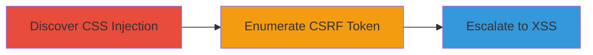

---
tags:
  - css-injection
  - csrf-leak
  - xss
  - web-vuln
type: attack_chain
tools: []
tactics:
  - '[[Initial Access]]'
  - '[[Collection]]'
verified: false
platforms:
  - Web
submitted: true
complexity: medium
created_at: '2023-10-01T00:00:00Z'
procedures:
  - '[[procedures/Discover-CSS-Injection-in-bgcolor-Parameter]]'
  - '[[procedures/Enumerate-CSRF-Token-via-CSS-Injection]]'
  - '[[procedures/Escalate-CSS-Injection-to-XSS-via-HTML-Endpoints]]'
step_count: 3
techniques:
  - '[[Exploit Public-Facing Application]]'
  - '[[JavaScript]]'
updated_at: '2025-12-14T17:27:57.209Z'
description: >-
  A multi-stage attack exploiting CSS injection in the Chaturbate /embed/admin/
  endpoint to leak CSRF tokens via side-channel color detection and potentially
  escalate to full XSS.
skill_level: intermediate
impact_level: high
id: 2586bfc1-d52b-40b0-a2c5-f9ef7b33d4c9
validated: true
mitre_tactics:
  - '[[Initial Access]]'
  - '[[Collection]]'
mitre_techniques:
  - '[[Exploit Public-Facing Application]]'
  - '[[JavaScript]]'
---
# CSS Injection in Chaturbate Embed Leading to CSRF Token Leakage and Potential XSS

Multi-stage attack chain demonstrating exploitation of a CSS injection vulnerability in Chaturbate's embed admin endpoint to steal CSRF tokens through visual side-channel attacks and potentially escalate to cross-site scripting for broader impact.

## Chain Metrics Dashboard

| Metric | Value |
|--------|-------|
| Chain Status | Unverified |
| Total Steps | 3 |
| Execution Time | ~5 minutes |
| Skill Level | Intermediate |
| Complexity | Medium |
| Impact Level | High |

## Attack Flow Visualization



## Prerequisites & Requirements

### Required Tools

- Web browser for manual testing
- Optional: Burp Suite or similar proxy for payload crafting

### Target Environment

- Web platform (Chaturbate application)
- Access to /embed/admin/ endpoint
- No specific ports required beyond standard HTTPS (443)

### Initial Access Requirements

- Public access to the Chaturbate website
- No credentials needed for initial discovery
- Ability to embed or access the admin iframe

## Detailed Attack Procedures

### Step 1: Discover CSS Injection
procedure: [[procedures/Discover-CSS-Injection-in-bgcolor-Parameter]]

**Objective**: Identify and confirm the CSS injection point in the bgcolor parameter to alter page styling arbitrarily.

**Instructions**: Access the target endpoint with a crafted URL to test for injection. Use URL encoding to inject a payload that closes the existing CSS rule and applies a new style, such as changing the background to red.

Example payload in browser:

```url
https://chaturbate.com/embed/admin/?bgcolor=%7D*%7Bbackground:red&tour=nvfS&disable_sound=0&campaign=iNSGX
```

This decodes to `}*{background:red}`, closing the body style and applying red to all elements.

**Expected Output**: The entire page background turns red, confirming arbitrary CSS execution.

**Success Indicators**:
- Visual change in page styling (e.g., red background)
- No errors or sanitization blocking the payload

### Step 2: Enumerate CSRF Token
procedure: [[procedures/Enumerate-CSRF-Token-via-CSS-Injection]]

**Objective**: Leverage the CSS injection to detect and exfiltrate the user's CSRF token through color-based side-channel observation.

**Instructions**: Set up a demonstration environment or use a POC to inject CSS rules that change the background color based on CSRF token characters. Reset the demo if needed, then load the injection page while observing color changes.

Example access for reset:

```url
http://d0nut.pythonanywhere.com/demo/token_stealing/7GTt5qD1LD273WYkJyaR/reset
```

Then inject via:

```url
http://d0nut.pythonanywhere.com/demo/token_stealing/7GTt5qD1LD273WYkJyaR
```

Observe background shifts (e.g., via GIF animation like cssi.gif) to infer token characters through visual or timing attacks.

**Expected Output**: Sequential color changes revealing token characters, enabling full token reconstruction.

**Success Indicators**:
- Detectable color variations tied to token values
- Successful token exfiltration without direct access

### Step 3: Escalate to XSS
procedure: [[procedures/Escalate-CSS-Injection-to-XSS-via-HTML-Endpoints]]

**Objective**: Combine CSS injection with vulnerable HTML-returning endpoints to inject and execute arbitrary JavaScript.

**Instructions**: Identify endpoints like POST /choose_broadcaster_chat_color that return unescaped HTML (Content-Type: text/html). Craft a CSS payload to inject into these endpoints, closing styles and adding script tags for XSS.

Example interaction: Send a POST request to /choose_broadcaster_chat_color with a bgcolor payload that includes `<script>alert(1)</script>` after CSS closure.

Monitor the response for executable HTML injection.

**Expected Output**: JavaScript execution in the victim's browser, such as an alert popup or data exfiltration.

**Success Indicators**:
- Script tags rendered and executed
- Potential for session hijacking or data theft

## Attack Chain Summary

### Key Achievements

1. Confirmed CSS injection allowing arbitrary style manipulation
2. Demonstrated CSRF token leakage via side-channel color detection
3. Identified path to full XSS escalation for broader compromise

## Technique & Tactic Coverage

### MITRE ATT&CK Techniques

- [[Exploit Public-Facing Application]] Exploit Public-Facing Application
- [[JavaScript]] JavaScript

### MITRE ATT&CK Tactics

- [[Initial Access]] Initial Access
- [[Collection]] Collection

---

*Last updated: 2023-10-01T00:00:00Z*
