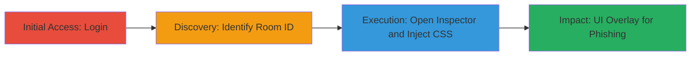

# CSS Injection in Rocket.Chat Message Avatars for UI Overlay and Phishing

Multi-stage attack chain demonstrating a complete attack workflow exploiting a CSS injection vulnerability in Rocket.Chat's message avatar feature to manipulate the user interface and enable phishing attacks.

## Chain Metrics Dashboard

| Metric | Value |
|--------|-------|
| Chain Status | Unverified |
| Total Steps | 4 |
| Execution Time | ~5 minutes |
| Skill Level | Intermediate |
| Complexity | Medium |
| Impact Level | High |

## Attack Flow Visualization



## Prerequisites & Requirements

### Required Tools

- [[tools/Browser-Web-Inspector]]

### Target Environment

- Web-based Rocket.Chat instance (Meteor.js framework)
- Required services/ports: HTTPS (443)
- Network access requirements: Valid user credentials for the target Rocket.Chat

### Initial Access Requirements

- Valid login credentials to Rocket.Chat
- Network position: Direct access to the web application
- Prior access needed: None, assuming authenticated user session

## Detailed Attack Procedures

### Step 1: Authenticate to Rocket.Chat
procedure: [[procedures/Authenticate-to-Rocket-Chat]]

**Objective**: Gain authenticated access to the Rocket.Chat application to enable messaging features.

**Instructions**: Navigate to the Rocket.Chat login page and enter valid credentials to establish a session.

**Expected Output**: Successful login redirect to the dashboard or chat interface, with an active user session.

**Success Indicators**:
- User dashboard loads without errors
- Access to rooms or direct messages is available

### Step 2: Identify Room or Direct Message ID
procedure: [[procedures/Identify-Rocket-Chat-Room-ID]]

**Objective**: Obtain the RID (room or DM ID) necessary for targeting the sendMessage method.

**Instructions**: Use the browser's Web Inspector to inspect network requests or UI elements while navigating to a target room or DM. Look for the 'rid' parameter in API calls or URL fragments.

**Expected Output**: Extraction of a valid RID, such as a string like 'GENERAL' for public rooms or a user ID for DMs.

**Success Indicators**:
- RID value identified from network tab or console logs
- Confirmation by viewing the room's metadata in inspector

### Step 3: Open Web Inspector and Prepare for Injection
procedure: [[procedures/Exploit-CSS-Injection-in-Rocket-Chat-Avatars]]

**Objective**: Access the browser console to execute the malicious JavaScript call for CSS injection.

**Instructions**: Right-click on the page and select 'Inspect' or press F12 to open developer tools, then navigate to the Console tab.

**Expected Output**: Console panel opens, ready for JavaScript execution.

**Success Indicators**:
- No browser errors on opening tools
- Console is interactive and accepts input

### Step 4: Execute CSS Injection via Meteor.call
procedure: [[procedures/Exploit-CSS-Injection-in-Rocket-Chat-Avatars]]

**Objective**: Send a message with a malicious avatar payload to inject CSS, overlaying UI elements for phishing.

**Instructions**: In the console, execute the [[commands/meteor-sendmessage-css-injection]] command with the obtained RID:

```javascript
Meteor.call("sendMessage", {
  rid: "<ROOM OR DM ID>",
  avatar: "none);position:fixed;top:0;right:0;bottom:0;left:0;z-index:999;background-color:black;opacity:0.5;pointer-events:none;",
  msg: "Enjoy the Dark Theme!",
  alias: "hacker"
});
```

Multiple injections can layer elements to create fake login overlays prompting for 2FA tokens.

**Expected Output**: Message sent successfully, with the injected CSS applying a semi-transparent black overlay to the page.

**Success Indicators**:
- Overlay appears on the UI without errors
- Victims may enter credentials into chat fields, mistaking them for prompts

## Attack Chain Summary

### Key Achievements

1. Authenticated access to Rocket.Chat messaging
2. Identification of target room for injection
3. Successful CSS injection leading to UI manipulation
4. Potential credential phishing via overlaid elements

## Technique & Tactic Coverage

### MITRE ATT&CK Techniques

- [[Exploit Public-Facing Application]] Exploit Public-Facing Application
- [[Phishing]] Phishing

### MITRE ATT&CK Tactics

- [[Initial Access]] Initial Access
- [[Collection]] Collection

---
*Last updated: 2023-10-01T00:00:00Z*
