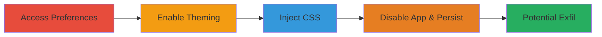

# CSS Injection in Slack Custom Theming to Disable App and Enable Potential Data Exfiltration

Multi-stage attack chain demonstrating exploitation of improper input validation in Slack's custom theming feature on macOS, leading to arbitrary CSS injection that hides the app's content and persists across reinstalls, with potential for CSS-based data exfiltration.

## Chain Metrics Dashboard

| Metric | Value |
|--------|-------|
| Chain Status | Unverified |
| Total Steps | 4 |
| Execution Time | ~2 minutes |
| Skill Level | Beginner |
| Complexity | Low |
| Impact Level | High |

## Attack Flow Visualization

## Prerequisites & Requirements

### Required Tools

- [[tools/CSS-Keylogging]] (for potential exfiltration PoC development)

### Target Environment

- Slack desktop application installed on macOS
- User access to the Slack app with theming permissions
- No network access required; local app exploitation

### Initial Access Requirements

- Local user account on the target macOS machine
- Slack app running or installable
- No prior credentials or network position needed beyond app access

## Detailed Attack Procedures

### Step 1: Access Sidebar Preferences
procedure: [[procedures/Access-Slack-Sidebar-Preferences]]

**Objective**: Navigate to the custom theming settings in Slack to prepare for injection.

**Instructions**: Launch the Slack app on macOS and open the Preferences menu, then select the Sidebar section to access theming options.

**Expected Output**: Sidebar preferences panel visible, including custom theming toggle.

**Success Indicators**:
- Preferences menu opens successfully
- Sidebar settings are accessible

### Step 2: Enable Custom Theming
procedure: [[procedures/Enable-Slack-Custom-Theming]]

**Objective**: Activate the custom theming feature to unlock the vulnerable input field.

**Instructions**: In the Sidebar preferences, locate and toggle on the custom theming option.

**Expected Output**: Custom theming enabled, revealing fields like Column Background for CSS input.

**Success Indicators**:
- Toggle switches to enabled state
- Theming input fields appear

### Step 3: Inject Malicious CSS
procedure: [[procedures/Inject-Malicious-CSS-in-Slack-Theming]]

**Objective**: Inject arbitrary CSS to manipulate the app's rendering and hide content.

**Instructions**: In the Column Background field, enter the payload `#FFFFFF;} html {display:none;}` to close any existing styles and apply a rule hiding all HTML elements.

**Expected Output**: CSS applied immediately, causing the app interface to become blank or hidden.

**Success Indicators**:
- Payload accepted without validation errors
- App content disappears upon application

### Step 4: Verify App Disablement and Persistence
procedure: [[procedures/Verify-App-Disablement-and-Persistence]]

**Objective**: Confirm the injection's effect renders the app unusable and persists post-reinstallation.

**Instructions**: Restart the Slack app and attempt to reinstall if needed; observe that the malicious CSS effect remains, making the app non-functional.

**Expected Output**: App fails to render content even after restarts or reinstalls on macOS.

**Success Indicators**:
- App remains hidden/unusable
- Effect survives app reinstallation

## Attack Chain Summary

### Key Achievements

1. Successful CSS injection via unvalidated theming input
2. Complete disablement of Slack app rendering on macOS
3. Persistence of the exploit across app reinstalls
4. Demonstrated potential for advanced CSS-based keylogging and message exfiltration

## Technique & Tactic Coverage

### MITRE ATT&CK Techniques

- [[Exploitation for Client Execution]] Exploitation for Client Execution
- [[Disable or Modify Tools]] Disable or Modify Tools
- [[Exfiltration Over Command and Control Channel]] Exfiltration Over C2 Channel Using File Transfer Protocol (for potential CSS keylogging exfil)

### MITRE ATT&CK Tactics

- [[Execution]] Execution
- [[Collection]] Collection
- [[Exfiltration]] Exfiltration

---
*Last updated: 2023-10-01T00:00:00Z*
