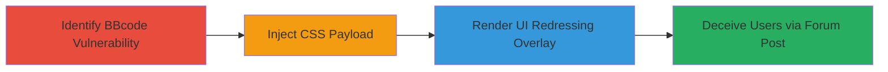

---
tags:
  - css-injection
  - ui-redressing
  - bbcode
  - phpbb
type: attack_chain
tools: []
tactics:
  - '[[Initial Access]]'
verified: false
platforms:
  - Web
submitted: true
complexity: medium
procedures:
  - '[[procedures/Identify-and-Test-BBcode-Tag-Input-Processing]]'
  - '[[procedures/Inject-Arbitrary-CSS-Properties-Using-BBcode]]'
  - '[[procedures/Observe-UI-Redressing-Impact-on-Page-Rendering]]'
step_count: 3
techniques:
  - '[[Exploit Public-Facing Application]]'
description: >-
  A multi-stage attack exploiting CSS injection in phpBB's BBcode tag to enable
  UI redressing by overlaying deceptive elements on forum pages.
skill_level: intermediate
impact_level: high
id: 9a17215a-f106-4ad5-bc4d-4f116eb4b2ac
created_at: '2025-12-13T23:52:24.874Z'
updated_at: '2025-12-13T23:52:24.874Z'
validated: true
mitre_tactics:
  - '[[Initial Access]]'
mitre_techniques:
  - '[[Exploit Public-Facing Application]]'
---
# CSS Injection via BBcode Tag in phpBB for UI Redressing Attacks

Multi-stage attack chain demonstrating a complete attack workflow exploiting a CSS injection vulnerability in phpBB's BBcode processing to perform UI redressing attacks.

## Chain Metrics Dashboard

| Metric | Value |
|--------|-------|
| Chain Status | Unverified |
| Total Steps | 3 |
| Execution Time | ~5 minutes |
| Skill Level | Intermediate |
| Complexity | Medium |
| Impact Level | High |

## Attack Flow Visualization

## Prerequisites & Requirements

### Required Tools

- None (manual testing via web browser)

### Target Environment

- phpBB forum software (version vulnerable to the issue, e.g., pre-patch releases)
- Web platform with PHP backend
- Access to post forum threads

### Initial Access Requirements

- Valid user account on the phpBB forum to create posts
- No special privileges required beyond posting ability
- Network access to the forum URL

## Detailed Attack Procedures

### Step 1: Identify and Test BBcode Tag Input Processing
procedure: [[procedures/Identify-and-Test-BBcode-Tag-Input-Processing]]

**Objective**: Identify the vulnerable BBcode tag and verify its input handling to confirm CSS injection potential.

**Instructions**: Log in to the phpBB forum and create a test post. Insert the BBcode tag with simple inputs to observe how the input is processed into HTML/CSS. For example, use [style=font-weight:bold]test[/style] and inspect the rendered HTML to see if the input becomes a style attribute on a span element.

**Expected Output**: The forum post renders a test, confirming direct insertion into CSS without full sanitization.

**Success Indicators**:
- Input appears directly in the style attribute
- Quotes are stripped, but other CSS is preserved

### Step 2: Inject Arbitrary CSS Properties Using BBcode
procedure: [[procedures/Inject-Arbitrary-CSS-Properties-Using-BBcode]]

**Objective**: Craft and inject malicious CSS to create overlay elements for UI manipulation.

**Instructions**: In a forum post, use the BBcode tag to inject CSS properties like position, z-index, and background-image. Example payload: [style=position:fixed; top:0; left:0; z-index:9999; background-image:url(https://example.com/skull.png); width:100%; height:100%;][/style]. Post the thread and view it to test rendering.

**Expected Output**: A full-screen overlay (e.g., skull image) appears on top of the forum page, obscuring content.

**Success Indicators**:
- Overlay element renders with injected styles
- Page layout is altered as intended

### Step 3: Observe UI Redressing Impact on Page Rendering
procedure: [[procedures/Observe-UI-Redressing-Impact-on-Page-Rendering]]

**Objective**: Validate the attack's effectiveness in misleading users through visual deception.

**Instructions**: View the posted thread in a browser and interact with the page to confirm the overlay interferes with normal UI elements, such as buttons or forms, potentially tricking users into unintended actions.

**Expected Output**: Users see deceptive visuals (e.g., skull overlay) that could simulate errors or hide malicious links, enabling phishing-like attacks.

**Success Indicators**:
- Normal page elements are obscured or repositioned
- Potential for clickjacking or visual phishing confirmed

## Attack Chain Summary

### Key Achievements

1. Confirmed CSS injection in BBcode processing without proper sanitization.
2. Demonstrated arbitrary styling to overlay deceptive elements.
3. Enabled UI redressing attacks via public forum posts, impacting user trust and interaction.

## Technique & Tactic Coverage

### MITRE ATT&CK Techniques

- [[Exploit Public-Facing Application]]

### MITRE ATT&CK Tactics

- [[Initial Access]]

---
*Last updated: 2023-10-01*
