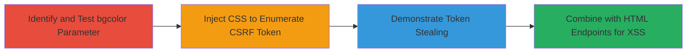

# CSS Injection via bgcolor Parameter Leading to CSRF Token Leak and XSS

Multi-stage attack chain demonstrating exploitation of a CSS injection vulnerability in Chaturbate's /embed/admin/ endpoint. The attack begins with injecting malformed CSS via the bgcolor parameter to break out of intended styles, enabling arbitrary CSS rules. This escalates to enumerating and leaking the user's CSRF token through targeted styling, and finally chains into potential XSS by combining with endpoints that return unescaped HTML content.

## Chain Metrics Dashboard

| Metric | Value |
|--------|-------|
| Chain Status | Unverified |
| Total Steps | 4 |
| Execution Time | ~5 minutes |
| Skill Level | Intermediate |
| Complexity | Medium |
| Impact Level | High |

## Attack Flow Visualization

## Prerequisites & Requirements

### Required Tools

- Browser developer tools for testing payloads
- URL encoder/decoder (e.g., built-in browser tools)

### Target Environment

- Web platform
- Access to Chaturbate's /embed/admin/ endpoint
- No specific ports or services beyond standard HTTPS (443)

### Initial Access Requirements

- Public access to the target URL
- No credentials required for initial injection testing
- Victim's browser context for token leak demonstration

## Detailed Attack Procedures

### Step 1: Identify and Test bgcolor Parameter
procedure: [[procedures/Test-bgcolor-Parameter-for-CSS-Injection]]

**Objective**: Confirm CSS injection vulnerability by injecting a payload that breaks out of the intended body background style and applies arbitrary CSS, such as turning the page background red.

**Instructions**: Access the target endpoint with an encoded payload in the bgcolor parameter. Use URL encoding for the payload }*{background:red to close the existing style and apply a universal selector.

No specific commands are executed; this is done via direct URL manipulation in a browser.

**Expected Output**: The entire page background turns red, indicating successful breakout from the body {background: [value];} rule.

**Success Indicators**:
- Page elements styled unexpectedly (e.g., red background)
- No errors in browser console related to invalid CSS

### Step 2: Inject CSS to Enumerate CSRF Token
procedure: [[procedures/Enumerate-CSRF-Token-using-CSS-Selectors]]

**Objective**: Use injected CSS selectors to target elements containing the CSRF token, revealing its characters through visual changes or timing attacks.

**Instructions**: Craft CSS payloads using attribute selectors or nth-child to style elements based on token character values (e.g., background color changes for specific digits). Test via the /embed/admin/ endpoint with encoded payloads.

No commands; browser-based testing with developer tools to inspect styled elements.

**Expected Output**: Visual indicators (e.g., colored elements) or timing differences that leak token digits, as shown in POC demonstrations.

**Success Indicators**:
- Specific elements styled based on token content
- Token characters enumerated successfully

### Step 3: Demonstrate Token Stealing in POC Setup
procedure: [[procedures/Demonstrate-Token-Stealing-in-POC-Setup]]

**Objective**: Simulate the full token leak in a controlled POC environment to capture the CSRF token via the CSS exploit.

**Instructions**: Reset the POC setup by visiting the reset URL, then trigger the injection on the main POC page to observe token capture.

No commands; direct URL access in browser.

**Expected Output**: Captured CSRF token visible in the POC interface or network logs.

**Success Indicators**:
- Token successfully leaked and displayed
- No interruptions in the injection flow

### Step 4: Combine with Other Endpoints for XSS
procedure: [[procedures/Combine-CSS-Injection-with-HTML-Endpoints-for-XSS]]

**Objective**: Chain the CSS injection with POST endpoints like /choose_broadcaster_chat_color that return HTML, injecting styles that enable script execution.

**Instructions**: Inject CSS payloads targeting the HTML response from the endpoint, potentially closing tags to insert <script> elements.

No commands; use browser or proxy tools to send POST requests with injected parameters.

**Expected Output**: Executable JavaScript in the victim's context, such as alerts or data exfiltration.

**Success Indicators**:
- JavaScript execution confirmed (e.g., alert popup)
- DOM manipulation via injected scripts

## Attack Chain Summary

### Key Achievements

1. Confirmed CSS injection via bgcolor parameter breakout.
2. Leaked CSRF token through CSS-based enumeration.
3. Demonstrated practical token stealing in POC.
4. Chained to potential XSS for arbitrary code execution.

## Technique & Tactic Coverage

### MITRE ATT&CK Techniques

- [[Exploit Public-Facing Application]] Exploit Public-Facing Application
- [[JavaScript]] JavaScript

### MITRE ATT&CK Tactics

- [[Initial Access]] Initial Access
- [[Collection]] Collection

---
*Last updated: 2023-10-01T00:00:00Z*
