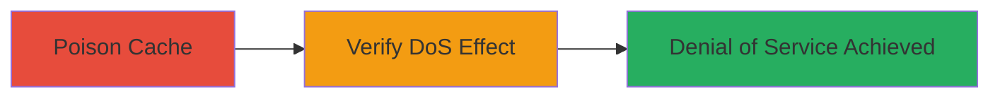

---
tags:
  - cache-poisoning
  - dos
  - cloudflare
  - azure-blob
  - web
type: attack_chain
tools: []
tactics:
  - '[[Impact]]'
verified: false
platforms:
  - Web
  - Cloud
  - Azure
  - Cloudflare
submitted: true
complexity: medium
created_at: '2023-10-01T00:00:00Z'
procedures:
  - '[[procedures/Poison-Cloudflare-Cache-with-403-Response]]'
  - '[[procedures/Verify-Cache-Poisoning-Effect]]'
step_count: 2
techniques:
  - '[[Network Denial of Service]]'
  - '[[Exploit Public-Facing Application]]'
updated_at: '2025-12-14T17:26:56.247Z'
description: >-
  A multi-step attack that poisons the Cloudflare cache on downloads.exodus.com
  by triggering and caching a 403 Forbidden response from Azure Blob Storage,
  leading to Denial of Service for legitimate file downloads.
skill_level: intermediate
impact_level: high
id: 6dc14595-3a3c-44c2-a3ae-6cd40a1ab9a6
validated: true
mitre_tactics:
  - '[[Impact]]'
mitre_techniques:
  - '[[Network Denial of Service]]'
  - '[[Exploit Public-Facing Application]]'
---
# Cache Poisoning DoS on Cloudflare CDN via Invalid Authorization Header

Multi-stage attack chain demonstrating cache poisoning to achieve Denial of Service on static file downloads hosted on Azure Blob Storage behind Cloudflare.

## Chain Metrics Dashboard

| Metric | Value |
|--------|-------|
| Chain Status | Unverified |
| Total Steps | 2 |
| Execution Time | ~1 minute |
| Skill Level | Intermediate |
| Complexity | Medium |
| Impact Level | High |

## Attack Flow Visualization



## Prerequisites & Requirements

### Required Tools

- [[commands/curl-poison-cache]]
- [[commands/curl-verify-cache]]

### Target Environment

- Web platform with Cloudflare CDN fronting Azure Blob Storage
- Access to downloads.exodus.com or similar subdomain
- No authentication required for public static files

### Initial Access Requirements

- Public internet access to the target subdomain
- No credentials needed
- Ability to send custom HTTP requests

## Detailed Attack Procedures

### Step 1: Poison the Cache
procedure: [[procedures/Poison-Cloudflare-Cache-with-403-Response]]

**Objective**: Trigger a 403 Forbidden response from Azure Blob Storage using an invalid Authorization header and cache it in Cloudflare, poisoning the entry for the target file path.

**Instructions**: Use [[commands/curl-poison-cache]] to send a crafted GET request to the target path with an invalid Authorization header:

```bash
curl -X GET "https://downloads.exodus.com/releases/hashes-exodus-21.2.12.txt?cachebuster=hackerone" -H "Authorization: InvalidBearerToken" -v
```

This causes Azure to reject the request with 403, which Cloudflare caches without validation.

**Expected Output**: 403 Forbidden response, confirmed by verbose output showing the error body cached.

**Success Indicators**:
- HTTP 403 status returned
- Cache-Control headers indicate caching by Cloudflare

### Step 2: Verify the Poisoning Effect
procedure: [[procedures/Verify-Cache-Poisoning-Effect]]

**Objective**: Confirm the DoS by requesting the same resource without the invalid header, receiving the cached 403 instead of the legitimate file.

**Instructions**: Use [[commands/curl-verify-cache]] to send a clean GET request to the same path:

```bash
curl -X GET "https://downloads.exodus.com/releases/hashes-exodus-21.2.12.txt?cachebuster=hackerone" -v
```

Cloudflare serves the poisoned 403 cache entry to legitimate users.

**Expected Output**: Cached 403 Forbidden response, even without Authorization header.

**Success Indicators**:
- HTTP 403 status on legitimate request
- Response served quickly from cache (check CF-Cache-Status: HIT)

## Attack Chain Summary

### Key Achievements

1. Successfully poisoned Cloudflare cache with error response
2. Demonstrated DoS impact on file downloads like wallet installers
3. Highlighted lack of error response validation in CDN caching

## Technique & Tactic Coverage

### MITRE ATT&CK Techniques

- [[Network Denial of Service]] Network Denial of Service
- [[Exploit Public-Facing Application]] Exploit Public-Facing Application

### MITRE ATT&CK Tactics

- [[Impact]] Impact

---
*Last updated: 2023-10-01T00:00:00Z*
