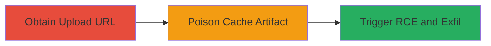

# Cache Poisoning in NX Cloud Leading to RCE and Secret Exfiltration in Mozilla fxa CI Pipeline

Multi-stage attack chain demonstrating a complete supply chain compromise via CI build cache poisoning in the Mozilla fxa repository.

## Chain Metrics Dashboard

| Metric | Value |
|--------|-------|
| Chain Status | Unverified |
| Total Steps | 3 |
| Execution Time | ~30 minutes |
| Skill Level | Intermediate |
| Complexity | Medium |
| Impact Level | High |

## Attack Flow Visualization

## Prerequisites & Requirements

### Required Tools

- None (relies on public repository access and HTTP client for uploads)

### Target Environment

- CI/CD platform with NX Cloud integration
- Public Git repository (e.g., GitHub)
- Services: NX Cloud caching
- Tech stack: NX build tools

### Initial Access Requirements

- Public read access to the target repository
- No credentials needed for upload URL acquisition
- Network access to NX Cloud endpoints

## Detailed Attack Procedures

### Step 1: Obtain Authorized Upload URL
procedure: [[procedures/Obtain-Authorized-Upload-URL-for-NX-Cloud-Cache]]

**Objective**: Acquire a reusable upload URL for the NX Cloud cache artifact used in the target CI pipeline.

**Instructions**: Access the public Mozilla fxa repository on GitHub and inspect the CI configuration or build logs to identify the NX Cloud integration. Locate the authorized upload link generated for cache artifacts during a normal build process. This link is typically exposed in public build outputs or can be derived from the repository's NX setup.

**Expected Output**: A valid upload URL pointing to the specific cache artifact in NX Cloud.

**Success Indicators**:
- Upload URL obtained without authentication
- URL references the correct cache namespace for the fxa repository

### Step 2: Reuse Upload URL to Poison Cache
procedure: [[procedures/Reuse-Upload-URL-to-Poison-Cache-Artifact]]

**Objective**: Modify and upload a poisoned cache artifact to inject malicious code into the CI build cache.

**Instructions**: Download the legitimate cache artifact using the obtained URL if needed, then modify it to include arbitrary code (e.g., a script that executes during build restoration). Re-upload the modified artifact to the same URL, exploiting the lack of single-use enforcement. Ensure the poisoned content targets the build script to enable execution on cache restore.

**Expected Output**: Successful upload confirmation from NX Cloud, overwriting the original cache.

**Success Indicators**:
- Cache artifact updated without errors
- Poisoned content verifiable via subsequent download

### Step 3: Trigger RCE and Exfiltrate Secrets
procedure: [[procedures/Trigger-RCE-via-Poisoned-Cache-and-Exfiltrate-Secrets]]

**Objective**: Activate the poisoned cache during a CI build to execute code and leak sensitive environment variables.

**Instructions**: Trigger a new build in the fxa repository (e.g., by pushing a commit if authorized, or waiting for an automated trigger). During the build, NX will restore the poisoned cache, executing the injected code. The code should capture and exfiltrate environment variables containing secret tokens to an attacker-controlled endpoint.

**Expected Output**: Build logs or external server receiving exfiltrated secrets, such as API tokens.

**Success Indicators**:
- RCE confirmed via executed payload
- Sensitive tokens (e.g., fxa secrets) received externally

## Attack Chain Summary

### Key Achievements

1. Acquired and exploited reusable cache upload URLs in NX Cloud.
2. Poisoned CI build cache to inject and execute arbitrary code.
3. Exfiltrated production secret tokens as proof of full compromise.

## Technique & Tactic Coverage

### MITRE ATT&CK Techniques

- [[Supply Chain Compromise]] Supply Chain Compromise
- [[Command-Line Interface]] Command and Scripting Interpreter
- [[Data from Cloud Storage]] Data from Cloud Storage

### MITRE ATT&CK Tactics

- [[Execution]] Execution
- [[Collection]] Collection

---
*Last updated: 2023-10-01T00:00:00Z*
