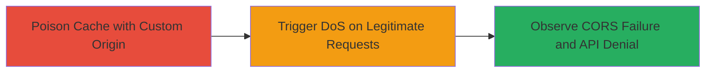

---
tags:
  - cache-poisoning
  - cors
  - wordpress
  - dos
  - api
type: attack_chain
tools:
  - '[[tools/Browser-JavaScript-Console]]'
  - '[[tools/Fetch-API]]'
tactics:
  - '[[Impact]]'
commands:
  - '[[commands/fetch-wp-json-poison]]'
platforms:
  - Web
complexity: medium
procedures:
  - '[[procedures/Poison-WP-JSON-Cache-with-Arbitrary-Origin]]'
  - '[[procedures/Verify-DoS-via-Poisoned-CORS-Response]]'
step_count: 2
techniques:
  - '[[Endpoint Denial of Service]]'
description: >-
  Multi-stage attack exploiting cache poisoning in WordPress.com's WP-JSON API
  to manipulate CORS headers, resulting in denial of service for legitimate
  cross-origin requests.
skill_level: intermediate
impact_level: high
id: c06df5f1-5dae-4cf2-aea1-5fbdca949876
created_at: '2025-12-14T17:32:48.600Z'
updated_at: '2025-12-14T17:32:48.600Z'
verified: false
validated: true
submitted: true
mitre_tactics:
  - '[[Impact]]'
mitre_techniques:
  - '[[Endpoint Denial of Service]]'
---
# Cache Poisoning of CORS Access-Control-Allow-Origin in WordPress WP-JSON API Leading to DoS

## Overview

This attack chain demonstrates how to exploit a cache poisoning vulnerability in the WP-JSON API on WordPress.com sites. The API echoes arbitrary Origin headers into the Access-Control-Allow-Origin (ACAO) response header for CORS support, but edge caches store these responses without keying on the Origin value. By sending requests with a custom Origin from a different site, the cache can be poisoned, causing subsequent legitimate cross-origin requests from other origins to receive mismatched ACAO headers. Browsers then block these requests due to CORS policy violations, resulting in a denial of service (DoS) for sites relying on the API, such as those using subdomains or headless setups. The attack requires no authentication and can affect multiple backends if repeated.

## Chain Metrics Dashboard

| Metric | Value |
|--------|-------|
| Chain Status | Unverified |
| Total Steps | 2 |
| Execution Time | ~5 minutes |
| Skill Level | Intermediate |
| Complexity | Medium |
| Impact Level | High |

## Attack Flow Visualization



## Prerequisites & Requirements

### Required Tools

- [[tools/Browser-JavaScript-Console]]
- [[tools/Fetch-API]]

### Target Environment

- WordPress.com hosted sites with WP-JSON API endpoints (e.g., https://target.wordpress.com/wp-json/)
- Edge caches enabled (indicated by X-Cache headers in responses)
- No specific ports; operates over HTTPS on port 443

### Initial Access Requirements

- Access to any HTTPS website different from the target for executing JavaScript
- No credentials required
- Browser with developer tools enabled

## Detailed Attack Procedures

### Step 1: Poison the Cache
procedure: [[procedures/Poison-WP-JSON-Cache-with-Arbitrary-Origin]]

**Objective**: Send multiple cross-origin requests with a custom Origin header to poison the edge cache, embedding the attacker's Origin in the ACAO response header.

**Instructions**: Open the browser's JavaScript console on a non-target HTTPS site (e.g., https://nathandavison.com). Use [[commands/fetch-wp-json-poison]] to target the WP-JSON endpoint with a unique query parameter to isolate the test. Repeat 5-10 times to ensure the poison spreads across cache backends.

```javascript
fetch('https://target.wordpress.com/wp-json/?dontreallypoison1').then(res => res.json()).then(json => console.log(json));
```

**Expected Output**: JSON response from the WP-JSON API is logged to the console, with the response including an ACAO header matching the testing site's Origin (visible in Network tab).

**Success Indicators**:
- Response headers show Access-Control-Allow-Origin set to the custom Origin
- X-Cache header indicates HIT on subsequent requests from the same origin

### Step 2: Trigger and Verify DoS
procedure: [[procedures/Verify-DoS-via-Poisoned-CORS-Response]]

**Objective**: From a different origin, attempt a legitimate request to the same endpoint and observe the CORS failure due to the poisoned cache serving mismatched ACAO headers.

**Instructions**: Switch to another HTTPS site different from both the target and the poisoning site. Execute the same [[commands/fetch-wp-json-poison]] command in the console to hit the poisoned cache.

```javascript
fetch('https://target.wordpress.com/wp-json/?dontreallypoison1').then(res => res.json()).then(json => console.log(json));
```

**Expected Output**: CORS error in the console, such as "Cross-Origin Request Blocked: The Same Origin Policy disallows reading the remote resource... (Reason: CORS header ‘Access-Control-Allow-Origin’ does not match with the requesting origin)".

**Success Indicators**:
- Browser blocks the response due to ACAO mismatch
- Network tab shows cached response with incorrect Origin in ACAO header
- Legitimate API access denied for cross-origin consumers

## Attack Chain Summary

### Key Achievements

1. Successfully poison the WP-JSON API cache with arbitrary ACAO headers
2. Demonstrate DoS impact on cross-origin requests from other origins
3. Highlight vulnerability in edge caching without Origin-based keys, affecting WordPress.com sites

## Technique & Tactic Coverage

### MITRE ATT&CK Techniques

- [[Endpoint Denial of Service]]

### MITRE ATT&CK Tactics

- [[Impact]]

---
*Last updated: 2023-10-01*
