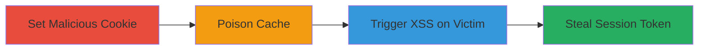

# Cache Poisoning via 'hav' Cookie Leading to Stored XSS and Account Takeover

Multi-stage attack chain demonstrating a complete attack workflow exploiting a web application's cache poisoning vulnerability to deliver stored XSS via the 'hav' cookie on abritel.fr.

## Chain Metrics Dashboard

| Metric | Value |
|--------|-------|
| Chain Status | Unverified |
| Total Steps | 3 |
| Execution Time | ~5 minutes |
| Skill Level | Intermediate |
| Complexity | Medium |
| Impact Level | High |

## Attack Flow Visualization

## Prerequisites & Requirements

### Required Tools

- Browser developer tools or a proxy like Burp Suite for cookie manipulation

### Target Environment

- Web platform (PHP-based site like abritel.fr)
- Access to set cookies via HTTP requests
- No specific ports required beyond standard HTTPS (443)

### Initial Access Requirements

- No credentials needed; public-facing web application
- Ability to send crafted HTTP requests
- Victim interaction for final exploitation

## Detailed Attack Procedures

### Step 1: Set Malicious 'hav' Cookie
procedure: [[procedures/Set-Malicious-hav-Cookie-with-WAF-Bypassing-XSS-Payload]]

**Objective**: Craft and set a 'hav' cookie containing a WAF-bypassing XSS payload to exploit the unsanitized reflection.

**Instructions**: Use browser tools or a proxy to set the cookie with a payload that leverages double quote hiding by the server, such as `xss"</sc"ript><sv"g/onloa"d=aler"t(window.INITIAL_STATE.system.cookie)>`. This bypasses WAF rules blocking direct script tags.

**Expected Output**: Cookie set successfully in the request headers.

**Success Indicators**:
- Cookie value reflected in subsequent responses without sanitization
- No WAF block triggered

### Step 2: Poison Cache by Requesting Vulnerable Endpoint
procedure: [[procedures/Poison-Cache-by-Requesting-Vulnerable-Endpoint]]

**Objective**: Send a request to the cacheable endpoint with the poisoned cookie, causing the server to cache the malicious JavaScript response.

**Instructions**: Issue a GET request to `https://www.abritel.fr/annonces/location-vacances/france_midi-pyrenees_46_stcere_dt0.php.js` including the malicious 'hav' cookie. The reflection in `var hav="value"` will inject the XSS payload into the cached .js file.

**Expected Output**: Server responds with the .js file containing the reflected payload; subsequent requests from other users pull the poisoned cache.

**Success Indicators**:
- Response includes injected `<svg/onload=alert(...)>` after the bypassed quotes
- Cache hit confirmed on repeat requests

### Step 3: Trigger XSS on Victim Access to Poisoned Cache
procedure: [[procedures/Trigger-XSS-on-Victim-Access-to-Poisoned-Cache]]

**Objective**: Induce a victim to load the poisoned .js file, executing the XSS to steal their session cookie.

**Instructions**: Direct the victim to a page that loads the vulnerable .js endpoint (e.g., via a phishing link to abritel.fr listings). The cached XSS executes, accessing `window.INITIAL_STATE.system.cookie` to exfiltrate the session token, enabling account takeover.

**Expected Output**: JavaScript alert or network request exfiltrating the victim's cookie value.

**Success Indicators**:
- XSS payload executes in victim's browser
- Session token captured and usable for takeover

## Attack Chain Summary

### Key Achievements

1. Bypassed WAF using double quote obfuscation in cookie payload
2. Poisoned server cache to persist XSS across users
3. Achieved stored XSS leading to session theft and full account compromise

## Technique & Tactic Coverage

### MITRE ATT&CK Techniques

- [[Exploit Public-Facing Application]] Exploit Public-Facing Application
- [[JavaScript]] JavaScript

### MITRE ATT&CK Tactics

- [[Initial Access]] Initial Access
- [[Collection]] Collection

---
*Last updated: 2023-10-01T00:00:00Z*
