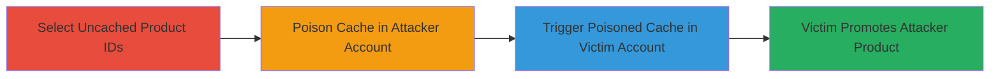

---
tags:
  - cache-poisoning
  - path-traversal
  - shopify
  - linkpop
  - amazon-affiliate
type: attack_chain
tools: []
tactics:
  - '[[Execution]]'
verified: false
platforms:
  - Web
submitted: true
complexity: medium
created_at: '2023-10-01T00:00:00Z'
procedures:
  - '[[procedures/Select-Uncached-Amazon-Product-IDs]]'
  - '[[procedures/Poison-Cache-with-Path-Traversal-URL]]'
  - '[[procedures/Trigger-Poisoned-Cache-in-Victim-Account]]'
step_count: 3
techniques:
  - '[[Exploit Public-Facing Application]]'
updated_at: '2025-12-14T17:28:36.388Z'
description: >-
  Multi-stage attack exploiting inadequate URL parsing in Shopify Linkpop to
  poison the cache of Amazon affiliate products, causing victims to
  unintentionally promote attacker-controlled products.
skill_level: intermediate
impact_level: high
id: c0e2d515-ef1b-4b94-9de8-f0912cd33bf7
validated: true
mitre_tactics:
  - '[[Execution]]'
mitre_techniques:
  - '[[Exploit Public-Facing Application]]'
---
# Cache Poisoning via URL Path Traversal in Shopify Linkpop Amazon Affiliate Links

Multi-stage attack chain demonstrating a complete attack workflow exploiting cache poisoning in Shopify's Linkpop service through URL path manipulation on Amazon affiliate links.

## Chain Metrics Dashboard

| Metric | Value |
|--------|-------|
| Chain Status | Unverified |
| Total Steps | 3 |
| Execution Time | ~5 minutes |
| Skill Level | Intermediate |
| Complexity | Medium |
| Impact Level | High |

## Attack Flow Visualization

## Prerequisites & Requirements

### Required Tools

- Web browser for account access
- Access to Shopify Linkpop accounts (attacker and victim)

### Target Environment

- Shopify Linkpop service
- Amazon.ca affiliate links
- No specific ports; web-based access required

### Initial Access Requirements

- Attacker must have a Linkpop account
- Knowledge of victim product ID
- No prior network access beyond internet; assumes legitimate account credentials for both parties

## Detailed Attack Procedures

### Step 1: Select Uncached Product IDs
procedure: [[procedures/Select-Uncached-Amazon-Product-IDs]]

**Objective**: Identify uncached Amazon product IDs for both attacker and victim to ensure the poisoning takes effect without interference from existing cache entries.

**Instructions**: Research Amazon.ca for suitable products. Verify cache status by attempting to add the product to Linkpop and noting addition time (under 1 second indicates cached; select fresh ones if so).

**Expected Output**: Two product IDs confirmed as uncached, e.g., Victim ID: B0BXXXXXXX, Attacker ID: B0CYYYYYYY.

**Success Indicators**:
- Product addition takes longer than 1 second, confirming uncached status
- IDs are valid Amazon ASINs without prior Linkpop integration

### Step 2: Poison Cache with Path Traversal URL
procedure: [[procedures/Poison-Cache-with-Path-Traversal-URL]]

**Objective**: Craft and add a manipulated URL in the attacker's Linkpop account to overwrite the cache entry for the victim's product ID with the attacker's product data.

**Instructions**: Log into the attacker's Linkpop account. Navigate to add a new Amazon product and input the crafted URL: `https://amazon.ca/dp/[VICTIM-ID]/../[ATTACKER-ID]`. Submit to poison the cache.

**Expected Output**: The attacker's product is successfully added, but the cache for the victim's ID now points to the attacker's product.

**Success Indicators**:
- URL is accepted without error
- Cache poisoning verifiable by checking the displayed product matches attacker's

### Step 3: Trigger Poisoned Cache in Victim Account
procedure: [[procedures/Trigger-Poisoned-Cache-in-Victim-Account]]

**Objective**: Have the victim add their legitimate product, retrieving the poisoned cache and displaying the attacker's product instead.

**Instructions**: In the victim's Linkpop account, add the legitimate Amazon URL: `https://www.amazon.ca/dp/[VICTIM-ID]`. The system pulls the poisoned cache.

**Expected Output**: Victim's account shows the attacker's product details, leading to unintentional promotion.

**Success Indicators**:
- Victim's added product displays attacker's image, title, and affiliate link
- Victim's links redirect to attacker's Amazon product

## Attack Chain Summary

### Key Achievements

1. Successful cache poisoning via path traversal, overwriting victim product data
2. Victim unintentionally promotes attacker's affiliate products, potentially generating unauthorized commissions
3. Demonstrates impact on data integrity in affiliate link management systems

## Technique & Tactic Coverage

### MITRE ATT&CK Techniques

- [[Exploit Public-Facing Application]]

### MITRE ATT&CK Tactics

- [[Execution]]

---
*Last updated: 2023-10-01T00:00:00Z*
