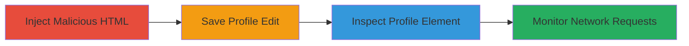

---
tags:
  - css-escape
  - proxy-bypass
  - image-proxy
  - web-vuln
  - tracking
type: attack_chain
tools:
  - '[[tools/Browser-Developer-Tools]]'
tactics:
  - '[[Execution]]'
commands: []
platforms:
  - Web
complexity: medium
procedures:
  - '[[procedures/Inject-Escaped-CSS-URL-into-Profile-Bio]]'
  - '[[procedures/Verify-Proxy-Bypass-with-Developer-Tools]]'
step_count: 4
techniques:
  - '[[Exploit Public-Facing Application]]'
description: >-
  Bypasses Chaturbate's Camo image proxy by injecting HTML with CSS escape
  sequences into user profile bio fields, allowing direct loading of arbitrary
  external images and potential IP logging.
skill_level: intermediate
impact_level: medium
id: e4f10dfb-3db7-4280-b46a-eaf5e3dfa27b
created_at: '2025-12-13T23:52:20.796Z'
updated_at: '2025-12-13T23:52:20.796Z'
verified: false
validated: true
submitted: true
mitre_tactics:
  - '[[Execution]]'
mitre_techniques:
  - '[[Exploit Public-Facing Application]]'
---
# Camo Image Proxy Bypass via CSS Escape Sequences in Profile Bio

Multi-stage attack chain demonstrating a complete attack workflow to bypass image proxy filtering on Chaturbate profiles.

## Chain Metrics Dashboard

| Metric | Value |
|--------|-------|
| Chain Status | Unverified |
| Total Steps | 4 |
| Execution Time | ~5 minutes |
| Skill Level | Intermediate |
| Complexity | Medium |
| Impact Level | Medium |

## Attack Flow Visualization

## Prerequisites & Requirements

### Required Tools

- [[tools/Browser-Developer-Tools]]

### Target Environment

- Web platform (Chaturbate user profile editing)
- Required services: Chaturbate profile bio fields (About Me or Wish List)
- Network access requirements: Authenticated access to edit a room owner profile

### Initial Access Requirements

- Valid Chaturbate account with room owner privileges
- Network position: Direct internet access
- Prior access needed: Logged-in session

## Detailed Attack Procedures

### Step 1: Inject Malicious HTML
procedure: [[procedures/Inject-Escaped-CSS-URL-into-Profile-Bio]]

**Objective**: Insert HTML with obfuscated CSS URL into the profile bio to evade proxy detection.

**Instructions**: In the Profile Bio (About Me or Wish List) field, enter HTML like `XX`, where `\72` escapes the 'r' in 'url'. This obfuscates the URL so the backend parser does not recognize and proxy it.

**Expected Output**: The bio field accepts the input without error.

**Success Indicators**:
- HTML injection succeeds without sanitization rejection
- No immediate proxy replacement during edit preview

### Step 2: Save Profile Edit
procedure: [[procedures/Inject-Escaped-CSS-URL-into-Profile-Bio]]

**Objective**: Persist the injected content to the profile.

**Instructions**: Submit the profile edit form to update the bio. The backend fails to decode the CSS escape and leaves the URL unproxied.

**Expected Output**: Profile updates successfully, and the bio displays the injected HTML.

**Success Indicators**:
- Profile saves without errors
- Injected content is visible in the updated profile

### Step 3: Inspect Profile Element
procedure: [[procedures/Verify-Proxy-Bypass-with-Developer-Tools]]

**Objective**: Confirm the URL remains unproxied after rendering.

**Instructions**: Load the updated profile page in a browser and open Developer Tools (F12). Inspect the injected `` element to verify the style attribute shows `background:url(http://foo.com/bar)` after browser unescaping.

**Expected Output**: Raw HTML in inspector reveals the direct URL without Camo proxy prefix.

**Success Indicators**:
- Element inspection shows unproxied external URL
- No Camo proxy URL (e.g., camo.stream.highwebmedia.com) in the style

### Step 4: Monitor Network Requests
procedure: [[procedures/Verify-Proxy-Bypass-with-Developer-Tools]]

**Objective**: Observe direct external resource loading.

**Instructions**: In Developer Tools' Network tab, refresh the profile page and watch for requests to the external URL (e.g., http://foo.com/bar). Modern browsers may block via CSP, but older ones load directly.

**Expected Output**: Network tab shows attempt to fetch the external image directly, potentially logging the visitor's IP.

**Success Indicators**:
- Direct request to external domain observed
- No proxied request through Camo service

## Attack Chain Summary

### Key Achievements

1. Successful bypass of Camo image proxy using CSS escapes
2. Embedding of arbitrary external images in profiles
3. Forcing visitor browsers to make direct network requests for tracking

## Technique & Tactic Coverage

### MITRE ATT&CK Techniques

- [[Exploit Public-Facing Application]]

### MITRE ATT&CK Tactics

- [[Execution]]

---
*Last updated: 2023-10-01*
