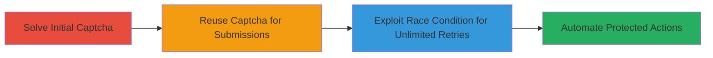

---
tags:
  - captcha-bypass
  - race-condition
  - web-vulnerability
  - defense-evasion
type: attack_chain
tools: []
tactics:
  - '[[Defense Evasion]]'
  - '[[Initial Access]]'
commands: []
platforms:
  - Web
complexity: medium
procedures:
  - '[[procedures/Captcha-Reuse-Bypass]]'
  - '[[procedures/Race-Condition-Retry-Bypass]]'
step_count: 2
techniques:
  - '[[Exploit Public-Facing Application]]'
  - '[[Disable or Modify Tools]]'
description: >-
  A multi-stage attack exploiting a captcha reuse misconfiguration and a race
  condition to bypass protections and automate unauthorized actions on VK.com.
skill_level: intermediate
impact_level: high
id: 82ce6bce-1b8a-45b8-acef-be25a3e5fcbd
created_at: '2025-12-14T17:24:18.906Z'
updated_at: '2025-12-14T17:24:18.906Z'
verified: false
validated: true
submitted: true
mitre_tactics:
  - '[[Defense Evasion]]'
  - '[[Initial Access]]'
mitre_techniques:
  - '[[Exploit Public-Facing Application]]'
  - '[[Disable or Modify Tools]]'
---
# Captcha Reuse Misconfiguration and Race Condition Bypass in VK.com

## Overview

This attack chain demonstrates how a misconfiguration in VK.com's captcha implementation allowed attackers to reuse solved captchas indefinitely, bypassing uniqueness checks. Combined with a race condition in the retry limit mechanism, this enabled unlimited automated submissions of actions that were intended to be protected by rate limiting and captcha verification. The vulnerabilities were identified through systematic testing of the captcha submission endpoint and retry logic, potentially allowing spam, account creation, or other automated abuses at scale.

## Chain Metrics Dashboard

| Metric | Value |
|--------|-------|
| Chain Status | Unverified |
| Total Steps | 2 |
| Execution Time | ~5 minutes |
| Skill Level | Intermediate |
| Complexity | Medium |
| Impact Level | High |

## Attack Flow Visualization



## Prerequisites & Requirements

### Required Tools

- Browser developer tools or a HTTP client like curl for testing submissions.

### Target Environment

- Web platform (VK.com application).
- Access to the captcha-protected endpoints (e.g., login, submission forms).
- No special privileges required; public-facing web app.

### Initial Access Requirements

- Valid session or anonymous access to VK.com.
- Network access to https://vk.com.
- Basic understanding of HTTP requests and JSON payloads.

## Detailed Attack Procedures

### Step 1: Bypass Captcha Uniqueness
procedure: [[procedures/Captcha-Reuse-Bypass]]

**Objective**: Exploit the misconfiguration to reuse a single solved captcha for multiple submissions, avoiding repeated solving.

**Instructions**: First, solve a captcha once using the legitimate flow to obtain a valid captcha token. Then, capture the submission request (e.g., via browser dev tools) and replay it multiple times with the same token in the payload.

For example, inspect the network tab during a normal submission, note the captcha ID and solution, and resubmit using a tool like curl:

```bash
curl -X POST 'https://vk.com/submit_endpoint' \
  -H 'Content-Type: application/json' \
  -d '{"captcha_id": "solved_captcha_id", "captcha_solution": "solution_value", "action": "protected_action"}'
```

Repeat the request without regenerating the captcha.

**Expected Output**: Successful responses for multiple submissions without prompting for a new captcha.

**Success Indicators**:
- Multiple actions processed using the same captcha token.
- No error messages about invalid or expired captcha.

### Step 2: Bypass Retry Limits via Race Condition
procedure: [[procedures/Race-Condition-Retry-Bypass]]

**Objective**: Use a race condition to reset or ignore retry counters, allowing excessive attempts beyond enforced limits.

**Instructions**: Trigger multiple concurrent requests to the retry-protected endpoint to exploit the race in counter handling. Use parallel threads or rapid sequential requests to submit actions just after a failure, before the retry count is properly incremented.

For instance, script a loop or use a tool to fire simultaneous POST requests:

```bash
# Example using parallel curl calls (simulate with a script)
for i in {1..10}; do
  curl -X POST 'https://vk.com/retry_endpoint' \
    -H 'Content-Type: application/json' \
    -d '{"action": "retry_action", "attempt": $i}' &
done
wait
```

Monitor responses to confirm retries are not limited.

**Expected Output**: All requests succeed or fail independently without global retry limit enforcement.

**Success Indicators**:
- More attempts allowed than the configured limit (e.g., >5 retries).
- No blocking or rate-limit errors across concurrent submissions.

## Attack Chain Summary

### Key Achievements

1. Bypassed captcha uniqueness, enabling efficient automation.
2. Overcame retry limits via race condition, removing throttling.
3. Demonstrated potential for large-scale abuse of protected features.

## Technique & Tactic Coverage

### MITRE ATT&CK Techniques

- [[Exploit Public-Facing Application]]
- [[Disable or Modify Tools]]

### MITRE ATT&CK Tactics

- [[Defense Evasion]]
- [[Initial Access]]

---
*Last updated: 2023-10-01*
