# Chained 2FA Bypasses, SSRF, Information Disclosure, CSRF, and CSS Injection for Account Takeover in BountyPay CTF

Multi-stage attack chain demonstrating a complete attack workflow in the h1-2006 CTF challenge on the BountyPay platform.

## Chain Metrics Dashboard

| Metric | Value |
|--------|-------|
| Chain Status | Unverified |
| Total Steps | 6 |
| Execution Time | ~30 minutes |
| Skill Level | Intermediate |
| Complexity | Medium |
| Impact Level | High |

## Attack Flow Visualization

```mermaid
graph LR
    A[2FA Bypass via Comparison Control] --> B[SSRF to Discover Android App]
    B --> C[Exploit Leaked Tokens in Deeplinks]
    C --> D[Access Staff Subdomain with Leaked ID]
    D --> E[Privilege Escalation via GET CSRF]
    E --> F[2FA Bypass via CSS Injection]
    F --> G[Account Takeover and Payment Processing]

    style A fill:#e74c3c
    style B fill:#f39c12
    style C fill:#f39c12
    style D fill:#3498db
    style E fill:#3498db
    style F fill:#9b59b6
    style G fill:#27ae60
```



## Prerequisites & Requirements

### Required Tools

- Browser developer tools for CSS injection
- curl for API requests
- Android emulator or device for deeplink testing

### Target Environment

- Web platform with API endpoints (api.bountypay.h1ctf.com, staff.bountypay.h1ctf.com)
- BountyPay Android application
- No specific ports required; assumes HTTP/HTTPS access

### Initial Access Requirements

- Valid user account on the platform
- Access to public images (e.g., Sandra's badge)
- Ability to interact with API and app deeplinks

## Detailed Attack Procedures

### Step 1: Bypass Initial 2FA
procedure: [[procedures/Bypass-2FA-by-Controlling-Comparison-Values]]

**Objective**: Gain unauthorized access by manipulating the 2FA verification process.

**Instructions**: Intercept the 2FA verification request using a proxy like Burp Suite. Modify both the expected and provided values in the comparison to match, allowing bypass without valid codes.

**Expected Output**: Successful authentication response from the server.

**Success Indicators**:
- Access granted to protected resources
- No 2FA prompt reappears

### Step 2: Discover Android Application via SSRF
procedure: [[procedures/Exploit-SSRF-to-Discover-Android-Application]]

**Objective**: Use SSRF to access internal endpoints and reveal the hidden BountyPay Android app.

**Instructions**: Send a crafted request to the vulnerable endpoint pointing to software.bountypay.h1ctf.com using [[commands/curl-ssrf-request]]:

```bash
curl -X POST 'https://vulnerable-endpoint' -d 'url=http://software.bountypay.h1ctf.com/internal'
```

Parse the response for app discovery details.

**Expected Output**: Response containing Android app information or deeplinks.

**Success Indicators**:
- Internal domain response received
- Android app assets exposed

### Step 3: Exploit Leaked Tokens for API Access
procedure: [[procedures/Exploit-Leaked-Tokens-in-Android-Deeplinks-for-API-Access]]

**Objective**: Use leaked authorization tokens from deeplinks to authenticate API requests.

**Instructions**: Extract the token from the deeplink (e.g., via adb or emulator). Then authenticate to the API using [[commands/curl-api-auth]]:

```bash
curl -H 'Authorization: Bearer LEAKED_TOKEN' 'https://api.bountypay.h1ctf.com/challenges'
```

Complete challenges to gain further access.

**Expected Output**: API responses with challenge completion status.

**Success Indicators**:
- Valid API access confirmed
- Challenges solved

### Step 4: Access Staff Subdomain with Leaked ID
procedure: [[procedures/Use-Leaked-Staff-ID-for-Unauthorized-Staff-Access]]

**Objective**: Leverage leaked staff ID to access restricted staff areas.

**Instructions**: Obtain the staff ID from Sandra's badge image. Send a POST request using [[commands/curl-staff-access]]:

```bash
curl -X POST 'https://api.bountypay.h1ctf.com/api/staff' -d 'staff_id=LEAKED_ID'
```

This grants access to staff.bountypay.h1ctf.com.

**Expected Output**: Redirect or access token for staff subdomain.

**Success Indicators**:
- Staff dashboard accessible
- Elevated permissions noted

### Step 5: Escalate Privileges via GET CSRF
procedure: [[procedures/Privilege-Escalation-via-GET-CSRF]]

**Objective**: Elevate user privileges using a CSRF vulnerability in GET requests.

**Instructions**: Craft a malicious link or form that triggers a GET request to the escalation endpoint. Host it and trick the victim (or use in context) with [[commands/html-csrf-poc]]:

```bash
# Create HTML file with 
```

Deliver via phishing or direct access.

**Expected Output**: Privilege update confirmation.

**Success Indicators**:
- Role changed to admin/staff
- Access to higher functions

### Step 6: Final 2FA Bypass via CSS Injection
procedure: [[procedures/Bypass-2FA-via-CSS-Injection]]

**Objective**: Bypass the remaining 2FA using CSS injection to manipulate the interface.

**Instructions**: Inject CSS via a vulnerable input field to hide or alter 2FA elements, using browser console or request tampering:

```bash
# Injected CSS: document.getElementById('2fa-input').style.display = 'none';
```
Submit without entering code.

**Expected Output**: Bypassed 2FA screen, full access granted.

**Success Indicators**:
- Account fully controlled
- Pending payments processable

## Attack Chain Summary

### Key Achievements

1. Bypassed multiple 2FA layers for unauthorized entry
2. Discovered and exploited hidden mobile app components
3. Achieved privilege escalation and account takeover
4. Processed unauthorized bounty payments

## Technique & Tactic Coverage

### MITRE ATT&CK Techniques

- [[Valid Accounts]] Valid Accounts (2FA bypasses)
- [[Exploit Public-Facing Application]] Exploit Public-Facing Application (SSRF, CSRF)
- [[Unsecured Credentials]] Unsecured Credentials (leaked tokens/ID)
- [[Forge Web Credentials]] Forge Web Credentials (CSRF)
- [[JavaScript]] JavaScript (CSS injection as UI manipulation)

### MITRE ATT&CK Tactics

- [[Initial Access]] Initial Access
- [[Discovery]] Discovery (info disclosure)
- [[Lateral Movement]] Lateral Movement (privilege escalation)

---

*Last updated: 2023-10-01T00:00:00Z*
