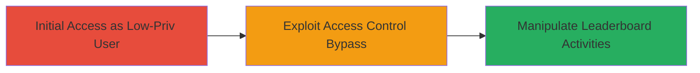

# Chained Broken Access Control in TikTok Live Backstage for Unauthorized Leaderboard Manipulation

Multi-stage attack chain demonstrating a complete attack workflow exploiting insufficient access controls in TikTok's Live Backstage to manipulate public leaderboards of unrelated organizations.

## Chain Metrics Dashboard

| Metric | Value |
|--------|-------|
| Chain Status | Unverified |
| Total Steps | 1 |
| Execution Time | ~5 minutes |
| Skill Level | Intermediate |
| Complexity | Medium |
| Impact Level | High |

## Attack Flow Visualization

## Prerequisites & Requirements

### Required Tools

- Web browser (e.g., Chrome with developer tools)

### Target Environment

- TikTok Live Backstage web application
- Access to a low-privilege account (group member or leader)

### Initial Access Requirements

- Valid low-privilege credentials for TikTok account
- Network access to TikTok web platform
- No prior admin access needed

## Detailed Attack Procedures

### Step 1: Exploit Broken Access Control
procedure: [[procedures/Exploit-Broken-Access-Control-in-TikTok-Live-Backstage]]

**Objective**: Gain unauthorized control over public leaderboard activities of other organizations by bypassing access controls with low-privilege credentials.

**Instructions**: Log in to TikTok Live Backstage with a low-privilege account. Navigate to the public leaderboard management interface intended for the attacker's organization. Modify the URL or use developer tools to alter parameters targeting another organization's leaderboard ID (e.g., change org_id in the request). Submit actions to manipulate rankings, such as adding/removing entries or altering scores.

**Expected Output**: Successful manipulation of the target organization's leaderboard without error, visible changes in live event rankings.

**Success Indicators**:
- Leaderboard updates applied to unrelated organization
- No access denied errors during manipulation
- Real-time reflection of changes in public view

## Attack Chain Summary

### Key Achievements

1. Bypassed organization-specific access controls using low-privilege account
2. Achieved full control over public leaderboard features of other organizations
3. Enabled disruption of live events and rankings without detection

## Technique & Tactic Coverage

### MITRE ATT&CK Techniques

- [[Exploit Public-Facing Application]]

### MITRE ATT&CK Tactics

- [[Initial Access]]
- [[Privilege Escalation]]

---
*Last updated: 2023-10-01T00:00:00Z*
