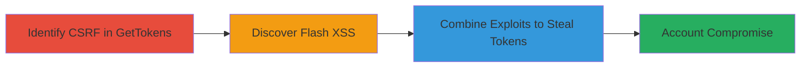

---
tags:
  - csrf
  - xss
  - flash
  - token-theft
  - socialclub
  - web-vulnerability
type: attack_chain
tools: []
tactics:
  - '[[Initial Access]]'
  - '[[Execution]]'
  - '[[Collection]]'
verified: false
platforms:
  - Web
submitted: true
complexity: medium
created_at: '2024-10-01T12:00:00Z'
procedures:
  - '[[procedures/Identify-CSRF-Vulnerability-in-GetTokens-Endpoint]]'
  - '[[procedures/Discover-Flash-based-XSS-Vulnerability]]'
  - '[[procedures/Combine-Flash-XSS-with-CSRF-to-Steal-Tokens]]'
step_count: 3
techniques:
  - '[[Exploit Public-Facing Application]]'
  - '[[Drive-by Compromise]]'
updated_at: '2025-12-14T17:27:49.540Z'
description: >-
  A multi-stage attack exploiting a CSRF vulnerability in the SocialClub
  GetTokens endpoint combined with a Flash-based XSS to bypass protections and
  steal sensitive user tokens, leading to potential account compromise.
skill_level: intermediate
impact_level: high
id: 88213699-2659-4f9d-9ddf-66ca844c0596
validated: true
mitre_tactics:
  - '[[Initial Access]]'
  - '[[Execution]]'
  - '[[Collection]]'
mitre_techniques:
  - '[[Exploit Public-Facing Application]]'
  - '[[Drive-by Compromise]]'
---
# Chained CSRF and Flash XSS to Steal SocialClub Private Tokens

Multi-stage attack chain demonstrating a complete attack workflow exploiting vulnerabilities in Rockstar Games' SocialClub platform.

## Chain Metrics Dashboard

| Metric | Value |
|--------|-------|
| Chain Status | Unverified |
| Total Steps | 3 |
| Execution Time | ~10 minutes |
| Skill Level | Intermediate |
| Complexity | Medium |
| Impact Level | High |

## Attack Flow Visualization

## Prerequisites & Requirements

### Required Tools

- Browser with developer tools (e.g., Chrome DevTools)
- Flash exploit framework or custom SWF file for XSS testing

### Target Environment

- Web platform: SocialClub (https://socialclub.rockstargames.com)
- Services: Profile editing endpoint
- Tech stack: Flash, JavaScript
- Network access: Internet access to SocialClub domain

### Initial Access Requirements

- Victim must be authenticated to SocialClub
- Attacker needs to host malicious Flash content or lure victim to a controlled site
- No prior credentials required for discovery, but victim session needed for exploitation

## Detailed Attack Procedures

### Step 1: Identify CSRF Vulnerability
procedure: [[procedures/Identify-CSRF-Vulnerability-in-GetTokens-Endpoint]]

**Objective**: Detect the lack of CSRF protections in the GetTokens endpoint to enable forged requests.

**Instructions**: Use browser developer tools to inspect network requests during profile editing. Attempt to craft a forged request from an external site to the endpoint https://socialclub.rockstargames.com/profileedit/GetTokens without CSRF tokens. Verify if the request succeeds without authentication checks.

**Expected Output**: Successful retrieval of tokens without proper validation, indicating CSRF flaw.

**Success Indicators**:
- Request accepted from external origin
- No CSRF token required or validated

### Step 2: Discover Flash-based XSS Vulnerability
procedure: [[procedures/Discover-Flash-based-XSS-Vulnerability]]

**Objective**: Identify insecure Flash handling that allows code injection to bypass secure endpoint calls.

**Instructions**: Analyze SocialClub pages for Flash embeds. Craft a malicious SWF file to inject JavaScript or exploit Flash's cross-origin capabilities. Load the Flash content in a victim-controlled context and observe if it executes arbitrary code.

**Expected Output**: Execution of injected code, confirming XSS via Flash.

**Success Indicators**:
- Arbitrary code runs in victim's browser
- Bypasses same-origin policy for endpoint access

### Step 3: Combine Exploits for Token Theft
procedure: [[procedures/Combine-Flash-XSS-with-CSRF-to-Steal-Tokens]]

**Objective**: Leverage Flash XSS to trigger the CSRF-vulnerable request and exfiltrate private tokens.

**Instructions**: Host the malicious Flash on an attacker-controlled site. Lure the authenticated victim to the site, where Flash XSS forces a background request to the GetTokens endpoint. Capture and exfiltrate the response containing tokens to the attacker's server.

**Expected Output**: Stolen private tokens sent to attacker's endpoint.

**Success Indicators**:
- Tokens retrieved without user interaction
- Potential for full account takeover

## Attack Chain Summary

### Key Achievements

1. Identified unprotected CSRF endpoint for token retrieval
2. Exploited Flash XSS to bypass secure mechanisms
3. Achieved token theft leading to account compromise

## Technique & Tactic Coverage

### MITRE ATT&CK Techniques

- [[Exploit Public-Facing Application]]
- [[Drive-by Compromise]]

### MITRE ATT&CK Tactics

- [[Initial Access]]
- [[Execution]]
- [[Collection]]

---
*Last updated: 2024-10-01T12:00:00Z*
