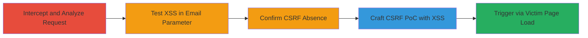

# Chained CSRF and Reflected XSS for Arbitrary JavaScript Execution in User Profile Update

Multi-stage attack chain demonstrating a complete workflow to exploit a reflected XSS vulnerability in the 'frm_email' parameter of a user profile update endpoint, chained with CSRF to enable non-interactive JavaScript execution on the target subdomain (*.██████████). The attack allows stealing session cookies, performing actions on behalf of users, or defacing the application by tricking authenticated victims into visiting a malicious page that auto-submits a forged form.

## Chain Metrics Dashboard

| Metric | Value |
|--------|-------|
| Chain Status | Unverified |
| Total Steps | 5 |
| Execution Time | ~10 minutes |
| Skill Level | Intermediate |
| Complexity | Medium |
| Impact Level | High |

## Attack Flow Visualization

## Prerequisites & Requirements

### Required Tools

- [[tools/Burp-Suite-Professional]]

### Target Environment

- Web application with user profile update functionality
- Authenticated session on the target subdomain (*.██████████)
- No specific ports or services beyond standard HTTPS (port 443)

### Initial Access Requirements

- Attacker must have network access to intercept traffic (e.g., via proxy)
- Victim must be authenticated to the target application
- No prior credentials needed for discovery, but authenticated proxy session for testing

## Detailed Attack Procedures

### Step 1: Intercept and Analyze Profile Update Request
procedure: [[procedures/Intercept-Profile-Update-Request-with-Burp-Suite]]

**Objective**: Capture the legitimate POST request to the profile update endpoint to understand its structure and parameters.

**Instructions**: Configure your browser to proxy traffic through Burp Suite. Log in to the target application and navigate to the profile update page. Submit a normal profile update form to capture the request.

In Burp Suite, inspect the intercepted HTTP POST request to `/██████` with parameters like `action=F█████`, `token=████████`, `frm_email`, `frm_zip5`, and `cmd_submit=Submit`. Note the origin from `https://███████` and included authentication cookies.

**Expected Output**: Detailed view of the request headers, body, and cookies in Burp's Proxy or Repeater tab.

**Success Indicators**:
- Request captured successfully
- Parameters including `frm_email` identified

### Step 2: Test Reflected XSS in frm_email Parameter
procedure: [[procedures/Test-Reflected-XSS-in-frm_email-Parameter]]

**Objective**: Identify if the `frm_email` parameter is vulnerable to reflected XSS by injecting a test payload and observing execution.

**Instructions**: In Burp Suite's Repeater, modify the `frm_email` parameter with a payload such as `nagli@wearehackerone.com"/><svg/onload=alert(document.domain)>`. Forward the modified request and examine the response.

Observe that the payload reflects unsanitized into the HTML response, triggering the `alert(document.domain)` JavaScript execution.

**Expected Output**: Browser alert box displaying the domain name, confirming XSS.

**Success Indicators**:
- Payload reflected without escaping
- JavaScript executes in the response context

### Step 3: Verify Absence of CSRF Protections
procedure: [[procedures/Verify-Absence-of-CSRF-Protections]]

**Objective**: Confirm that the endpoint lacks CSRF mitigations, allowing cross-origin form submissions.

**Instructions**: Review the captured request in Burp Suite for any CSRF tokens or origin checks. Attempt to submit the form from a different origin (e.g., a local HTML file) without the `token` parameter or from a cross-site context.

Note the absence of CSRF token validation, origin, or referer header checks, enabling cross-origin submissions.

**Expected Output**: Successful form submission from a non-origin site without errors.

**Success Indicators**:
- No CSRF token required or validated
- Cross-origin requests accepted

### Step 4: Craft Malicious CSRF HTML PoC with XSS
procedure: [[procedures/Craft-Malicious-CSRF-HTML-PoC-with-XSS]]

**Objective**: Build an HTML page that auto-submits a forged profile update form injecting the XSS payload via CSRF.

**Instructions**: Create an HTML file with a hidden form targeting `https://█████/████████`. Include inputs for `action=F███████`, `token=███████` (if known or bypassed), `frm_email` with the XSS payload `nagli@wearehackerone.com"/><svg/onload=alert(document.domain)>`, `frm_zip5=12121`, and `cmd_submit=Submit`. Add a script to manipulate history (pushState) and auto-submit the form on page load using `form.submit()`.

Host the HTML page on an attacker-controlled server.

**Expected Output**: HTML file ready for delivery, which submits the form silently upon loading.

**Success Indicators**:
- Form auto-submits without user interaction
- XSS payload included in submission

### Step 5: Deliver and Execute CSRF XSS Attack
procedure: [[procedures/Deliver-and-Execute-CSRF-XSS-Attack]]

**Objective**: Trick the victim into loading the PoC page, triggering the CSRF submission and XSS execution.

**Instructions**: Distribute the malicious HTML page via phishing email, social engineering, or a compromised site. When the authenticated victim visits the page, it auto-submits the form, injecting the XSS payload into their profile update, resulting in JavaScript execution on the target domain.

Monitor for execution via the alert or replace with payload to steal cookies (e.g., `document.cookie` exfiltration).

**Expected Output**: Alert on victim's browser or exfiltrated data to attacker server.

**Success Indicators**:
- Victim loads page
- XSS alert fires on target domain
- Session cookies potentially stolen

## Attack Chain Summary

### Key Achievements

1. Identified reflected XSS in profile email field without sanitization
2. Exploited missing CSRF protections for non-interactive attack delivery
3. Demonstrated full chain leading to arbitrary JS execution and session hijacking on *.██████████

## Technique & Tactic Coverage

### MITRE ATT&CK Techniques

- [[Drive-by Compromise]] Drive-by Compromise
- [[JavaScript]] JavaScript

### MITRE ATT&CK Tactics

- [[Initial Access]] Initial Access
- [[Execution]] Execution
- [[Collection]] Collection

---
*Last updated: 2023-10-01T00:00:00Z*
