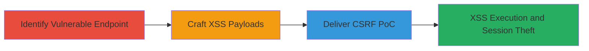

# Chained CSRF and XSS for Session Hijacking via Unsanitized Form Parameters

Multi-stage attack chain demonstrating a complete web vulnerability exploitation workflow targeting a POST endpoint vulnerable to CSRF, leading to reflected XSS through inadequate input sanitization.

## Chain Metrics Dashboard

| Metric | Value |
|--------|-------|
| Chain Status | Unverified |
| Total Steps | 3 |
| Execution Time | ~15 minutes |
| Skill Level | Intermediate |
| Complexity | Medium |
| Impact Level | High |

## Attack Flow Visualization

## Prerequisites & Requirements

### Required Tools

- [[tools/Burp-Suite]]

### Target Environment

- Web application with POST endpoints handling form data (e.g., building, classroom, course parameters)
- No CSRF token validation
- Insufficient HTML escaping on inputs
- Network access to the target site (e.g., https://target-site.com)

### Initial Access Requirements

- Authenticated user session on the target site
- Ability to intercept and modify HTTP requests
- Social engineering capability to deliver PoC to victims

## Detailed Attack Procedures

### Step 1: Identify Vulnerable Endpoint
procedure: [[procedures/Identify-Vulnerable-CSRF-Lacking-POST-Endpoint]]

**Objective**: Locate a POST endpoint that lacks CSRF protection, allowing cross-origin requests.

**Instructions**: Use [[tools/Burp-Suite]] to proxy traffic and inspect form submissions. Navigate to the target form, submit it, and check the request for CSRF tokens in headers or hidden fields. Confirm absence by attempting a cross-origin POST from a test page.

**Expected Output**: Identification of endpoint like /submit-form without anti-CSRF measures.

**Success Indicators**:
- No CSRF token present in legitimate requests
- Successful forged POST from external origin

### Step 2: Craft XSS Payloads
procedure: [[procedures/Craft-XSS-Payloads-for-Form-Parameters]]

**Objective**: Develop URL-encoded JavaScript payloads to escape HTML context and execute code upon form submission.

**Instructions**: In [[tools/Burp-Suite]] Repeater, modify parameters such as building, classroom, and course with payloads like %22%3E%3Cimg+src%3Dx+onerror%3Dalert(document.domain)%3E. Submit and observe if the payload executes in the response or subsequent page.

**Expected Output**: Alert box or script execution confirming XSS breakout.

**Success Indicators**:
- Payload breaks out of attribute context
- JavaScript executes in victim's browser

### Step 3: Generate and Deliver PoC
procedure: [[procedures/Generate-and-Deliver-CSRF-PoC-HTML-Page]]

**Objective**: Create an auto-submitting HTML page that forges the POST request with XSS payload, tricking the victim into execution.

**Instructions**: Use [[tools/Burp-Suite]] to generate a CSRF PoC HTML file with hidden form fields containing the XSS payloads. Host the page on an attacker-controlled server and deliver via phishing email or malicious link.

**Expected Output**: Victim's browser auto-submits the form, triggering XSS on the target site.

**Success Indicators**:
- Form submission from external site succeeds
- Attacker gains access to victim's session cookies or local storage

## Attack Chain Summary

### Key Achievements

1. Bypassed CSRF protections to force unauthorized form submissions
2. Injected and executed arbitrary JavaScript via unsanitized parameters
3. Enabled session hijacking, data exfiltration, and further attacks like impersonation

## Technique & Tactic Coverage

### MITRE ATT&CK Techniques

- [[Drive-by Compromise]] Drive-by Compromise (CSRF delivery)
- [[JavaScript]] JavaScript (XSS execution)

### MITRE ATT&CK Tactics

- [[Initial Access]] Initial Access (via forged requests)
- [[Execution]] Execution (script injection)
- [[Collection]] Collection (session data theft)

---

*Last updated: 2023-10-01T00:00:00Z*
