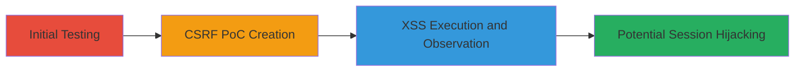

# Chained CSRF and XSS in Zomato Contact Form

Multi-stage attack chain demonstrating a complete attack workflow exploiting CSRF to deliver XSS payloads via Zomato's contact form at https://www.zomato.com/contact.

## Chain Metrics Dashboard

| Metric | Value |
|--------|-------|
| Chain Status | Unverified |
| Total Steps | 3 |
| Execution Time | ~5 minutes |
| Skill Level | Intermediate |
| Complexity | Medium |
| Impact Level | High |

## Attack Flow Visualization

## Prerequisites & Requirements

### Required Tools

- [[tools/Burp-Suite-Professional]]

### Target Environment

- Web platform
- Access to https://www.zomato.com/contact
- Latest Firefox browser for testing

### Initial Access Requirements

- No credentials required; works on public contact form
- Victim must be authenticated to Zomato for full impact
- Attacker needs to host a malicious HTML page

## Detailed Attack Procedures

### Step 1: Initial Testing
procedure: [[procedures/Test-Contact-Form-for-CSRF-and-XSS-Vulnerabilities]]

**Objective**: Verify the absence of CSRF protection and input sanitization in the contact form.

**Instructions**: Submit test payloads to the form at https://www.zomato.com/contact using POST with parameters like name, email, phone, message, and csrf_token. Test both logged-in and anonymous sessions in Firefox.

**Expected Output**: Successful form submissions without errors, indicating lack of validation.

**Success Indicators**:
- Form accepts submissions from external sources
- No CSRF token enforcement observed

### Step 2: CSRF PoC Creation
procedure: [[procedures/Create-and-Execute-CSRF-PoC-to-Trigger-XSS]]

**Objective**: Craft and host a malicious page that auto-submits the form with XSS payloads.

**Instructions**: Use Burp Suite to generate an HTML page with a hidden form targeting https://www.zomato.com/contact. Include XSS in name ('') and email ('"'), along with csrf_token 'fa53b2d4ea3ae0113d903ed5b0200fcb' and other fields. Host and load the page in the victim's browser.

**Expected Output**: Auto-submission injects the payload into Zomato's form.

**Success Indicators**:
- Form data submitted cross-origin
- Payloads reflected without sanitization

### Step 3: XSS Execution
procedure: [[procedures/Observe-XSS-Execution]]

**Objective**: Confirm JavaScript execution from the injected XSS, demonstrating data exfiltration.

**Instructions**: After CSRF submission, observe the contact form page for alert popups showing document.cookie.

**Expected Output**: Browser alert displaying victim's cookies.

**Success Indicators**:
- JavaScript alert triggers
- Cookies exposed, enabling session hijacking

## Attack Chain Summary

### Key Achievements

1. Bypassed CSRF protection to force form submissions
2. Injected and executed XSS payloads client-side
3. Demonstrated potential for cookie theft and account compromise

## Technique & Tactic Coverage

### MITRE ATT&CK Techniques

- [[JavaScript]]
- [[Drive-by Compromise]]

### MITRE ATT&CK Tactics

- [[Initial Access]]
- [[Execution]]
- [[Collection]]

---
*Last updated: 2023-10-01T00:00:00Z*
