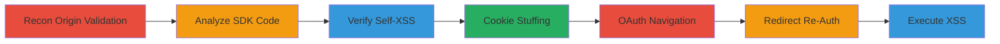

---
tags:
  - xss
  - csrf
  - cookie-stuffing
  - shopify
type: attack_chain
tools:
  - '[[tools/Browser-DevTools]]'
  - '[[tools/Code-Beautifier]]'
tactics:
  - '[[Initial Access]]'
  - '[[Execution]]'
  - '[[Credential Access]]'
commands:
  - '[[commands/postmessage-setwindowlocation]]'
  - '[[commands/set-secure-admin-session-id-cookie]]'
  - '[[commands/set-master-udr-cookie]]'
platforms:
  - Web
complexity: medium
procedures:
  - '[[procedures/Check-for-Broken-Origin-Validation-in-Embedded-Apps]]'
  - '[[procedures/Beautify-and-Analyze-SDK-Source-Code]]'
  - '[[procedures/Verify-Self-XSS-via-PostMessage]]'
  - '[[procedures/Perform-Cookie-Stuffing-for-Login-CSRF]]'
  - '[[procedures/Navigate-Victim-to-OAuth-Authorize-Endpoint]]'
  - '[[procedures/Use-Redirect-to-Re-Authenticate-Embedded-App]]'
  - '[[procedures/Execute-XSS-in-Victims-Session]]'
step_count: 7
techniques:
  - '[[JavaScript]]'
  - '[[Adversary-in-the-Middle]]'
  - '[[Steal Web Session Cookie]]'
description: >-
  Multi-stage attack exploiting DOM-based XSS, Login CSRF, and cookie stuffing
  in Shopify's Embedded App SDK to execute unauthorized actions on victim
  stores.
skill_level: intermediate
impact_level: high
id: d35a3aab-d251-450b-8839-5cfb38bf71e0
created_at: '2025-12-13T23:56:04.002Z'
updated_at: '2025-12-13T23:56:04.002Z'
verified: false
validated: true
submitted: true
mitre_tactics:
  - '[[Initial Access]]'
  - '[[Execution]]'
  - '[[Credential Access]]'
mitre_techniques:
  - '[[JavaScript]]'
  - '[[Adversary-in-the-Middle]]'
  - '[[Steal Web Session Cookie]]'
---
# Chained DOM XSS and Login CSRF in Shopify Embedded App SDK for Unauthorized Actions

Multi-stage attack chain demonstrating a complete attack workflow.

## Chain Metrics Dashboard

| Metric | Value |
|--------|-------|
| Chain Status | Unverified |
| Total Steps | 7 |
| Execution Time | ~15 minutes |
| Skill Level | Intermediate |
| Complexity | Medium |
| Impact Level | High |

## Attack Flow Visualization



## Prerequisites & Requirements

### Required Tools

- [[tools/Browser-DevTools]]
- [[tools/Code-Beautifier]]

### Target Environment

- Web
- Shopify Embedded App SDK, OAuth
- JavaScript

### Initial Access Requirements

- Access to a Shopify store for testing
- Victim interaction with malicious page
- No prior credentials needed

## Detailed Attack Procedures

### Step 1: Check for Broken Origin Validation
procedure: [[procedures/Check-for-Broken-Origin-Validation-in-Embedded-Apps]]

**Objective**: Identify that embedded apps verify origins based on the logged-in store, allowing JavaScript execution on own stores.

**Instructions**: Analyze documentation and confirm shopOrigin is set to the current logged-in shop.

**Expected Output**: Confirmation of origin validation tied to logged-in shop.

**Success Indicators**:
- Broken validation identified
- Potential for iframing apps on own stores

### Step 2: Beautify and Analyze SDK Source Code
procedure: [[procedures/Beautify-and-Analyze-SDK-Source-Code]]

**Objective**: Find DOM XSS sink in Shopify.API.setWindowLocation by beautifying SDK code.

**Instructions**: Use [[tools/Code-Beautifier]] to examine https://cdn.shopify.com/s/assets/external/app.js and identify navigation without protocol validation.

**Expected Output**: Identification of vulnerable function.

**Success Indicators**:
- Vulnerable events discovered
- DOM XSS sink confirmed

### Step 3: Verify Self-XSS via PostMessage
procedure: [[procedures/Verify-Self-XSS-via-PostMessage]]

**Objective**: Test self-XSS by posting a message to an iframed embedded app with a javascript: URL.

**Instructions**: In Browser DevTools, execute [[commands/postmessage-setwindowlocation]]:

```javascript
$$('iframe')[0].contentWindow.postMessage('{"message":"Shopify.API.setWindowLocation","data":"javascript:alert(document.domain);0[0]"}','*')
```

**Expected Output**: Alert showing document domain, confirming XSS.

**Success Indicators**:
- Alert triggered
- Self-XSS verified

### Step 4: Perform Cookie Stuffing for Login CSRF
procedure: [[procedures/Perform-Cookie-Stuffing-for-Login-CSRF]]

**Objective**: Stuff cookies to enable Login CSRF, forcing victim to log in to attacker's store.

**Instructions**: Execute [[commands/set-secure-admin-session-id-cookie]]:

```javascript
document.cookie = '_secure_admin_session_id=EVIL;path=/admin/oauth';
```

Then execute [[commands/set-master-udr-cookie]]:

```javascript
document.cookie = '_master_udr=EVIL;path=/admin/oauth';
```

**Expected Output**: Cookies set in the browser.

**Success Indicators**:
- Evil cookies stuffed
- Path-specific overrides successful

### Step 5: Navigate Victim to OAuth Authorize Endpoint
procedure: [[procedures/Navigate-Victim-to-OAuth-Authorize-Endpoint]]

**Objective**: Log victim in as attacker using stuffed cookies on /admin/oauth/authorize.

**Instructions**: Navigate to /admin/oauth/authorize with client_id, redirect_uri, etc., leveraging stuffed cookies.

**Expected Output**: Victim logged in to attacker's store.

**Success Indicators**:
- Successful login CSRF
- Victim session under attacker control

### Step 6: Use Redirect to Re-Authenticate Embedded App
procedure: [[procedures/Use-Redirect-to-Re-Authenticate-Embedded-App]]

**Objective**: Redirect from shopify.com to victim's store to re-authenticate with victim's session.

**Instructions**: Navigate to https://www.shopify.com/admin/oauth/authorize which redirects to victim's store, then trigger auth flow.

**Expected Output**: Embedded app re-authenticated in victim's session.

**Success Indicators**:
- Redirect successful
- Auth flow triggered in victim context

### Step 7: Execute XSS in Victim's Session
procedure: [[procedures/Execute-XSS-in-Victims-Session]]

**Objective**: Post malicious message to iframe to execute XSS and perform unauthorized actions.

**Instructions**: In the authenticated context, post the malicious message to create a new script as proof.

**Expected Output**: Arbitrary JavaScript executed, e.g., new script created in victim's store.

**Success Indicators**:
- XSS payload executed
- Unauthorized actions performed

## Attack Chain Summary

### Key Achievements

1. Identified and exploited DOM-based XSS in SDK
2. Chained with Login CSRF via cookie stuffing
3. Achieved unauthorized actions on victim Shopify stores

## Technique & Tactic Coverage

### MITRE ATT&CK Techniques

- [[JavaScript]]
- [[Adversary-in-the-Middle]]

### MITRE ATT&CK Tactics

- [[Initial Access]]
- [[Execution]]

*Last updated: 2023-10-01*
