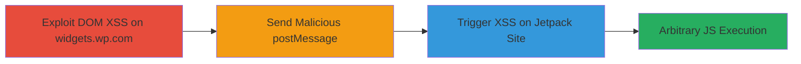

# Chained DOM XSS on Widgets.wp.com to Jetpack Likes via postMessage

Multi-stage attack chain demonstrating a complete attack workflow exploiting DOM-based XSS on widgets.wp.com to propagate to Jetpack-enabled sites via postMessage, enabling arbitrary JavaScript execution on over 100k domains.

## Chain Metrics Dashboard

| Metric | Value |
|--------|-------|
| Chain Status | Unverified |
| Total Steps | 3 |
| Execution Time | ~5 minutes |
| Skill Level | Intermediate |
| Complexity | Medium |
| Impact Level | High |

## Attack Flow Visualization

## Prerequisites & Requirements

### Required Tools

- [[tools/publicwww-com]]

### Target Environment

- Web platform with JavaScript enabled
- Target sites using WordPress Jetpack Likes feature
- No specific ports or services beyond HTTP/HTTPS

### Initial Access Requirements

- No credentials required
- Public network access to widgets.wp.com and target Jetpack sites
- Browser with developer tools for payload testing

## Detailed Attack Procedures

### Step 1: Exploit DOM XSS on Widgets.wp.com
procedure: [[procedures/Exploit-DOM-XSS-on-Widgets-wp-com-Sharing-Buttons-Preview]]

**Objective**: Inject malicious payload into the sharing-buttons-preview page to execute JavaScript in the widgets.wp.com context.

**Instructions**: Construct a URL with tampered parameters like custom[0][icon] and custom[0][name] containing a payload such as `"%3E%3Cimg%20src%20onerror=alert(document.domain)%3E`. Navigate to the URL in a browser to trigger the DOM XSS via the unencoded template insertion in preview.js.

**Expected Output**: Alert box displaying "widgets.wp.com" or execution of the onerror handler.

**Success Indicators**:
- JavaScript alert fires on page load
- DOM inspection shows injected  tag

### Step 2: Send Malicious postMessage from XSS Context
procedure: [[procedures/Send-Malicious-postMessage-from-XSS-Context]]

**Objective**: From the XSS context on widgets.wp.com, craft and send a postMessage to a target Jetpack-enabled site with a tampered liker.avatar_URL payload.

**Instructions**: In the XSS payload from Step 1, include JavaScript to open a window or iframe to the target site (e.g., wordpress.com) and send a postMessage event: `targetWindow.postMessage({ liker: { avatar_URL: '"%3E%3Cimg%20src%20onerror=alert(document.domain)%3E' } }, '*');`. Ensure the message originates from widgets.wp.com to bypass origin checks.

**Expected Output**: postMessage sent successfully, visible in browser dev tools network tab.

**Success Indicators**:
- Message received on target window
- No origin validation errors

### Step 3: Trigger Jetpack XSS via PoC Link
procedure: [[procedures/Trigger-Jetpack-XSS-via-PoC-Link]]

**Objective**: Deliver the exploit to victims via a clickable PoC that chains the XSS to execute on the target domain.

**Instructions**: Host or use a PoC HTML file like https://0-a.nl/jetpackxssclick.html?url=https://wordpress.com/blog/2024/01/31/http3/, which loads the malicious widgets.wp.com URL and handles the postMessage. Click the link to open a new window where the Jetpack Likes listener inserts the payload into innerHTML, triggering alert(document.domain) on the target.

**Expected Output**: Alert on the target domain (e.g., "wordpress.com").

**Success Indicators**:
- Arbitrary JS executes on target site
- Potential for user actions like data theft or modification

## Attack Chain Summary

### Key Achievements

1. Exploited DOM XSS on a public Automattic domain to gain JS execution.
2. Propagated the attack cross-origin via postMessage to Jetpack sites.
3. Enabled widespread compromise of over 100k WordPress sites with Jetpack Likes.

## Technique & Tactic Coverage

### MITRE ATT&CK Techniques

- [[JavaScript]]
- [[Exploit Public-Facing Application]]

### MITRE ATT&CK Tactics

- [[Execution]]
- [[Initial Access]]

---
*Last updated: 2024-10-01T00:00:00Z*
