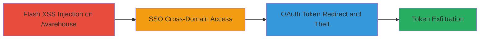

# Chained Flash XSS, SSO Misconfiguration, and OAuth Redirect Flaw for Facebook Token Theft in Rockstar SocialClub

Multi-stage attack chain demonstrating a complete attack workflow exploiting vulnerabilities in Rockstar Games' SocialClub to steal Facebook OAuth tokens.

## Chain Metrics Dashboard

| Metric | Value |
|--------|-------|
| Chain Status | Unverified |
| Total Steps | 3 |
| Execution Time | ~5 minutes |
| Skill Level | Intermediate |
| Complexity | Medium |
| Impact Level | High |

## Attack Flow Visualization

## Prerequisites & Requirements

### Required Tools

- Browser with Flash support (e.g., legacy Chrome or Firefox with Flash enabled)
- Developer tools for payload crafting

### Target Environment

- Web platform
- Services: Facebook OAuth, SocialClub SSO
- Tech stack: Flash, OAuth
- Network access: Public internet to rockstargames.com and subdomains

### Initial Access Requirements

- No prior credentials needed; targets public-facing web app
- Victim interaction required (e.g., user visiting malicious page)
- Flash player enabled on victim browser

## Detailed Attack Procedures

### Step 1: Flash XSS Injection
procedure: [[procedures/Exploit-Flash-Based-XSS-on-Rockstar-Warehouse]]

**Objective**: Inject malicious script via Flash vulnerability on rockstargames.com/warehouse to initiate the exploit chain.

**Instructions**: Craft a malicious Flash payload exploiting inadequate input sanitization in the Flash content on the /warehouse endpoint. Host the payload on an attacker-controlled server and trick the victim into interacting with it via a link or embedded content on rockstargames.com/warehouse.

**Expected Output**: Successful script execution in the victim's browser context, allowing further payload delivery.

**Success Indicators**:
- Malicious script alerts or logs confirm execution
- Access to victim cookies or session data

### Step 2: SSO Cross-Domain Access
procedure: [[procedures/Leverage-SSO-Between-Rockstar-Domains]]

**Objective**: Escalate access from the vulnerable warehouse domain to the main rockstargames.com via shared SSO session.

**Instructions**: Once XSS is executed, use the injected script to perform actions that trigger SSO authentication sharing between rockstarwarehouse.com and rockstargames.com, exploiting improper configuration to inherit the session across domains.

**Expected Output**: Valid session on rockstargames.com without additional authentication.

**Success Indicators**:
- Cross-domain requests succeed with shared session
- Access to protected resources on the primary domain

### Step 3: OAuth Token Theft
procedure: [[procedures/Manipulate-OAuth-Redirect-to-Steal-Facebook-Tokens]]

**Objective**: Redirect Facebook OAuth flow to an attacker-controlled subdomain to capture tokens.

**Instructions**: From the escalated session, initiate a Facebook OAuth login on SocialClub. Manipulate the redirect URI to point to an arbitrary subdomain like evil.socialclub.rockstargames.com, which the server accepts due to lack of validation, sending the OAuth token to the attacker.

**Expected Output**: OAuth token captured on attacker endpoint.

**Success Indicators**:
- Token received in attacker logs
- Ability to use token for unauthorized SocialClub actions

## Attack Chain Summary

### Key Achievements

1. Injected XSS via Flash to bypass initial defenses
2. Escalated privileges across domains using SSO
3. Stole sensitive OAuth tokens for account compromise

## Technique & Tactic Coverage

### MITRE ATT&CK Techniques

- [[Exploitation for Client Execution]] Exploitation for Client Execution (Flash XSS)
- [[T1078.004]] Valid Accounts: Cloud Accounts (SSO misconfig)
- [[Application Access Token]] Use Alternate Authentication Material: Web Session Cookie (OAuth token theft)

### MITRE ATT&CK Tactics

- [[Initial Access]] Initial Access
- [[Execution]] Execution
- [[Credential Access]] Credential Access

---
*Last updated: 2023-10-01T00:00:00Z*
