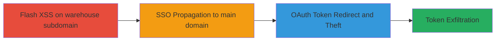

---

# Chained Flash XSS, SSO Misconfiguration, and OAuth Redirect for Facebook Token Theft

Multi-stage attack chain demonstrating a complete workflow to steal Facebook OAuth tokens through chained web vulnerabilities on Rockstar Games' platforms.

## Chain Metrics Dashboard

| Metric | Value |
|--------|-------|
| Chain Status | Unverified |
| Total Steps | 3 |
| Execution Time | ~10 minutes |
| Skill Level | Intermediate |
| Complexity | Medium |
| Impact Level | High |

## Attack Flow Visualization

## Prerequisites & Requirements

### Required Tools

- Browser with Flash support (e.g., legacy Chrome or Firefox with Flash enabled)
- Developer tools for script injection
- Proxy tool like Burp Suite for intercepting OAuth flows

### Target Environment

- Web platform
- Services: Facebook OAuth, Rockstar SocialClub SSO
- Tech stack: Flash, OAuth 2.0, SSO mechanisms
- Network access: Public internet to rockstargames.com and subdomains

### Initial Access Requirements

- No prior credentials needed
- Ability to visit rockstargames.com/warehouse
- User interaction via malicious Flash content

## Detailed Attack Procedures

### Step 1: Exploit Flash-based XSS
procedure: [[procedures/Exploit-Flash-based-XSS-on-rockstargames-warehouse]]

**Objective**: Inject and execute malicious JavaScript in the victim's browser on the warehouse subdomain to establish initial code execution.

**Instructions**: Host a malicious SWF file exploiting a Flash player vulnerability on rockstargames.com/warehouse. Trick the user into loading it via a crafted link or embedded content. Once loaded, the Flash executes JavaScript to perform actions like reading local storage or preparing for chaining.

**Expected Output**: JavaScript alert or console log confirming execution on the warehouse subdomain.

**Success Indicators**:
- Malicious script runs in browser context of rockstargames.com/warehouse
- Access to DOM elements or local storage confirmed

### Step 2: Propagate Exploit via SSO
procedure: [[procedures/Propagate-Exploit-via-SSO-between-rockstargames-and-rockstarwarehouse]]

**Objective**: Use the SSO mechanism to elevate the XSS from the isolated warehouse subdomain to the main rockstargames.com domain, gaining broader access.

**Instructions**: From the XSS payload in Step 1, trigger the SSO login flow by navigating to the SocialClub authentication endpoint. The inadequate subdomain isolation in SSO allows the injected script to persist or redirect session state to the main domain, executing code there.

**Expected Output**: XSS payload executes on rockstargames.com, visible via altered page behavior or logged events.

**Success Indicators**:
- Session propagation confirmed by script execution on main domain
- Access to main domain cookies or resources

### Step 3: Redirect and Steal Facebook OAuth Tokens
procedure: [[procedures/Redirect-and-Steal-Facebook-OAuth-Tokens-via-Subdomain-Manipulation]]

**Objective**: Manipulate the OAuth redirect URI to an attacker-controlled subdomain, capturing the issued Facebook access tokens.

**Instructions**: With control on the main domain from Step 2, intercept or modify the Facebook OAuth flow on socialclub.rockstargames.com. Exploit the lack of redirect validation to set the callback to an arbitrary *.rockstargames.com subdomain under attacker control (e.g., via DNS spoofing or registration). Upon OAuth completion, the token is sent to the attacker's endpoint for exfiltration.

**Expected Output**: Captured OAuth token in attacker logs, usable for Facebook API access.

**Success Indicators**:
- Redirect to attacker subdomain succeeds
- Facebook token received and validated via API call

## Attack Chain Summary

### Key Achievements

1. Achieved remote code execution via legacy Flash XSS on a subdomain.
2. Bypassed subdomain isolation using SSO chaining.
3. Stolen high-value OAuth tokens enabling Facebook account compromise.

## Technique & Tactic Coverage

### MITRE ATT&CK Techniques

- [[Exploit Public-Facing Application]] Exploit Public-Facing Application
- [[JavaScript]] JavaScript
- [[Steal Application Access Token]] Steal Application Access Token

### MITRE ATT&CK Tactics

- [[Initial Access]] Initial Access
- [[Execution]] Execution
- [[Credential Access]] Credential Access

---

*Last updated: 2023-10-01T00:00:00Z*
