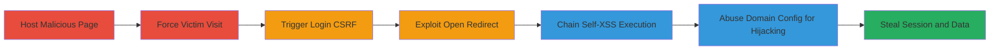

# Chained Login CSRF, Open Redirect, and Self-XSS in HackerOne SSO-SAML for Session Hijacking

Multi-stage attack chain demonstrating exploitation of multiple vulnerabilities in HackerOne's SSO-SAML login flow, allowing an attacker to force a victim's browser to authenticate without consent, redirect to attacker-controlled sites, and chain with Self-XSS to steal session data and access confidential reports.

## Chain Metrics Dashboard

| Metric | Value |
|--------|-------|
| Chain Status | Unverified |
| Total Steps | 5 |
| Execution Time | ~10 minutes |
| Skill Level | Intermediate |
| Complexity | Medium |
| Impact Level | High |

## Attack Flow Visualization

## Prerequisites & Requirements

### Required Tools

- Web server (e.g., Python SimpleHTTPServer) for hosting malicious HTML
- Browser for testing

### Target Environment

- Web platform with SAML SSO enabled (e.g., HackerOne)
- No specific ports required beyond standard HTTPS (443)
- Attacker needs victim's email address

### Initial Access Requirements

- Social engineering to trick victim into visiting malicious page
- No prior credentials needed; exploits unauthenticated login flow
- Network access to public web

## Detailed Attack Procedures

### Step 1: Create Malicious HTML Page for Login CSRF
procedure: [[procedures/Create-Malicious-HTML-for-Login-CSRF]]

**Objective**: Build a page that embeds an iframe to manipulate the victim's session and auto-initiate SAML login.

**Instructions**: Create an HTML file with an iframe loading a session-clearing endpoint and JavaScript for delayed redirect to the SAML sign-in URL with the victim's email.

**Expected Output**: Hosted malicious page ready for victim interaction.

**Success Indicators**:
- Page loads without errors
- Iframe triggers session change
- Redirect initiates login flow

### Step 2: Force Victim to Load the Malicious Page
procedure: [[procedures/Force-Victim-to-Load-Malicious-Page]]

**Objective**: Trick the victim into visiting the page, clearing cookies and starting the automated login.

**Instructions**: Host the HTML on an attacker-controlled server and send a phishing link to the victim. Ensure the page uses clear cookies to avoid session conflicts.

**Expected Output**: Victim's browser loads the page, iframe executes, and login flow begins to https://hackerone.com/users/saml/sign_in?email=[victim_email]&remember_me=true.

**Success Indicators**:
- Victim confirms visit (e.g., via callback)
- Login initiation observed in network logs

### Step 3: Exploit Open Redirect During Login
procedure: [[procedures/Exploit-Open-Redirect-in-SAML-Login]]

**Objective**: Redirect the login flow to an external attacker-controlled IdP site for phishing or further exploitation.

**Instructions**: During the GET request to the sign_in endpoint, append a redirect parameter to an arbitrary external URL without validation.

**Expected Output**: Browser redirects to attacker site, potentially capturing credentials or continuing the attack.

**Success Indicators**:
- Unvalidated redirect to external domain
- Victim lands on phishing page

### Step 4: Chain with Self-XSS for Exploitation
procedure: [[procedures/Chain-Self-XSS-with-Login-CSRF]]

**Objective**: After forced login, trigger stored Self-XSS in victim-only areas to execute malicious JavaScript under the victim's session.

**Instructions**: Use the CSRF-forced login to access areas where Self-XSS is stored, then trigger execution via logout and victim re-interaction (e.g., sign-in).

**Expected Output**: XSS payload executes, allowing data theft or actions in victim's session.

**Success Indicators**:
- Self-XSS payload triggers post-login
- Malicious actions (e.g., data exfil) succeed

### Step 5: Abuse SAML Email Domain Configuration
procedure: [[procedures/Abuse-SAML-Email-Domain-Configuration]]

**Objective**: Exploit domain config to enable typosquatting and hijack login flows.

**Instructions**: In the SAML config, add domains with extra dots (e.g., hackerone..com) to register similar domains and redirect victims via typing errors.

**Expected Output**: Attacker registers hijacked domain and intercepts logins.

**Success Indicators**:
- Invalid domain configs accepted
- Typosquatted domain resolves to attacker control

## Attack Chain Summary

### Key Achievements

1. Forced authentication without victim consent via Login CSRF
2. Arbitrary redirects enabling phishing attacks
3. Chained Self-XSS for post-login code execution and session theft
4. Configuration abuse for long-term domain hijacking

## Technique & Tactic Coverage

### MITRE ATT&CK Techniques

- [[Drive-by Compromise]] Drive-by Compromise
- [[T1566.001]] Phishing: Spearphishing Attachment (adapted for link)
- [[JavaScript]] JavaScript

### MITRE ATT&CK Tactics

- [[Initial Access]] Initial Access
- [[Execution]] Execution
- [[Credential Access]] Credential Access

---
*Last updated: 2023-10-01T00:00:00Z*
